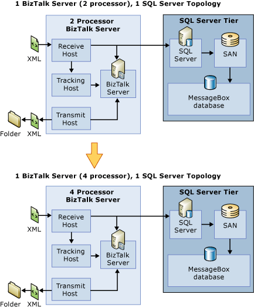

# Scaling Up the BizTalk Server Tier
To scale up the BizTalk tier, you upgrade the CPU, memory, IO and other resources. The following figure shows an example of how you might scale up the BizTalk tier from a two processor computer to a four processor computer.  
  
   
  
 The scenarios for scaling up your BizTalk tier are similar to when you choose to scale out:  
  
-   BizTalk Server becomes a bottleneck. The bottleneck itself may be caused by one of the following problems:  
  
-   CPU: If the scenario uses CPU intensive pipelines, maps, or orchestrations, the BizTalk servers will not have any extra CPU headroom.  
  
-   Memory and I/O: If the existing computers have reached their maximum limit on memory and IO, and the computer needs to be upgraded.  
  
-   Scaling out is too expensive.  
  
-   If scale-out does not address the bottleneck. For example, scaling out does not address the following bottlenecks:  
  
    -   Large Message Transforms  
  
    -   Large number of messages per interchange  
  
    -   High memory utilization by some of BTS components, such as pipelines or adapters  
  
    -   A transport, such as EDI  
  
## When You Can’t Scale Up the BizTalk Tier  
  
-   The MessageBox database is the bottleneck.  
  
-   An adapter becomes the bottleneck. For example, if you are using an adapter, after you increase the number of BizTalk receivers, lock contention might increase on the backend application where the BizTalk adapter is pulling data from. This limits your ability to scale up the adapter.  
  
## See Also  
 [Scaling Out the BizTalk Server Tier](../core/scaling-out-the-biztalk-server-tier.md)   
 [Scaling Up the SQL Server Tier](../core/scaling-up-the-sql-server-tier.md)   
 [Scaling Out the SQL Server Tier](../core/scaling-out-the-sql-server-tier.md)   
 [Scaled-Out Receiving Hosts](../core/scaled-out-receiving-hosts.md)   
 [Scaled-Out Processing Hosts](../core/scaled-out-processing-hosts.md)   
 [Scaled-Out Sending Hosts](../core/scaled-out-sending-hosts.md)   
 [Using Windows Server Cluster to Provide High Availability for BizTalk Server Hosts2](../core/use-windows-cluster-to-provide-high-availability-for-biztalk-hosts.md)   
 [Scaled-Out Databases](../core/scaled-out-databases.md)   
 [Clustering the BizTalk Server Databases](../core/clustering-the-biztalk-server-databases1.md)