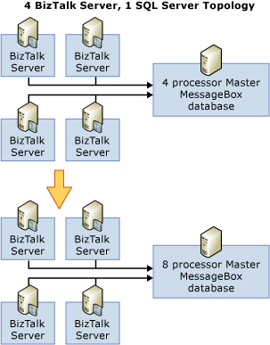

# Scaling Up the SQL Server Tier
In this pattern, the existing SQL MessageBox database is upgraded to scale according to the requirements in throughput or latency.  
  
 The following figure shows a scenario where the master MessageBox database is upgraded from quad processor server to 8 processor server.  
  
   
  
## When to Scale-up the SQL Tier  
  
-   When you can scale up the master MessageBox database.  
  
-   When the master MessageBox database becomes the bottleneck. Those bottlenecks can be:  
  
    -   **CPU** In case of very expensive and complex orchestration scenarios, Message box consumes heavy CPU resources. Scaling-up the SQL server by adding more CPUs should scale the scenario.  
  
    -   **Memory or I/O** Memory or I/O can be bottleneck and can be upgraded.  
  
-   When scaling-up is cheaper than scaling-out and scaling-up can address the bottleneck. For example, if the master MessageBox database has an issue with SQL lock contention, this issue cannot be solved by scaling-up.  
  
## When do you decide SQL cannot scale-up?  
 Scale-up cannot address lock contention bottlenecks on the SQL tier. If these kinds of bottlenecks are hit, scale-out is better option than scale-up.  
  
## Strategies and Considerations for Scaling Up the SQL Tier  
  
-   Scale-up the master MessageBox database first and then scale-out.  
  
-   The master MessageBox database will eventually be the bottleneck. So, the master MessageBox database should be faster and bigger (for example, an Itanium-based 64-bit or x64-based, dual core computer).  
  
## See Also  
 [Scaling Out the BizTalk Server Tier](../core/scaling-out-the-biztalk-server-tier.md)   
 [Scaling Up the BizTalk Server Tier](../core/scaling-up-the-biztalk-server-tier.md)   
 [Scaling Out the SQL Server Tier](../core/scaling-out-the-sql-server-tier.md)   
 [Scaled-Out Receiving Hosts](../core/scaled-out-receiving-hosts.md)   
 [Scaled-Out Processing Hosts](../core/scaled-out-processing-hosts.md)   
 [Scaled-Out Sending Hosts](../core/scaled-out-sending-hosts.md)   
 [Using Windows Server Cluster to Provide High Availability for BizTalk Server Hosts2](../core/use-windows-cluster-to-provide-high-availability-for-biztalk-hosts.md)   
 [Scaled-Out Databases](../core/scaled-out-databases.md)   
 [Clustering the BizTalk Server Databases](../core/clustering-the-biztalk-server-databases1.md)