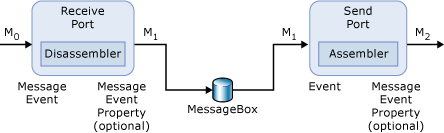

# Scenario 1: Sizing the Tracking Database  for Simple BizTalk Messages
In the following figure, a simple BizTalk Server message passes in and out of BizTalk Server without undergoing any message transformation.  
  
   
  
 **A simple BizTalk Server message - no transformation**  
  
 Before you apply the formula in the previous section, you will need to gather some facts about this scenario. In this example, we use the following:  
  
- The message size is 5K.  
  
- No properties will be promoted.  
  
- The number of messages you receive in a year is 3.5 million.  
  
- Tracking is turned on for all events. There are four events in this scenario. The events are:  
  
  -   Receipt of message M0  
  
  -   Output of message M1 from the receive port  
  
  -   Receipt of message M1 by the transmit pipeline  
  
  -   Output of message M2 by the send pipeline  
  
- Two additional messages are created in this scenario. Message M0 is the incoming message and is therefore not created by BizTalk Server. Message M1 is the output message from the receive port and M2 is the output from the transmit port. M1 and M2 are created by BizTalk Server.  
  
  Applying this information to the formula gives the following:  
  
```  
[(5*252 bytes) + (10*182 bytes) + (0*5(40 bytes + 0) * 3,500,000]/1024/1024  
[(1620 + 1820 + 0) * 3,500,000]/1024/1024 = 10280.61 MB ~ 10.04 GB per year  
```  
  
## Messages with a single promoted property  
 Let's take another look at this example and add one additional fact to the scenario. You want to promote a single field, approximately 10 bytes in size, from the original message. The maximum size of a promoted field is 256 characters, or approximately 256 bytes (512 bytes if the characters are Unicode).  
  
 With this additional fact, the equation now appears as follows:  
  
```  
[(2*150 bytes) + (4*230 bytes) + (1*2(52 bytes + 10 bytes)) * 3,500,000]/1024/1024  
[(300 + 920 + 124) * 3,500,000]/1024/1024 = 4486 MB ~ 4.38 GB per year  
```  
  
 If you wanted to promote an additional field that is 10 bytes in size, the equation would be:  
  
```  
[(2*150 bytes) + (4*230 bytes) + ((1*2*(52 bytes + 10 bytes) + (1*2*(52 bytes + 10 bytes)) * 3,500,000]/1024/1024  
[(300 + 920 + 248) * 3,500,000]/1024/1024 = 4899 MB ~ 4.78 GB per year  
```  
  
 As you can see, if you promote a single 10-byte property in this scenario, it will add an additional 333.79 MB ~ 0.33 GB per year to the size of the BizTalk Tracking database.  
  
 Promoting two 10-byte properties will add an additional 667.58 MB ~ 0.65 GB of additional space per year to the size of the BizTalk Tracking database.  
  
## Messages with message body tracking activated  
 In this example, let us also assume that we are planning on activating message body tracking. We will need to add the second equation for message tracking, shown in the previous section. The equation will look like the following for this example:  
  
```  
[3,500,000 * 4 * 5KB]/1024 = 68359.375 MB ~ 66.75 GB per year  
  
```  
  
 By adding the results of the two equations, we can estimate that the BizTalk Tracking database will grow approximately 54.48 GB to 54.88 GB per year.  
  
## See Also  
 [Using Message Variables to Size the Tracking Database](../core/using-message-variables-to-size-the-tracking-database.md)   
 [Sizing the Tracking Database to Track Message Bodies](../core/sizing-the-tracking-database-to-track-message-bodies.md)   
 [Scenario 2: Sizing the Tracking Database  for Messages in Orchestrations](../core/scenario-2-sizing-the-tracking-database-for-messages-in-orchestrations.md)   
 [Scenario 4: Sizing the Tracking Database for all Messages](../core/scenario-4-sizing-the-tracking-database-for-all-messages.md)   
 [Scenario 3: Sizing the Tracking Database  for Messages Sent Out to Distribution Lists](../core/scenario-3-size-the-tracking-database-for-messages-sent-to-distribution-lists.md)