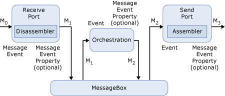

# Scenario 2: Sizing the Tracking Database  for Messages in Orchestrations
Let's look at an example that includes an orchestration. The following figure displays the entire business process. In this scenario, a message comes into BizTalk Server, is sent through an orchestration, is changed within the orchestration, and is then sent out through a send port.  
  
   
  
 **The BizTalk Server message process**  
  
 Here are some of the facts concerning this scenario:  
  
- The message size is 5K.  
  
- We are not promoting any properties.  
  
- The number of messages we receive in a year is 3.5 million.  
  
- Tracking is turned on for all events. There are six events in this scenario:  
  
  -   Receipt of message M0  
  
  -   Output of message M1 from the receive port  
  
  -   Receipt of message M1 by the orchestration  
  
  -   Output of message M2 from the orchestration  
  
  -   Receipt of message M2 by the send port  
  
  -   Output of message M3 by the send pipeline  
  
- Three additional messages are created in this scenario. Message M0 is the incoming message and is therefore not created by BizTalk Server. Message M1 is the output message from the receive port, M2 is the output message from the orchestration, and M3 is the output message from the transmit port.  
  
  Applying this information to the formula gives the following result:  
  
```  
[(3*150 bytes) + (6*230 bytes) + (0*0(52 bytes + 0) * 3,500,000]/1024/1024  
[(450 + 1380 + 0) * 3,500,000]/1024/1024 = 6108 MB ~ 5.96 GB per year  
```  
  
## Messages in orchestrations with a single promoted property  
 Now let's promote a single field in this scenario, as in the earlier example. The promoted property is approximately 10 bytes in size. The equation now looks like this:  
  
```  
[((3*150 bytes) + (6*230 bytes) + (1*3*(52 bytes + 10 bytes)) * 3,500,000]/1024/1024  
[(450 + 1380 + 186) * 3,500,000]/1024/1024 = 6729 MB ~ 6.57 GB per year  
```  
  
 If you need to promote an additional property that is 20 bytes in size, the formula now looks like this:  
  
```  
[(3*150 bytes) + (6*230 bytes) + ((1*3*(52 bytes + 10 bytes) + (1*3*(52 bytes + 20 bytes)) * 3,500,000]/1024/1024  
[(450 + 1380 + 372) * 3,500,000]/1024/1024 = 7350 MB ~ 7.18 GB per year  
```  
  
## Messages in orchestrations with message body tracking activated  
 If you want to accommodate message tracking, the result from calculating the additional space needed is identical to the result in the earlier scenario, or 50.1 GB per year.  
  
## See Also  
 [Using Message Variables to Size the Tracking Database](../core/using-message-variables-to-size-the-tracking-database.md)   
 [Sizing the Tracking Database to Track Message Bodies](../core/sizing-the-tracking-database-to-track-message-bodies.md)   
 [Scenario 1: Sizing the Tracking Database  for Simple BizTalk Messages](../core/scenario-1-sizing-the-tracking-database-for-simple-biztalk-messages.md)   
 [Scenario 4: Sizing the Tracking Database for all Messages](../core/scenario-4-sizing-the-tracking-database-for-all-messages.md)   
 [Scenario 3: Sizing the Tracking Database  for Messages Sent Out to Distribution Lists](../core/scenario-3-size-the-tracking-database-for-messages-sent-to-distribution-lists.md)