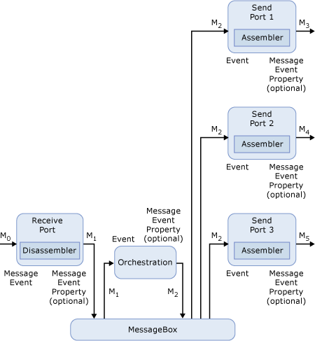

# Scenario 3: Sizing the Tracking Database  for Messages Sent Out to Distribution Lists
In the following figure, you have a message that proceeds through an orchestration, is changed within the orchestration, and is then sent out to several different send ports through a distribution list.  
  
   
  
 **BizTalk Server message that proceeds through an orchestration and is sent out to several different ports**  
  
 Here are some of the facts concerning this scenario:  
  
- The message size is 10K.  
  
- You are not promoting any properties.  
  
- The number of messages you receive in a year is 3.5 million.  
  
- Tracking is turned on for all events. There are five events in this scenario:  
  
  -   Receipt of message M0  
  
  -   Output of message M1 from the receive port  
  
  -   Output of message M3 by the send port  
  
  -   Output of message M4 by the send port  
  
  -   Output of message M5 by the send port  
  
  Applying this information to the equation gives the following:  
  
```  
[(5*252 bytes) + (10*182 bytes) + (0*5(40 bytes + 0) * 3,500,000]/1024/1024  
[(1620 + 1820 + 0) * 3,500,000]/1024/1024 = 10280.61 MB ~ 10.04 GB per year  
```  
  
## Messages in an orchestration that are sent out to a distribution list with a single promoted property  
 In this example, let's promote a single property, approximately 10 bytes in size, as we did in an earlier scenario. The equation now looks like this:  
  
```  
[((5*150 bytes) + (10*230 bytes) + (1*5(52 bytes + 10 bytes)) * 3,500,000]/1024/1024  
[(750 + 2300 + 260) * 3,500,000]/1024/1024 = 11048 MB ~ 10.79 GB per year  
```  
  
 If we promote an additional property that is 20 bytes in size the equation now looks like this:  
  
```  
[((5*150 bytes) + (10*230 bytes) + ((1*5(52 bytes + 10 bytes) + (1*5(52 bytes + 20 bytes)) * 3,500,000]/1024/1024  
[(750 + 2300 + 670) * 3,500,000]/1024/1024 = 12417 MB ~ 12.13 GB per year  
```  
  
## Messages in an orchestration that are sent out to a distribution list with message body tracking activated  
 If you want to accommodate message tracking, the equation will look like the following for this example:  
  
```  
[3,500,000 * 6 * 5KB]/1024 = 102539.06 MB ~ 100.14 GB per year  
  
```  
  
## See Also  
 [Using Message Variables to Size the Tracking Database](../core/using-message-variables-to-size-the-tracking-database.md)   
 [Sizing the Tracking Database to Track Message Bodies](../core/sizing-the-tracking-database-to-track-message-bodies.md)   
 [Scenario 1: Sizing the Tracking Database  for Simple BizTalk Messages](../core/scenario-1-sizing-the-tracking-database-for-simple-biztalk-messages.md)   
 [Scenario 2: Sizing the Tracking Database  for Messages in Orchestrations](../core/scenario-2-sizing-the-tracking-database-for-messages-in-orchestrations.md)   
 [Scenario 4: Sizing the Tracking Database for all Messages](../core/scenario-4-sizing-the-tracking-database-for-all-messages.md)