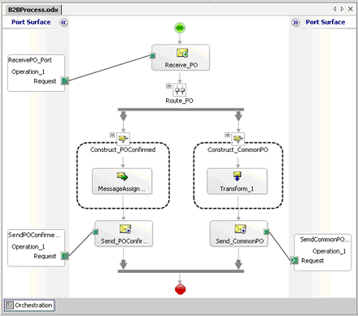

# Scenario 4: Sizing the Tracking Database for all Messages
If you had all three message scenarios present in a Microsoft® BizTalk Server® 2004 implementation, you would need to add together all of the scenario results to determine the size of the BizTalk Tracking database.  
  
 From the examples shown above:  
  
|Scenario|Space required, per year, in GB|  
|--------------|-------------------------------------|  
|Simple messages|4.78|  
|Messages in orchestrations|7.18|  
|Messages in orchestrations sent out to distribution lists|10.8|  
|**Total**|22.04|  
  
 In addition, if we turn on message body tracking for all three scenarios, we would get the following results:  
  
|Scenario|Space required, per year, in GB|  
|--------------|-------------------------------------|  
|Simple messages|50.1|  
|Messages in orchestrations|50.1|  
|Messages in orchestrations sent out to distribution lists|83.45|  
|**Total**|183.65|  
  
 This would give you a grand total of 205.69 GB per year growth on the BizTalk Tracking database. This figure does not include any contingency. If you decided to add a contingency of 10 percent to this total, as is recommended, then you should plan on the BizTalk Tracking database growing 227.94 GB per year. On top of this, you should consider the overhead due to SQL indices, storage, etc. You should base your multiplying factor after running the test scenarios in test if possible.  
  
## Other factors affecting BizTalk Tracking database size  
 There are other items, such as the shapes used within an orchestration that also affect the size of the BizTalk Tracking database.  
  
 If the orchestration debugger option is turned on, which it is by default, the status of each shape in the orchestration is saved to the BizTalk Tracking database.  
  
 The formula to determine the size needed to track shape status is:  
  
```  
[(# of object shapes ] * 76 bytes  
```  
  
 For example, in the following figure, you would use the following formula to determine the BizTalk Tracking size:  
  
```  
((4) * 76 bytes = 304 bytes  
```  
  
   
  
 If we assume that this orchestration processes 3.5 million messages, the additional space needed to track this orchestration would be:  
  
```  
304 bytes * 3,500,000/1024/1024 = 1015 MB ~ 0.99 GB.  
```  
  
 You will need to account for each orchestration that has the orchestration debugger set to "on" to get an approximate size for the BizTalk Tracking database.  
  
## See Also  
 [Using Message Variables to Size the Tracking Database](../core/using-message-variables-to-size-the-tracking-database.md)   
 [Sizing the Tracking Database to Track Message Bodies](../core/sizing-the-tracking-database-to-track-message-bodies.md)   
 [Scenario 1: Sizing the Tracking Database  for Simple BizTalk Messages](../core/scenario-1-sizing-the-tracking-database-for-simple-biztalk-messages.md)   
 [Scenario 2: Sizing the Tracking Database  for Messages in Orchestrations](../core/scenario-2-sizing-the-tracking-database-for-messages-in-orchestrations.md)   
 [Scenario 3: Sizing the Tracking Database  for Messages Sent Out to Distribution Lists](../core/scenario-3-size-the-tracking-database-for-messages-sent-to-distribution-lists.md)
