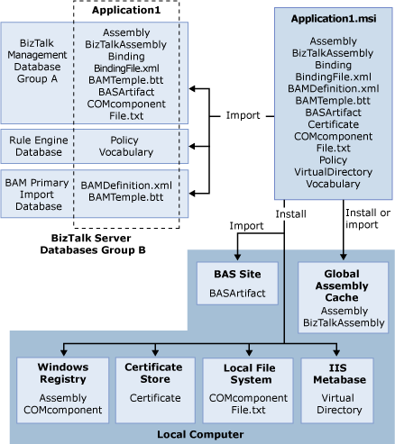

# Scenario: Deploying a New Application
This topic describes the scenario of deploying an application into a new environment where it has not been deployed before; for example, deploying an application that has been configured in a staging environment into a production environment.  
  
 As described in [The Application Deployment Process](../core/the-application-deployment-process.md), when you want to move an application from one environment to another, you export the application into an .msi file. You then import the .msi file into the BizTalk group in the new environment. You also install the application on the computers in that group that will run the application. Before it can begin functioning, you must install the application on each computer that will run it and also start the application.  
  
 In the following diagram, Application1 is imported from an .msi file into BizTalk Group B.  
  
   
  
 This imports artifacts into the various BizTalk Server databases as follows:  
  
- The BizTalk assembly, .NET assembly, bindings, binding file, BAM template, COM component, certificate, and text file are all added to the BizTalk Management database.  
  
- The policy and vocabulary are added to the Rule Engine database.  
  
- The BAM template and BAM definition file are both added to the BAM Primary Import database.  
  
  Each of these artifacts is also associated with Application1 in the BizTalk Management database.  
  
  The application is also installed on a local computer from the .msi file. This installs various artifacts that are included in the .msi file, as follows:  
  
- The virtual directory, named VirtualDirectory, is created in the Internet Information Services (IIS) metabase.  
  
- The certificate is added to the local certificate store.  
  
- The text file and COM component are copied to the local file system.  
  
- The BizTalk assembly and .NET assembly are added to the global assembly cache (GAC), if this deployment option was selected for them.  
  
- The .NET assembly and COM component are added to the Windows registry, if that deployment option was selected for them.  
  
## See Also  
 [Application Deployment and Management Scenarios](../core/application-deployment-and-management-scenarios.md)   
 [Deploying BizTalk Applications](../core/deploying-biztalk-applications.md)