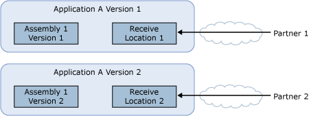

# Scenario: Deploying Two Versions of an Application
This topic describes the scenario of deploying two versions of an application within a BizTalk group, so that they can both run simultaneously. In this scenario, you need to deploy a major new version of the application. It requires partners to change their interaction with the system due to either schema or protocol change - essentially a new application. The changeover to this system has been tested but not under the scale of a full production system. You want to pilot the new system with 20 percent of the partners, and gradually increase that percentage until all the partners are using it.  
  
 Because the two applications receive messages on two different receive locations, you must ask those partners that should use the new version of the application to send messages to the new URL, so that they will be processed by the new version.  
  
 The following diagram shows a typical side-by-side application deployment.  
  
   
  
## See Also  
 [Application Deployment and Management Scenarios](../core/application-deployment-and-management-scenarios.md)
