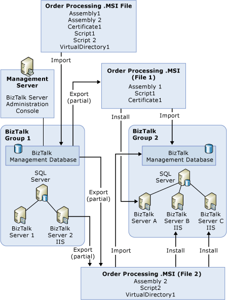

# Scenario: Distributing Artifacts Among Multiple Computers
This topic describes the application deployment scenario when the artifacts in an application are selectively installed on different computers. You might want to do this if you want certain assemblies or other types of artifacts in an application to be installed only on specific computers in a BizTalk group. To do this, you can export the artifacts included in an application into multiple .msi files, according to which artifacts you want to install together on a physical computer.  
  
 The following diagram shows an .msi file that is imported into the BizTalk Management database for BizTalk Group 1. This creates the Order Processing application and all of its artifacts in that group. The application artifacts are then exported into two different .msi files. One .msi file contains Assembly1, Certificate1, and Script1. The other .msi file contains Assembly2, Script2, and VirtualDirectory1.  
  
 Both .msi files are imported into BizTalk Group 2. Because they both belong to the Order Processing application, all of the artifacts in both .msi files are imported into the same application named Order Processing in the new group.  
  
 In addition, the application artifacts are installed from the .msi files onto the computers in the group that will run them. Note that the .msi file containing the virtual directory is installed on BizTalk Server B and BizTalk Server C, which are both running IIS.  
  
   
  
## See Also  
 [Application Deployment and Management Scenarios](../core/application-deployment-and-management-scenarios.md)   
 [How to Export a BizTalk Application](../core/how-to-export-a-biztalk-application.md)   
 [How to Import a BizTalk Application](../core/how-to-import-a-biztalk-application.md)   
 [How to Install a BizTalk Application](../core/how-to-install-a-biztalk-application.md)
