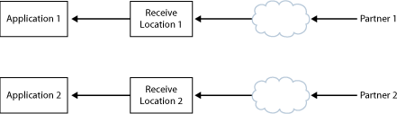

# Scenario: Updating Application Artifacts
There are two basic scenarios for updating the artifacts in an application that has been deployed into a production environment:  
  
- Updating an orchestration with a new version when the orchestration handles long-running transactions or is waiting for a response from a solicit-response port.  
  
- The more general update case, when you are not concerned with completing message processing, such as updating a schema or map with a new version.  
  
  In the general update case, you may be updating an artifact with a new version, for example to address a change in business requirements. This scenario is relatively straightforward, and you can overwrite the original artifact with the updated one. For a list of the steps involved, see [Checklist: Update the Artifacts in a BizTalk Application](../core/checklist-update-the-artifacts-in-a-biztalk-application.md).  
  
  The second scenario is more complex. In this case, you must allow the existing orchestration to finish processing the messages. At the same time, you must prevent the existing orchestration from processing any new messages. Instead, you want the updated version of the orchestration to take over. To accomplish this, you deploy the assembly containing the updated orchestration into the same BizTalk application as the original version, and then run both orchestrations simultaneously. (The new assembly must have a different version number than the assembly containing the original orchestration, or you will not be able to deploy it into the same BizTalk group.) You then stop the original orchestration, so that no new messages are routed to it, and start the updated version, so that all new messages are sent to it. After the original version has finished processing all of its messages, you can then undeploy it. For instructions on performing these tasks, see [How to Upgrade an Orchestration](../core/how-to-upgrade-an-orchestration.md).  
  
  The following diagram shows a typical side-by-side orchestration deployment.  
  
    
  
## See Also  
 [Application Deployment and Management Scenarios](../core/application-deployment-and-management-scenarios.md)   
 [Important Considerations for Updating Applications](../core/important-considerations-for-updating-applications.md)