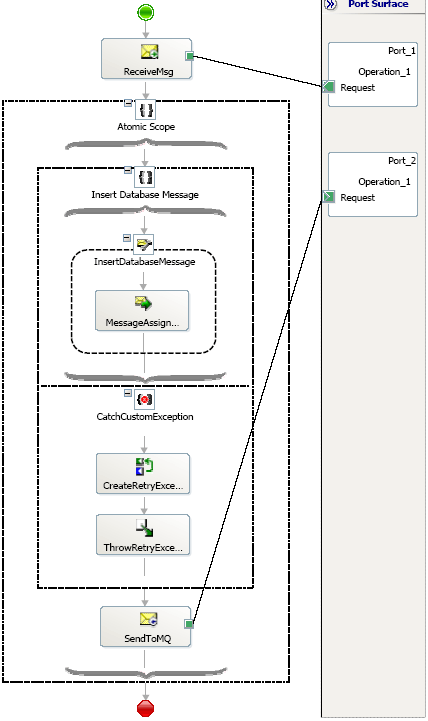
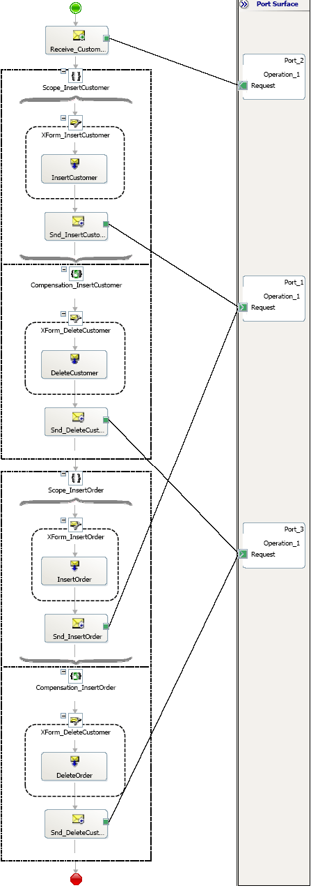

# Scenarios Using Atomic Transactions
The following scenarios describe the use of atomic transactions.  
  
## Scenario 1: An Atomic Transaction with COM+ ServicedComponent  
 The following orchestration shows how to use the **RetryTransactionException** with atomic transactions. Although exception handlers cannot be directly included for an atomic scope, the scope can include a non-transactional scope that can have an exception handler. The **ServicedComponent** enlists in the same DTC transaction and any exception raised by the component is caught and re-thrown as **RetryTransactionException**. (This assumes that the **Retry** property is set to **True** for the atomic scope).  
  
 Note that the orchestration would have been suspended and the action in the MessageAssignment shape would have been rolled back even if the **RetryTransactionException** is not thrown. This pattern, however, allows building resilience in the application where the retries occur automatically.  
  
 **An atomic transaction with COM+ ServicedComponent**  
  
   
  
## Scenario 2: Using Transacted Adapters with Atomic Transactions  
 The following orchestration shows how to use the atomic transactions with the SQL adapter. The whole orchestration is marked as long running with individual atomic transactions for the two logical pieces of work: Inserting a new Customer and Insert Order details for the customer.  
  
 If, for whatever reason, the Order Insert fails, the Customer Insert should be rolled back. The sample uses the SQL adapter to do the database work. As mentioned earlier, the scope associated with an atomic transaction completes when the message is sent to the MessageBox database. This implies that after the engine is successful in sending the message in the Scope_InsertCustomer and Scope_InsertOrder scopes, each one of the scopes commits. The SQL adapter creates a new transaction for the actual Insert of the Customer or the order.  
  
 The Ports have a property “Delivery Notification” for validating that the message has been successfully sent via the Sent Port. When the Delivery Notification property is set to “Transmitted”, a receive subscription is placed before the Transactional commit point of the Send Operation. However, in case of Atomic Scopes, the receive subscription is placed in the enclosing Parent scope.  
  
 In the scenario where the InsertOrder SQL transaction fails, a "Nack" will be sent back and the "Scope_InsertOrder" commits. After the Sent Port exhausts the configured retries, a DeliveryFailureException will be raised. This exception will be caught by the default exception handler, which will run the default compensation process. This will invoke the compensation handlers associated with the Scope_InsertCustomer and Scope_InsertOrder, causing the undo operation of inserting the customer information.  
  
> [!NOTE]
>  Nesting the two scopes in a long running scope and invoking the Compensate shape (targeting the long running transaction) from the exception handler for the long running scope will result in the same behavior as described above. The whole orchestration could not be marked atomic as atomic transactions do not allow nested transactions.  
  
 **Transacted adapters with atomic transactions**  
  
 
