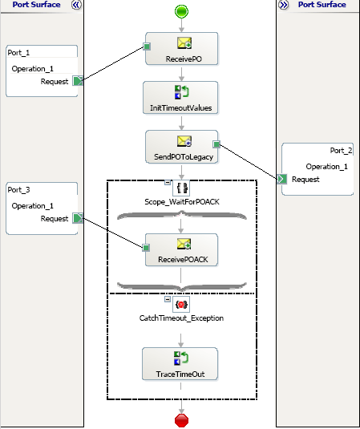
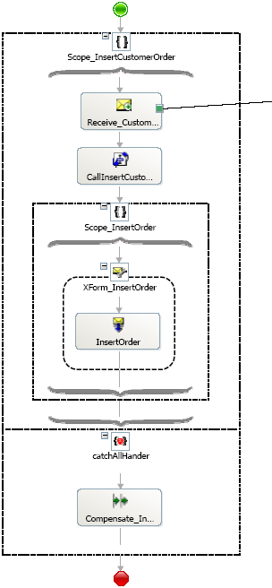
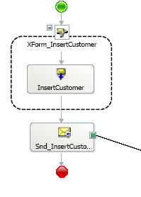
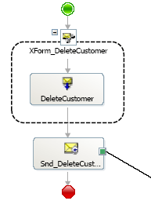

# Scenarios Using Long-Running Transactions
The following scenarios describe the use of long running transactions.  
  
## Scenario 1: Using Long Running Transactions with Timeouts  
 Long running scopes can be associated with a timeout, which is a logical time within which the long-running work must complete. If the scope does not complete within the specified time, a pre-defined system exception **TimeoutException** is raised.  
  
 You can create long running processes by either marking the entire orchestration as long running or having an outer long running scope nest any other scopes. In the former scenario, a system-provided exception handler runs, whereas the latter allows associating specific exception handlers to the outer scope. The default system-provided exception handler will run the compensation handler for each of the successfully completed nested transactional scopes, if any, in reverse order of their completion. You can achieve the same through self compensating by using the Compensate shape in the exception handler for a long running transaction.  
  
 The following orchestration is a representation of how to associate timeouts with long running transactions.  
  
 **Long running transactions with timeouts**  
  
   
  
 Sometimes you may need to interface with legacy systems that operate in a batch fashion. This scenario shows a purchase order being received and sent to the legacy system. The legacy system processes the purchase order and sends back a purchase order acknowledgement. The send operation initializes a correlation set using the purchase order number and the receive operation follows that correlation set. The receive operation is also in a long running scope with a timeout value.  
  
 The orchestration engine will dehydrate the orchestration instance waiting for the receive. The correlation will ensure that the same orchestration instance is invoked after the message is received. If the purchase order acknowledgement does not arrive within the time interval specified by the timeout values, a **TimeoutException** will be thrown.  
  
## Scenario 2: Using Long Running Transactions with Custom Compensation  
 The following orchestrations demonstrate how to associate and invoke custom compensations associated with entire orchestrations. This scenario inserts a new customer and inserts order details for the customer. The logic of the orchestration dictates that if the order insert fails, you should roll back the customer insert. The customer insert could be done by a legacy system, and is therefore, demonstrated in a separate callable orchestration. The called orchestration has the **Custom** property set for compensation, which provides a separate sheet to do the compensation process. The compensation is to delete the newly inserted customer.  
  
 The calling orchestration has a long running scope to do the order insert. This scope is nested within an outer long running scope. The outer scope has an exception handler associated to catch any exceptions. The handler uses the Compensate shape to invoke the custom exception associated with the called orchestration to roll back any changes that might have occurred in the call to the orchestration.  
  
 **Long running transactions with custom compensation**  
  
   
  
 **Called orchestration (main)**  
  
   
  
 **Called orchestration (compensation)**  
  
 