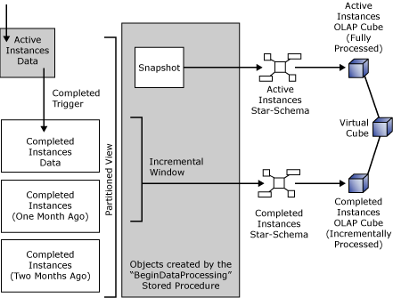

# Scheduled Aggregations
BAM bases scheduled aggregations on dynamically generated OLAP cubes and Data Transformation Services (DTS) packages. The data in scheduled aggregations represents a snapshot of your business activities when you start your DTS package. To achieve this, the first step of the DTS package for analysis is a call to the stored procedure **bam_Metadata_BeginAnalysis** that will retrieve a snapshot consisting of:  
  
- A snapshot copy of all activity instances in progress  
  
- A view that represents an incremental window on the completed activity instances from the moment that you ran the DTS package for the last time to the moment of the snapshot  
  
  BAM achieves this by taking an exclusive lock on the Activity Storage for a very short time, thus preventing any data writing at the same time. Once BAM takes the snapshot, the DTS package might take a long time to run, but BAM will ignore any new data that arrives during the processing. The following figure illustrates this activity:  
  
    
  BAM Scheduled Aggregations  
  
  In the figure, BAM moves data about the completed activity instances to the Completed Instances OLAP cube. BAM incrementally processes this cube.  
  
  At the same time, BAM moves the data about the activities still in progress to the Active Instances cube, which the DTS package fully processes. This is acceptable, because BAM assumes that only a relatively small number of activities are in progress at any given moment.  
  
  Data for the scheduled aggregations is available from a virtual cube that hides the difference between the completed and current activities. For more information, see [Querying Scheduled Aggregated Data](../core/querying-scheduled-aggregated-data.md).  
  
## See Also  
 [What Is an Aggregation?](../core/what-is-an-aggregation.md)