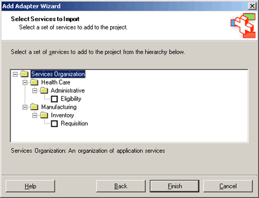

# Schema Categories in the Add Adapter Metadata Wizard

## Overview
> [!NOTE]
>  This topic is only for static adapters that implement the **IStaticAdapterConfig** interface.  
  
 An adapter may use any one of thousands of schemas to transform data before passing it to [!INCLUDE[btsBizTalkServerNoVersion](../includes/btsbiztalkservernoversion-md.md)]. When adding metadata to a BizTalk project, use the Add Adapter Metadata Wizard to select a schema from a list of all the schemas with which the adapter interacts.  
  
 In the sample file adapter, the CategorySchema.xml file is a schema instance that is used in conjunction with the Adapter Framework's BiztalkAdapterFramework.xsd file to populate a tree-view organization of service schemas.  The BizTalkAdapterFramework.xsd file is located in the [!INCLUDE[btsBiztalkServerPath](../includes/btsbiztalkserverpath-md.md)]Developer Tools folder.  
  
 You should create this file so that it organizes the schemas in a manner that is intuitive to your solution. The existing categories in CategorySchema.xml are just an example of what you can do in your own tree. The categories do not have any particular relevance to the data that is passed by the sample adapter. The organization of the schemas is particularly important with application-specific adapters, where thousands of different schemas may be available. For transport-specific adapters, this tree-view organization is unnecessary.  
  
 The following figure shows the **Select Services to Import** page in the Add Adapter Metadata Wizard.  
  
   
Tree view of the schema categories in the Add Adapter Metadata Wizard  


## Sample XML
  
 The following code shows the CategorySchema.xml file:  
  
```  
<?xml version="1.0" encoding="utf-8" ?>  
<CategoryTree>  
     <DisplayName>Services Organization</DisplayName>  
     <DisplayDescription>An organization of application services</DisplayDescription>  
     <CategoryTreeNode>  
          <DisplayName>Health Care</DisplayName>  
          <Description>Services under Health Care</Description>  
          <CategoryTreeNode>  
               <DisplayName>Administrative</DisplayName>  
               <Description>Administrative Health Care Services</Description>  
               <ServiceTreeNode>  
                    <DisplayName>Eligibility</DisplayName>  
                    <Description>Eligibility Verification Transactions</Description>  
                    <WSDLReference>ANSI X 12 270</WSDLReference>  
               </ServiceTreeNode>  
          </CategoryTreeNode>  
     </CategoryTreeNode>  
     <CategoryTreeNode>  
          <DisplayName>Manufacturing</DisplayName>  
          <Description>Manufacturing Services</Description>  
          <CategoryTreeNode>  
               <DisplayName>Inventory</DisplayName>  
               <Description>Inventory Services</Description>  
               <ServiceTreeNode>  
                    <DisplayName>Requisition</DisplayName>  
                    <Description>Requisition</Description>  
                    <WSDLReference>RequisitionService</WSDLReference>  
               </ServiceTreeNode>  
          </CategoryTreeNode>  
     </CategoryTreeNode>  
</CategoryTree>  
```  
  
 The following node types appear in this schema instance:  
  
- **CategoryTree.** Top-level structure of a model of system information. Contains zero or more of the CategoryTreeNode, ExpandableCategoryTreeNode, and ServiceTreeNode nodes.  
  
- **CategoryTreeNode.** Contains zero or more CategoryTreeNode and ServiceTreeNode nodes. Use the CategoryTreeNode that appears as a folder in the user interface (UI) to group a set of related services. Typically this contains a display name and description of the services to be displayed. An adapter might use a CategoryTreeNode if the number of child nodes is small.  
  
- **ExpandableCategoryTreeNode.** A leaf node that is dynamically populated when expanded. The ExpandableCategoryTreeNode is used as a placeholder and appears as a folder in the UI. This can be used to defer populating a category node with subelements until the user clicks to expand the node. An adapter might use an ExpandableCategoryTreeNode if a category contains a large number of child nodes.  
  
- **ServiceTreeNode.** A ServiceTreeNode appears as a document, or leaf node, in the UI and represents a Web Services Description Language (WSDL) file.  
  
  When a user clicks the folder to expand a node, the Adapter Framework calls the **IStaticAdapterConfig.GetServiceOrganization** method on the adapter passing the name of the node as the value of the **NodeIdentifier** attribute. The adapter should return a CategoryTree containing the subnodes to add under the ExpandableCategoryTreeNode. The Adapter Framework replaces the ExpandableCategoryTreeNode with a CategoryTreeNode and adds to it the children of the returned CategoryTree.  
  
> [!NOTE]
>  In the initial call to **IStaticAdapterConfig.GetServiceOrganization** the Adapter Framework passes null for the node identifier. This tells the adapter to return the root-level CategoryTree.  
  
 Below is the category tree schema extracted from the BiztalkAdapterFramework.xsd file. This is used by the Add Adapter Metadata Wizard as the skeleton tree with which to populate with specific application-dependent entities from an XML file. In our example that file is the CategorySchema.xml file.  
  
```  
<!-- Service Organization Tree schema used by Add Adapter Wizard -->  
    <xs:element name="CategoryTree" type="CategoryTree" />  
    <xs:complexType name="CategoryTree">  
        <xs:sequence>  
            <xs:element name="DisplayName" type="xs:string" />  
            <xs:element name="DisplayDescription" type="xs:string" />  
            <xs:choice minOccurs="0" maxOccurs="unbounded">  
                <xs:element name="ExpandableCategoryTreeNode" type="ExpandableCategoryTreeNode" minOccurs="0" maxOccurs="unbounded" />  
                <xs:element name="CategoryTreeNode" type="CategoryTreeNode" minOccurs="0" maxOccurs="unbounded" />  
                <xs:element name="ServiceTreeNode" type="ServiceTreeNode" minOccurs="0" maxOccurs="unbounded" />  
            </xs:choice>  
        </xs:sequence>  
    </xs:complexType>  
    <xs:complexType name="ExpandableCategoryTreeNode">  
        <xs:sequence>  
            <xs:element name="DisplayName" type="xs:string" />  
            <xs:element name="Description" type="xs:string" />  
        </xs:sequence>  
        <xs:attribute name="NodeIdentifier" type="xs:string" use="required"></xs:attribute>  
    </xs:complexType>  
    <xs:complexType name="CategoryTreeNode">  
        <xs:sequence>  
            <xs:element name="DisplayName" type="xs:string" />  
            <xs:element name="Description" type="xs:string" />  
            <xs:choice minOccurs="0" maxOccurs="unbounded">  
                <xs:element name="ExpandableCategoryTreeNode" type="ExpandableCategoryTreeNode" minOccurs="0" maxOccurs="unbounded" />  
                <xs:element name="CategoryTreeNode" type="CategoryTreeNode" minOccurs="0" maxOccurs="unbounded" />  
                <xs:element name="ServiceTreeNode" type="ServiceTreeNode" minOccurs="0" maxOccurs="unbounded" />  
            </xs:choice>  
        </xs:sequence>  
    </xs:complexType>  
    <xs:complexType name="ServiceTreeNode">  
        <xs:sequence>  
            <xs:element name="DisplayName" type="xs:string" />  
            <xs:element name="Description" type="xs:string" />  
            <xs:element name="WSDLReference" type="xs:string" />  
        </xs:sequence>  
    </xs:complexType>  
</xs:schema>  
```  
  
 After modifying your CategorySchema.xml file, rebuild the AdapterManagement project, and then run the Add Adapter Metadata Wizard to ensure that the tree represented in CategorySchema.xml appears correctly.  
  
 For information about running the Add Adapter Metadata Wizard, see the **Add Adapter Metadata Wizard Dialog Box** [!INCLUDE[ui-guidance-developers-reference](../includes/ui-guidance-developers-reference.md)].