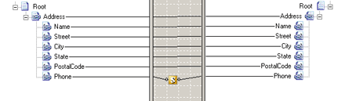

# Scripting Functoid
The **Scripting** functoid enables you to use custom script or code at run time to perform functions otherwise not available. For example, you can call a .NET assembly at run time by using the **Scripting** functoid and writing your own custom functions.  
  
 The **Scripting** functoid supports the following languages:  
  
- C# .NET  
  
- JScript .NET  
  
- Visual Basic .NET  
  
- Extensible Stylesheet Language Transformations (XSLT)  
  
- XSLT Call Templates  
  
  Another significant difference between the current **Scripting** functoid and earlier versions is that the script need no longer be created and stored in the functoid itself. Instead, you can create the script in a separate .NET assembly and reference the assembly through the **Script** property. Having the script in a separate assembly enables you to use the same script in more than one map. Additionally, you may be able to purchase **Scripting** functoid assemblies from third-party vendors.  
  
  You can use **Scripting** functoids created in previous versions of BizTalk Mapper with the current version of BizTalk Mapper. However, you must migrate the functoids first. For more information about how to migrate **Scripting** functoids, see [Migrating Functoids](../core/migrating-functoids.md).  
  
  When you add a **Scripting** functoid to a map, you need to configure the script the functoid uses. If you select a **Scripting** functoid, the **Script** property is enabled in the **Properties** window. If you click the ellipsis (**...**) button for this property, the **Configure Scripting Functoid** dialog box opens. Alternatively, you can double-click the **Scripting** functoid.  
  
  The following table shows the fields of this dialog box.  
  
|Configure Scripting Functoid dialog box field|Description|  
|---------------------------------------------------|-----------------|  
|**Select script type**|Use this field to select the type of script you want to use in this **Scripting** functoid.   Values:   -   **External Assembly**. Use this value if you want to associate the **Scripting** functoid with an assembly in the global assembly cache (GAC). **Warning:**      The code in the external assembly must be thread-safe. Under stress conditions, multiple instances of a map may be running concurrently. -   **Inline C#**.  Use this value if you want to associate the **Scripting** functoid with C# code in the **Inline script** buffer. -   **Inline JScript .NET**. Use this value if you want to associate the **Scripting** functoid with JScript .NET script in the **Inline script** buffer. -   **Inline Visual Basic .NET**. Use this value if you want to associate the **Scripting** functoid with Visual Basic .NET code in the **Inline script** buffer. -   **Inline XSLT**. Use this value if you want to associate the **Scripting** functoid with XSLT in the **Inline script** buffer. -   **Inline XSLT Call Template**. Use this value if you want to associate the **Scripting** functoid with XSLT call templates in the **Inline script** buffer.|  
|**Script assembly**|Select the assembly to associate with the **Scripting** functoid. Only assemblies referenced in the Project window appear in this list. Note also that you must register assemblies in the GAC.   This field is only available when **Select script type** is set to **External Assembly**.|  
|**Script class**|Select the class within the chosen assembly that you want this **Scripting** functoid to use.   This field is only available when **Select script type** is set to **External Assembly**.|  
|**Script method**|Select the method within the chosen class that you want this **Scripting** functoid to use. **Note:**  Make sure the number of input parameters expected by the method matches the number of input parameters specified in the **Configure Scripting Functoid** dialog box.|  
|**Inline script**|Write or copy the inline script to be used into this text box. Valid languages and scripts include: C#, JScript .NET, Visual Basic .NET, XSLT, and XSLT call templates.   This field is only available when **Select script type** is set to one of the **Inline** settings. **Caution:**  Avoid using the same method signature more than once. When several Scripting functoids have the same method signature, BizTalk selects the first implementation and disregards the others.|  
  
 The following figure shows how the **Scripting** functoid appears in a map using the C# .Net script to reformat a telephone number.  
  
   
Scripting Functoid Map  
  
## In This Section  
  
-   [Scripting Using External Assemblies](../core/scripting-using-external-assemblies.md)  
  
-   [Scripting Using Inline C#, JScript .NET, and Visual Basic .NET](../core/scripting-using-inline-csharp-jscript-net-and-visual-basic-net.md)  
  
-   [Scripting Using Inline XSLT and XSLT Call Templates](../core/scripting-using-inline-xslt-and-xslt-call-templates.md)