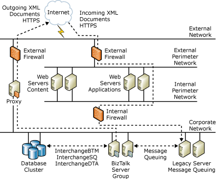

# Security Case Studies: Company A
Company A is a major supplier of material and services to the industrial sector. Its business model relies on electronic transactions with key customers and suppliers. Company A uses Microsoft BizTalk Application to manage transactions and communications between internal and external environments.  
  
## Potential Threats and Security Concerns  
 Company A wants to make sure that it processes only messages from authenticated sources. Some of the documents BizTalk Server processes can contain sensitive information such as financial and personnel data. Company A verifies each incoming message by using custom cryptographic APIs. It has also built its physical architecture to handle its security needs.  
  
 Company A uses file transfer protocol (FTP) for some of its message traffic. Although FTP is inherently not secure, Company A accepts the associated risks because it has many firewalls to help secure other outward-facing applications. Because Company A receives some of its incoming data through HTTPS, it is concerned about denial of service (DoS) attacks from external sources. If a DoS attack does occur, the company has mechanisms to alert the appropriate people immediately.  
  
## Security Architecture  
 The following figure shows the security architecture that Company A uses. Notice that it has segmented its environment with firewalls to help protect its front-end application and content servers, its back-end database and business logic servers, and its outgoing message infrastructure.  
  
 **Figure 1 Company A security architecture**  
  
   
  
 Company A has two main methods to send and receive information to and from BizTalk Server. The first method uses FTP. Company A supports electronic data interchange (EDI) transactions by using a third-party translation service provider to communicate with its suppliers and partners. This third-party translation service provider handles incoming and outgoing orders that BizTalk Server must process in an EDI format.  
  
 The second method that Company A uses is HTTPS. Company A also works with a third-party service provider that serves as a hub for its industry and makes the purchase and sale of products Company A sells and consumes easier.  
  
## Secure Digital Certificates  
 Company A implements its own secure digital certificates. It manages only a few certificates. Because it uses a third-party service provider, it is less concerned about digital certificates. Company A realizes that digital certificates are a greater concern for the service provider, because the service provider interacts with many different institutions.  
  
## See Also  
 [Security Case Studies for Small & Medium-Sized Companies](../core/security-case-studies-for-small-to-medium-sized-companies.md)    
 [Sample Scenarios for Threat Model Analysis](../core/sample-scenarios-for-threat-model-analysis.md)