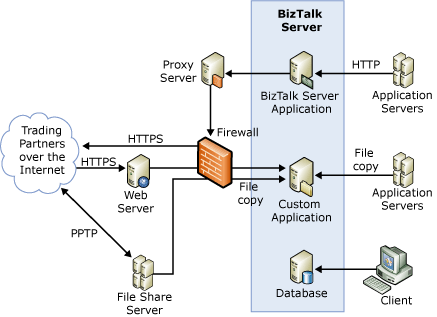

# Security Case Studies: Company B
Company B is a software company. Its business model relies on electronic transactions with key customers and suppliers. Company B uses a [!INCLUDE[btsBizTalkServerNoVersion](../includes/btsbiztalkservernoversion-md.md)] implementation for its transactions.  
  
 Company B uses [!INCLUDE[btsBizTalkServerNoVersion](../includes/btsbiztalkservernoversion-md.md)] to manage transactions and communications between internal and external applications. Company B communicates with approximately 85 internal applications and 2300 trading partners. It currently processes approximately 2.5 million documents per month, and estimates that it will process 6 million documents per month by the end of 2007.  
  
## Potential Threats and Security Concerns  
 Company B wants to make sure that it receives and processes only messages from authenticated sources. Company B also wants to make sure that it can receive and retrieve documents from outside its corporate network as safely as possible. The firewall that separates Company B's corporate network from the Internet only lets through traffic from port 80 and port 443. The firewall rejects all other traffic.  
  
## Security Architecture  
 The following figure shows the architecture that Company B uses. Company B uses BizTalk Server as a message broker to communicate between internal applications and to process, send, and receive correctly formatted messages to and from its suppliers and customers. Company B has to process internal and external documents in different formats. This includes flat files and XML documents.  
  
 **Figure 1 Company B security architecture**  
  
   
  
 Company B uses a single firewall to separate its corporate computers from the Internet. As an added layer of security, Company B incorporates Internet Protocol security (IPsec) communication between all its corporate servers and workstations that reside within the corporate network. Company B uses IPsec to encrypt all communications within its internal domain.  
  
 Company B uses a file share server to receive flat files. This file share server resides outside its corporate network and domain. A firewall separates the file share server from the corporate network. Company B's external partners post their flat file documents on this file share server, and they communicate with the file share server through an encrypted Point-to-Point Tunneling Protocol (PPTP) pipeline. Company B protects access to the file share server by partner passwords that expire every 30 days.  
  
 Company B has created a custom file-movement application that retrieves the flat file documents from the file share server and sends them to BizTalk Server for additional processing. The internal applications for Company B also use the custom file-movement application to pass flat files to BizTalk Server. BizTalk Server transforms these documents and sends them to Company B's trading partners.  
  
 Before BizTalk Server transforms the partner data to the internal application formats, it validates that it has an entry for the sender, receiver, and document type. If BizTalk Server receives a message for which it does not have an entry for either the sender, receiver, or document type, BizTalk Server rejects the message, and the operations team of Company B review the message. The internal applications send messages in a variety of formats that include EDIFACT, flat file, XML, and ANSI X12.  
  
 Company B also receives documents through HTTPS from internal and external sources. External partners post their documents to a Web server outside the corporate network. A firewall separates this Web server from the corporate network. The custom file-movement application also retrieves the documents posted through HTTPS. Company B uses a third-party product to encrypt and sign messages to its trading partners. As an additional piece of security, Company B performs a nightly audit on all the servers to make sure they have the correct security settings. Company B logs all exceptions for review.  
  
## See Also  
 
 [Security Case Studies for Small & Medium-Sized Companies](../core/security-case-studies-for-small-to-medium-sized-companies.md)   
 
 [Sample Architectures for Small & Medium-Sized Companies](../core/sample-architectures-for-small-medium-sized-companies.md)