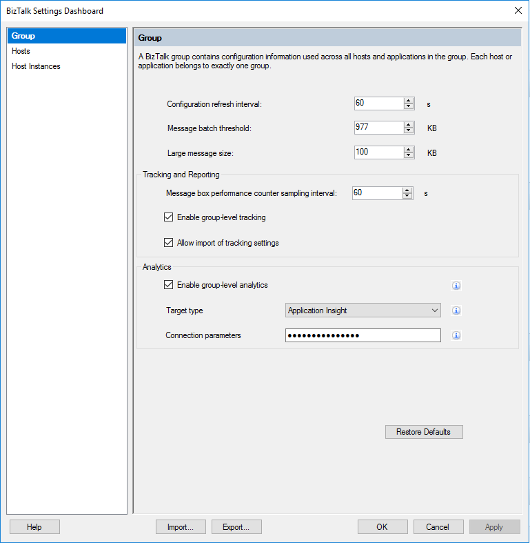
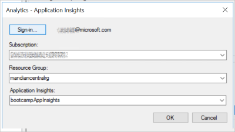
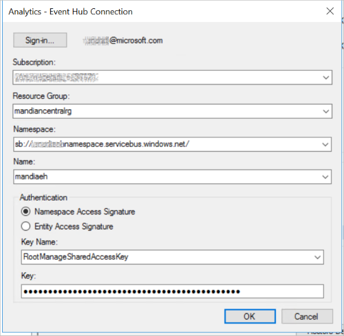
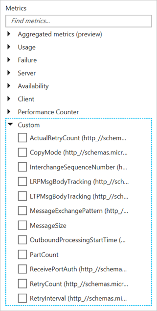

# Send BizTalk Server tracking data to Azure

Leverage the power of Azure (Application Insights and Azure Event Hubs) to monitor your BizTalk applications.

## Prerequisites

* To send your tracking data to Application Insights, create a new instance of [Application Insights](https://docs.microsoft.com/azure/application-insights/app-insights-create-new-resource). BizTalk Server uses the **Instrumentation Key** to authenticate.
* To send your tracking data to Azure Event Hubs, create an [Azure Event Hubs namespace and event hub](https://docs.microsoft.com/azure/event-hubs/event-hubs-create). BizTalk Server uses the SAS (namespace-level) or event hub-level policy to authenticate.

## Enable analytics for your environment

1. Open the **BizTalk Server Administration** console, right-click the **BizTalk Group**, and select **Settings**.
2. Check **Enable group-level analytics**.
3. For the **Target type**, select **Application Insight** or **Event Hub** from the list.

    > [!div class="mx-imgBorder"]
    > 

4. For the **Connection parameters**, select the **...** button, and **Sign-in** to your Azure account.

    **For Application Insights**  
    Select your **Subscription**, **Resource Group**, and your Application Insights instance.

    > [!div class="mx-imgBorder"]
    > 

    **For Event Hub**  
    Select your **Subscription**, **Resource Group**, Event Hub namespace, and event hub. For authentication, you can use an access signature (SAS) at the namespace-level, or entity signature at the event hub-level. Your available keys are auto-populated with the values previously configured within [Azure](https://portal.azure.com).

    > [!div class="mx-imgBorder"]
    > 

5. Select **OK** to save your changes. 

Once enabled, [!INCLUDE[btsBizTalkServerNoVersion_md](../includes/btsbiztalkservernoversion-md.md)] is ready to transmit data to your Azure resource. Next, enable analytics on your ports and orchestrations. 

## Enable analytics on your artifacts

1. In BizTalk Server Administration, right-click a **receive port**, **send port** or **orchestration**, and select **Tracking**.
2. Under **Analytics**, check **Enable Analytics**, similar to the following. This setting starts tracking and transmitting data from the artifact to your Azure resource.

    > [!div class="mx-imgBorder"]
    > 

3. Select **OK** to save your changes.
4. Restart the tracking host Instance, and confirm the BizTalk Application is started.

> [!TIP]
> Connect your BizTalk Server Analytics with other systems to gain even more insight into your organizations data.

## View your data

#### Use Application Insights

Once the data is sent to Application Insights, you can use the analytics tools within Azure to create advanced queries, and analyze your data.

1. Sign in to the [Azure Portal](https://portal.azure.com).
2. Open your Application Insights resource, and select **Metrics Explorer**.
3. Empty charts may display. In a chart, select **Edit**. Under **Metrics**, select **Custom** to see the available tracked properties. Select some of the different options to see the changes on your chart: 

    > [!div class="mx-imgBorder"]
    > 

4. Go back to your Application Insights resource, and select **Analytics**. In **Usage**, select **Run**. A sample query is executed, and the results are displayed in a chart.  

> [!TIP]
> Azure Application Insights is a powerful tool. There are resources to help you write queries in Application Insights at [Analytics in Application Insights](https://docs.microsoft.com/azure/application-insights/app-insights-analytics), and even to get started at [What is Application Insights?](https://docs.microsoft.com/azure/application-insights/app-insights-overview).

#### Use Event Hubs

Once the data is sent to Event Hubs, there are a couple of ways to see the data. Many Event Hubs users are using Event Hubs Capture to load streaming data into Azure. The intent is for you to focus on data processing, rather than on data capture. [Event Hubs Capture](https://docs.microsoft.com/azure/event-hubs/event-hubs-capture-overview) explains how it works, and how to set it up.

Another option is to create a receive port and receive location using the Event Hub Adapter. Then, you can output the data to a folder. This idea may be best if you want to test the scenario. [Event Hubs adapter](event-hubs-adapter.md) lists the steps to receive messages into BizTalk Server from Event Hubs.

## Where the data is stored

Your tracking data should display fairly quickly (within a few minutes) within your Azure resources. If it doesn't, then there may be an issue with the tracking host. In SQL Server, the Analytics data is stored in the BizTalkMsgBoxDb database, in the TrackingData_2_*x* tables. In SQL Server Management Studio, return the top 1000 rows on these four tables. If the data is there, then the tracking host is not moving the data to the BizTalkDTADb database. 

Some possible resolutions:

1. Restart the tracking host.
2. Create a dedicated tracking host. When BizTalk Server is installed, tracking may be enabled on the **BizTalk Server Application 1** host. Typically, this application is also used to process messages. Create a dedicated tracking host using the following steps: 

    1. In BizTalk Server Administration, open the properties of the BizTalk Server Application 1 host, and uncheck **Allow Host Tracking**. Restart this host instance.

    2. Create a new host named **Tracking**, and check **Allow Host Tracking**. Create a host instance, and start it.

Now, query the BizTalkMsgBoxDb TrackingData_2_x tables again. If the tables are empty, then the data was moved, and should start displaying in Application Insights.

## See also

 [Configure the Power BI operational data feed in BizTalk Server](../core/configure-the-operational-data-feed-for-power-bi-with-biztalk-server.md)
 
 [Application Insights](https://docs.microsoft.com/azure/azure-monitor/app/app-insights-overview)
 
 [Azure Event Hubs](https://docs.microsoft.com/azure/event-hubs/event-hubs-about)
