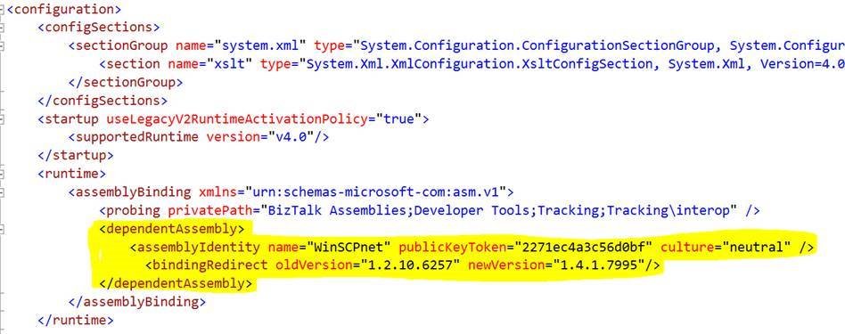

# SFTP Adapter
BizTalk Server includes an **SFTP** adapter to send and receive messages from a secure FTP server using the SSH file transfer protocol. This topic includes the steps to configure an **SFTP** receive location, and configure an SFTP send port to receive and send messages from a secure FTP server. It also includes common questions and answers.

## Prerequisites

Starting with BizTalk Server 2016, the SFTP adapter connects to SFTP by using the WinSCP library, which supports a larger range of SFTP servers.

1. Visit the [WinSCP website](https://winscp.net/eng/downloads.php) and find the **.NET assembly / COM library** section, or visit the [SourceForge downloads website](https://sourceforge.net/projects/winscp/files/WinSCP/) for older versions. 

1. Make sure to use the supported WinSCP versions for each BizTalk Server version:
 * BizTalk Server 2020 CU6 - WinSCP version [6.3.5](https://sourceforge.net/projects/winscp/files/WinSCP/6.3.5/WinSCP-6.3.5-Automation.zip/download)
 * BizTalk Server 2020 CU5 - WinSCP version [6.1.2](https://sourceforge.net/projects/winscp/files/WinSCP/6.1.2/WinSCP-6.1.2-Automation.zip/download)
 * BizTalk Server 2020 CU3 or CU4 - WinSCP version [5.19.2](https://sourceforge.net/projects/winscp/files/WinSCP/5.19.2/WinSCP-5.19.2-Automation.zip/download)
 * BizTalk Server 2020 CU1 or CU2 - WinSCP version [5.17.6](https://sourceforge.net/projects/winscp/files/WinSCP/5.17.6/WinSCP-5.17.6-Automation.zip/download)
 * BizTalk Server 2020 RTM - WinSCP version [5.15.4](https://sourceforge.net/projects/winscp/files/WinSCP/5.15.4/WinSCP-5.15.4-Automation.zip/download)
 * BizTalk Server 2016 CU9 - WinSCP version [5.19.2](https://sourceforge.net/projects/winscp/files/WinSCP/5.19.2/WinSCP-5.19.2-Automation.zip/download)
 * BizTalk Server 2016 CU7 or CU8 - WinSCP version [5.15.9](https://sourceforge.net/projects/winscp/files/WinSCP/5.15.9/WinSCP-5.15.9-Automation.zip/download)
 * BizTalk Server 2016 CU5 or CU6 - WinSCP version [5.13.1](https://sourceforge.net/projects/winscp/files/WinSCP/5.13.1/WinSCP-5.13.1-Automation.zip/download)
 * BizTalk Server 2016 RTM to CU4 - WinSCP version [5.7.7](https://sourceforge.net/projects/winscp/files/WinSCP/5.7.7/WinSCP-5.7.7-Automation.zip/download)

1. Download the correct **WinSCP-version-Automation.zip** file onto the BizTalk runtime servers.

1. Extract the **WinSCP-version-Automation.zip** contents, which contains WinSCP.exe and WinSCPnet.dll, to the BizTalk installation folder. (%BTSINSTALLPATH%)

For more information, see the following documentation:

- [Hardware and Software Requirements for BizTalk 2020](../install-and-config-guides/hardware-and-software-requirements-for-biztalk-server-2020.md)
- [Hardware and Software Requirements for BizTalk 2016](../install-and-config-guides/hardware-and-software-requirements-for-biztalk-server-2016.md)

> [!NOTE]
>
> BizTalk Server 2013 and BizTalk Server 2013 R2 use the older internal SSH library, which has limited SFTP server compatibility compared to WinSCP.

## Configure the receive location

> [!NOTE]
>  Before creating the receive location, you must have already added a one-way receive port. See [Create a Receive Port](../core/how-to-create-a-receive-port.md) for the specific steps.


1.  In the BizTalk Server Administration console, expand BizTalk Server, expand **BizTalk Group**, expand **Applications**, and then expand the application under you want to create a receive location.

2.  In the left pane, click the **Receive Ports** node and in the right pane, right-click the receive port with which you want to associate the new receive location, and then click **Properties**.

3.  In the left pane of the **Receive Port Properties** dialog box, select **Receive Locations**, and in the right pane click **New** to create a new receive location.

4.  In the **Receive Location Properties** dialog box, in the **Transport** section, select **SFTP** from the **Type** drop-down list, and then click **Configure** to configure the transport properties for the receive location.

5.  In the **SFTP Transport Properties**, do the following:

     **Others**

    | Use this | To do this |
    |--------------|----------------|
    | Connection Limit | Specify the maximum number of concurrent connections that can be opened to the server.<br /><br /> This setting is per server and per receive location. Consider the following scenarios:<br /><br /> - There are two receive locations that have the same configuration property values, including the ConnectionLimit property set to the same value. For example, the property is set to 6. In this situation, there is one connection pool (with 6 available connections) that is used by both receive locations.<br /><br /> - There are two receive locations configured with same configuration values, and have the ConnectionLimit property set to different values. For example, ReceiveLocation1 property is set to 6 and ReceiveLocation2 property is set to 5. In this situation, each receive location has its own connection pool with its own available connections. ReceiveLocation1 connection pool has 6 available connections. ReceiveLocation2 connection pool has 5 available connections. |
    | Log | Available starting with BizTalk Server 2016. <br/><br/>Enter the full path to create a client-side log file. Use this log file to troubleshoot any errors. |
    | Maximum Connection Reuse Time In Seconds | Available starting with BizTalk Server 2016 CU 7. <br/><br/>The maximum connection reuse time allows connections to be gracefully closed and removed from the pool after a connection has been in use for a specific amount of time. A value is 0 or less indicates that this behaviour is disabled. |
    | Transfer Mode | The WinSCP transfer mode. Available starting with BizTalk Server 2020 CU 3. Binary is the default mode. You can also select ASCII or Automatic. <br><br>Binary mode works in most scenarios, but in certain UNIX mainframe text file transfer scenarios, you might need to use ASCII mode for proper line end conversion. |

     **Polling**

    | Use this | To do this |
    |--------------|----------------|
    | Enable Timestamp Comparison | Available starting with BizTalk Server 2016 cumulative update 6. <br/><br/>If **Retain After Download** is set to True, this property determines whether a change in file timestamp will trigger a re-download of the file.<br /><br /> **Default value:** False |
    | Polling Interval | Specify the intervals at which the adapter polls the server. To poll continuously, set this value to zero.<br /><br /> **Default value:** 5 |
    | Redownload Interval | Available starting with BizTalk Server 2016 cumulative update 6. <br/><br/>Specifies interval after which the file will be downloaded again. Applicable if **Retain After Download** is True and **Enable Timestamp Comparison** is set to False. If set to -1, the file will not be downloaded again.<br /><br /> **Default value:** 0 <br /><br /> -1 indicates that the adapter will not download files again.<br /><br /> 0 indicates that the adapter will download the file in each polling cycle. |
    | Retain After Download | Available starting with BizTalk Server 2016 cumulative update 6. <br/><br/>Specifies whether the adapter will retain a file from the SFTP server after downloading it.<br/><br> **Default value:** False |
    | Unit | Specifies the unit in which the polling interval is specified, for example, Seconds, Minutes, Hours, or Days.<br /><br /> **Default value:** Seconds |  

     **Proxy** (Available starting with BizTalk Server 2013 R2)

    | Use this | To do this |
    |--------------|----------------|
    | Address | Specifies either the DNS name or the IP address of the proxy server. |
    | Password | Specifies the password for the proxy server. |
    | Port | Specifies the port for the proxy server. |
    | Type | Specifies the protocol used by the proxy server. |
    | UserName | Specifies the username for the proxy server. |

     **Security**

    | Use this | To do this |
    |--------------|----------------|
    | Accept Any SSH Server Host Key | When **True**, the receive location accepts any SSH public host key from the server. When **False**, the receive location uses the fingerprint of the server for authentication. You enter the fingerprint in the **SSHServerHostKeyFingerPrint** property.<br /><br /> **Default value:** False |
    | Client Authentication Mode | Select the authentication method that the receive location uses for authenticating the client to the SSH Server. If set to **Password**, you must enter the value in the **Password** property. If set to **PublicKeyAuthentication**, you must enter the private key of the user in the **PrivateKey** property. If set to **MultiFactorAuthentication** you must enter **Username** with its **Password** and **PrivateKey**. Additionally, if the private key is protected by a password, enter the password as well for the **PrivateKeyPassword** property.<br /><br /> **Default value:** Password |
    | Encryption Cipher | Available starting with BizTalk Server 2013 R2. <br/><br/>Enter the kind of encryption cipher.<br/><br/>BizTalk Server 2013 R2 options: Auto, AES, and TripleDES<br/><br/>BizTalk Server 2016 options: Auto, AES, Arcfour, Blowfish, TripleDES, and DES |
    | Key Exchange Algorithm Selection Policy | Available starting with BizTalk Server 2016 cumulative update 6. <br/><br/>Specify comma-separated list of KEX preference order. Token WARN is used to delimit substandard KEXes. Anything after WARN will not be used by BizTalk SFTP adapter. Example: ecdh,dh-gex-sha1,dh-group14-sha1,rsa,WARN,dh-group1-sha1. Visit WinSCP website for latest information. |
    | Password | Specify the SFTP user password if you set the **ClientAuthenticationMode** to **Password**. |
    | Private Key | Specify the private key for the SFTP user if you set the **ClientAuthenticationMode** to **PublicKeyAuthentication**.<br /><br /> **Note:** The private key file must be the specified .ppk file. |
    | Private Key Password | Specify a private key password, if required for the key specified in the **PrivateKey** property. |
    | SSH Server Host Key FingerPrint | Specifies the fingerprint of the public host key for the SSH server. |
    | SSO Affiliate | Available starting with BizTalk Server 2020. <br/><br/> Specify the Enterprise Single Sign-On affiliate application. |
    | User Name | Specifies a username to log on to the SFTP server.|

     **SSH Server**

    | Use this | To do this|
    |--------------|----------------|
    | File Mask | Specifies the file mask to use when retrieving files from a secure FTP server. To improve performance, be more specific to avoid attempting to download other protected files.|
    | Folder Path | Specifies the folder path on the secure FTP server from where the receive location can retrieve files. To improve performance, avoid using folders with lots of files which you don't receive.|
    | Port | Specifies the port address for the secure FTP server on which the file transfer takes place.|
    | Server Address | Specifies the server name or IP address of the secure FTP server.|

6.  Click **OK**.

7.  Enter the appropriate values in the **Receive Location Properties** dialog box to complete the configuration of the receive location and click **OK** to save settings. For information about the **Receive Locations Properties** dialog box, see [Create a Receive Location](../core/how-to-create-a-receive-location.md).

## Configure the send port

1.  In the BizTalk Server Administration console, create a new send port or double-click an existing send port to modify it. For more information, see [Create a Send Port](../core/how-to-create-a-send-port2.md). Configure all of the send port options and specify **SFTP** for the **Type** option in the **Transport** section of the **General** tab.

2.  On the **General** tab, in the **Transport** section, click the **Configure** button.

3.  In the **SFTP Transport Properties**, enter the following:

    **Others**

    | Use this | To do this|
    |--------------|----------------|
    | Connection Limit | Specify the maximum number of concurrent connections that can be opened to the server.|
    | Log |  Available starting with BizTalk Server 2016. <br/><br/>Enter the full path to create a client-side log file. Use this log file to troubleshoot any errors.|
    | Maximum Connection Reuse Time In Seconds |  Available starting with BizTalk Server 2016 CU 7. <br/><br/>The maximum connection reuse time allows connections to be gracefully closed and removed from the pool after a connection has been in use for a specific amount of time. A value is 0 or less indicates that this behaviour is disabled.|
    | Temporary Folder |  Available starting with BizTalk Server 2013 R2. <br/><br/>A temporary folder on the SFTP server to upload large files to, before they can be atomically moved to the required location on the same server.|

    **Proxy** (available starting with BizTalk Server 2013 R2)

    | Use this | To do this|
    |--------------|----------------|
    | Address | Specifies either the DNS name or the IP address of the proxy server.|
    | Password | Specifies the password for the proxy server.|
    | Port | Specifies the port for the proxy server.|
    | Type | Specifies the protocol used by the proxy server.|
    | User Name | Specifies the username for the proxy server.|

    **Security**

    | Use this | To do this|
    |--------------|----------------|
    | Access Any SSH Server Host Key | When **True**, the send port accepts any SSH public host key from the server. When **False**, the port matches the host key with the key specified in the **SSHServerHostKey** property.<br /><br /> **Default value:** False|
    | Client Authentication Mode | Specifies the authentication method that the send port uses for authenticating the client to the SSH Server. If set to **Password**, you must enter the value in the **Password** property. If set to **PublicKeyAuthentication**, you must enter the private key of the user in the **PrivateKey** property. If set to **MultiFactorAuthentication** you must provide **Username** with its **Password** and **PrivateKey**. Additionally, if the private key is protected by a password, enter the password as well for the **PrivateKeyPassword** property.<br /><br /> **Default value:** Password|
    | Encryption Cipher  |  Available starting with BizTalk Server 2013 R2.<br/><br/>Enter the kind of encryption cipher.<br/><br/>BizTalk Server 2013 R2 options: Auto, AES, and TripleDES<br/><br/>BizTalk Server 2016 options: Auto, AES, Arcfour, Blowfish, TripleDES, and DES|
    | Key Exchange Algorithm Selection Policy  | Available starting with BizTalk Server 2016 cumulative update 6. <br/><br/>Specify comma-separated list of KEX preference order. Token WARN is used to delimit substandard KEXes. Example: ecdh,dh-gex-sha1,dh-group14-sha1,rsa,WARN,dh-group1-sha1. Visit WinSCP website for latest information.|
    | Password | Specify the SFTP user password if you set the **ClientAuthenticationMode** to **Password**.|
    | Private Key | Specify the private key for the SFTP user if you set the **ClientAuthenticationMode** to **PublicKeyAuthentication**.|
    | Private Key Password | Specify a private key password, if required for the key specified in the **PrivateKey** property.|
    | SSH Server Host Key Finger Print | Specifies the fingerprint of the server used by the adapter to authenticate the server if the **AccessAnySSHServerHostKey** property is set to **False**. If the fingerprints do not match, the connection fails.|
    | SSO Affiliate | Available starting with BizTalk Server 2020. <br/><br/> Specify the Enterprise Single Sign-On affiliate application.|
    | User name | Specifies a username for the secure FTP server.|

    **SSH Server**

    | Use this | To do this|
    |--------------|----------------|
    | Append If Exists | If the file being transferred to the secure FTP server already exists at the destination, this property specifies whether the data from the file being transferred should be appended to the existing file. If set to **True**, the data is appended. If set to **False**, the file at the destination server is overwritten.<br /><br /> **Default value:** False|
    | Folder Path | Specifies the folder path on the secure FTP server where the file is copied.|
    | Port | Specifies the port address for the secure FTP server on which the file transfer takes place.|
    | Server Address | Specifies the server name or IP address of the secure FTP server.|
    | Target File Name | Specifies the name with which the file is transferred to the secure FTP server. You can also use macros for the target file name.|

4.  Click **OK** and **OK** again to save settings.

## Use a newer WinSCP version

To use a newer version of WinSCP with BizTalk Server, add an assembly redirection so that BizTalk knows the correct assembly to load. You can configure this redirection in the following BizTalk Server configuration files: 
- BTSNTSVC.exe.config (32-bit host instances)
- BTSNTSVC64.exe.config (64-bit host instances)
You can redirect BizTalk 2020 CU6 and later to newer versions. However, due to a breaking change in WinSCP automation after version 6.1.2, you can only redirect BizTalk 2016 (all versions) and BizTalk 2020 before CU6 up to the 6.1.2 version at the latest.

The following includes a sample configuration syntax. Make sure that you replace **`%NEWVERSION%`** with your version of the **WinSCPnet.dll** file:

```
<configuration>
 <runtime>
  <assemblyBinding>
   <dependentAssembly>
    <assemblyIdentity name="WinSCPnet" publicKeyToken="2271ec4a3c56d0bf" culture="neutral" />
    <bindingRedirect oldVersion="1.0.0.0-65535.65535.65535.65535" newVersion="%NEWVERSION%"/><!-- e g 6.1.2 = 1.14.0.13797 (winscpnet.dll version) -->
   </dependentAssembly>
  </assemblyBinding>
 </runtime>
</configuration>
```

When finished, your configuration looks similar to the following:



## Frequently asked questions

| Question | Answer |
|--------------|------------|
| What SFTP servers are supported? | See [Supported SFTP Servers](/archive/technet-wiki/29940.biztalk-server-supported-sftp-servers). Starting with BizTalk Server 2016, the SFTP adapter uses WinSCP to connect to SFTP. As a result, SFTP servers that support WinSCP should work. |
| Can the SFTP Adapter be used with the mutual authentication method (public key and password)? | - Starting with **BizTalk Server 2013 R2**, yes. If set to **MultiFactorAuthentication** you must provide **Username** with its **Password** and **PrivateKey**. Additionally, if the private key is protected by a password, specify the password as well for the **PrivateKeyPassword** property.<br /><br /> - For **BizTalk Server 2013**, either **Password** or **PublicKeyAuthentication** can be used. **MultiFactorAuthentication** is not supported in the SFTP adapter shipped with BizTalk Server 2013. |
| What private key formats are supported? Can the OpenSSH private key format be used? | The SFTP adapter supports only the PuTTY private key file format. PuTTYgen can be used to convert from OpenSSH to the .ppk format. |
| For SSHServerHostKeyFingerPrint, which fingerprint algorithm and format should be used? | You should use the MD5 fingerprint of the server’s key in the format: `ssh-rsa 2048 90:e4:9b:67:d9:22:a7:5f:6f:33:db:6a:b1:23:96:12`. |
| Does the SFTP adapter support 256-bit encryption? | Yes - The SFTP adapter supports 256-bit encryption. The supported encryption algorithms include:<br /><br /> - AES encryption: 256-bit, 192-bit, or 128-bit SDCTR or CBC<br /><br /> - 3DES (Triple-DES) encryption: 168-bit SDCTR or CBC |
| What SSH versions does the adapter support? | Only SSH2. Connection cannot be established with SFTP servers having SSH1 version. |
| Is file mask case sensitive? | No. *.txt and \*.TXT works alike. Please install the latest cumulative update for BizTalk Server 2013. BizTalk Server 2013 RTM release had case-sensitive file masks. |
| Exporting bindings give a blank password field. When trying to create a receive location by importing these bindings what all changes are to be made? | Edit the binding file by editing the password field. Also, in `<Password vt="1">MySecretPassword</Password>`, **vt="1"** indicates a null value. Change that to **vt="8"**, which indicates a string. For example:<br /><br /> `<Password vt="8">MySecretPassword</Password>`<br /><br /> For more details, see [VarEnum Enum](/dotnet/api/system.runtime.interopservices.varenum) |
| How do I specify the file paths? | Normally, paths are specified in the format `/folder/pathname`. However, different servers require different formats, with or without leading or trailing slashes. So, you can also try the following:<br /><br /> -                   `/folder/pathname`<br /><br /> -                   `/folder/pathname/`<br /><br /> -                   `folder/pathname`<br /><br /> -                   `folder/pathname/` |
| What is a good setting for the polling interval? | If you set this interval to a low value, you might get high CPU consumption. The recommendation is that you set this interval to as high a value as possible. Also, take into consideration that if the folder where you're polling has many files, only the DIR listing can take a long time. |
| What is a good setting for Maximum Connection Reuse Time In Seconds? | The recommendation is that you specify a value for this setting, for example, 240 seconds, to release temporary session files. |


