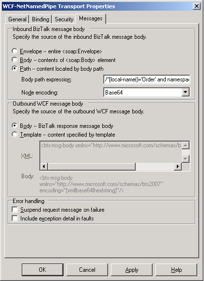
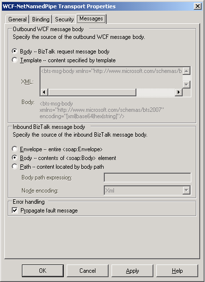

# Specifying the Message Body for the WCF Adapters
You can use the **Messages** tab in the WCF adapters to specify how the BizTalk message body is extracted from an incoming SOAP message, and how the BizTalk message body is placed in an outgoing SOAP message.  

## Specifying How the BizTalk Message Body Is Extracted from an Incoming SOAP Message  
 You can control how to create the inbound BizTalk message body from the SOAP messages incoming through the WCF adapters. The following figures show the **Messages** tabs of the WCF-NetNamedPipe receive adapter and send adapter as examples.  

   

   

 To specify how to create the BizTalk message body, select one of the following options in the **Inbound BizTalk message body** section in the preceding figures:  

- **Envelope -- entire \<soap:Envelope\>**. Uses the SOAP **Envelope** element of an incoming message to create the BizTalk message body part. The entire incoming message becomes the BizTalk message body. Use this option to create the BizTalk message body incorporating all the headers.  

  > [!NOTE]
  >  The SOAP headers are placed in the message context, but they are not promoted automatically. Promotion can be done in a custom pipeline component.  

- **Body -- contents of \<soap:Body\> element**. Uses the content of the SOAP **Body** element of an incoming message to create the BizTalk message body part. If the **Body** element has more than one child element, only the first element becomes the BizTalk message body part.  

- **Path -- content located by body path**. Uses the body path expression in the **Body path expression** text box to create the BizTalk message body part. The body path expression is evaluated against the immediate child element of the SOAP **Body** element of an incoming message. When incoming messages have binary data, you can use this option for the BizTalk message body to include only the binary data without any tags.  

  When the **Path -- content located by body path** option is selected, the **Node encoding** property can be configured to specify the expected encoding type for the node specified by the body path expression in the **Body path expression** text box. If the body path expression matches more than one element, only the first matched element is used.  

> [!NOTE]
>  For the **body path expression** property, only the XPath expressions suitable for forward-only processing of XML are supported. For more information about the XPath expressions available for this property, see "The Best of Both Worlds: Combining XPath with the XmlReader" at [http://go.microsoft.com/fwlink/?LinkID=75701](http://go.microsoft.com/fwlink/?LinkID=75701).  

 If the **Path -- content located by body path** option is selected and the **Node encoding** property is set to **String**, the WCF adapters expect that the matched node has UTF-8 encoded character data. If the incoming messages include escaped character data for the XML special characters such as \< and \>, the WCF adapters restore the escaped character data when creating the BizTalk message body part. For example, if the matched node has escaped character data such as **&lt;FirstName&gt;CONTOSO&lt;/FirstName&gt;** the WCF adapters create **\<FirstName\>CONTOSO\</FirstName\>** in the inbound BizTalk message body.  

 If the **Path -- content located by body path** option is selected and the **Node encoding** property is set to **Hex** or **Base64**, the matched node can have a valid **BinHex** or **Base64** sequence. If the matched node has an invalid sequence, the WCF client receives **FaultException**, an error message is logged in the event log on your BizTalk Server computer, and no message is suspended.  

 If the **Path -- content located by body path** option is selected and the **Node encoding** property is set to **XML**, the WCF adapters create the BizTalk message body with the outer XML of the node selected by the body path expression in the **Body path expression** text box.  

 If the matched node does not have data encoded as specified in the **Node encoding** property, an empty inbound BizTalk message body is created.  

 For example, suppose the WCF send adapters receive the following SOAP message from WCF clients:  

```  
<s:Envelope xmlns:s="http://www.w3.org/2003/05/soap-envelope" xmlns:a="http://www.w3.org/2005/08/addressing">  
  <s:Header>  
    <a:Action s:mustUnderstand="1">http://Microsoft.Samples.BizTalk.NetNamedPipe/OrderProcess/IOrderProcess/OrderRefresh</a:Action>   
    <a:MessageID>urn:uuid:59e74507-66d0-4d50-be70-c3ec248b6f78</a:MessageID>   
    <a:ReplyTo>  
       <a:Address>http://www.w3.org/2005/08/addressing/anonymous</a:Address>   
    </a:ReplyTo>  
    <a:To s:mustUnderstand="1">net.pipe://mycomputer/NetNamedPipeOrderProcessServiceBizTalk</a:To>   
  </s:Header>  
  <s:Body>  
    <Order xmlns="http://Microsoft.Samples.BizTalk.NetNamedPipe/OrderProcess">  
     <OrderDetail>  
       <CustomerID>CONTOSO</CustomerID>   
       <OrderID>00000000</OrderID>   
     </OrderDetail>  
    </Order>  
  </s:Body>  
</s:Envelope>  
```  

 If you configure the **Inbound BizTalk message body** section as shown in the following table, the previous incoming SOAP message becomes the inbound BizTalk message body part.  

|Inbound BizTalk message body|Body path expression|Node encoding|  
|----------------------------------|--------------------------|-------------------|  
|**Envelope -- entire \<soap:Envelope\>**|N/A|N/A|  

 If you configure the **BizTalk message body** section as shown in the following table, the WCF adapters create the inbound BizTalk message body part to contain only the **Order** element in the previous incoming SOAP message.  

|Inbound BizTalk message body|Body path expression|Node encoding|  
|----------------------------------|--------------------------|-------------------|  
|**Body -- contents of \<soap:Body\> element**|N/A|N/A|  

 If you configure the **BizTalk message body** section as shown in the following table, the WCF adapters expect that the incoming node that the body path expression matches will have UTF-8 encoded character data.  

|Inbound BizTalk message body|Body path expression|Node encoding|  
|----------------------------------|--------------------------|-------------------|  
|**Path -- content located by body path**|/*[local-name()='Order']/\*[local-name()='OrderDetail']/\*[local-name()='CustomerID']|**String**|  

 For the previous incoming SOAP message, the WCF adapters use the character data, **CONTOSO**, of the **CustomerID** element to create the inbound BizTalk message body part.  

> [!NOTE]
>  You cannot use the abbreviated syntax of XPath, **/Order/OrderDetail/CustomerID**, for the previous incoming SOAP message. This is because the abbreviated syntax of XPath returns the node not declared in a namespace, and the **CustomerID** element in the previous SOAP message is declared in the **http://Microsoft.Samples.BizTalk.NetNamedPipe/OrderProcess** namespace by default namespaces.  

 If you configure the **BizTalk message body** section as shown in the following table, the **CustomID** element in the previous incoming SOAP message should have a valid **BinHex** or **Base64** sequence.  

|Inbound BizTalk message body|Body path expression|Node encoding|  
|----------------------------------|--------------------------|-------------------|  
|**Path -- content located by body path**|/*[local-name()='Order']/\*[local-name()='OrderDetail']/\*[local-name()='CustomerID']|**Hex** or **Base64**|  

 If you configure the **BizTalk message body** section as shown in the following table, the WCF adapters create the inbound BizTalk message body for the previous incoming SOAP message as shown in the code after the table.  

|Inbound BizTalk message body|Body path expression|Node encoding|  
|----------------------------------|--------------------------|-------------------|  
|**Path -- content located by body path**|/*[local-name()='Order']/\*[local-name()='OrderDetail']/\*[local-name()='CustomerID']|**XML**|  

```  
<CustomerID xmlns="http://Microsoft.Samples.BizTalk.NetNamedPipe/OrderProcess">CONTOSO</CustomerID>   
```  

## Specifying the Source of the Outbound WCF Message Body  
 You can control how to create the outbound WCF message body from a BizTalk message body to send through the WCF adapters. To specify how the BizTalk message body is placed in the outbound WCF message body, you can use one of the following options in the **Outbound WCF message body** section on the **Messages** tab as shown in the figures in the previous section:  

- **Body -- BizTalk response message body**. Uses the BizTalk message body part to create the content of the SOAP **Body** element for an outgoing message. The outgoing BizTalk message body becomes the body of the outbound SOAP message.  

- **Template -- content specified by template**. Uses the template supplied in the **XML** text box to create the content of the SOAP **Body** element for an outgoing message. The WCF adapters with **Body -- BizTalk response message body** (the default value) option do not allow sending non-XML message such as character data and bitmap images. You can use the **Template -- content specified by template** option for the WCF adapters to send non-XML messages encoded in **base64**, **hex**, or **string**.  

  When the **Template -- content specified by template** option is selected, you must provide an arbitrary template XML element in the **Outbound WCF message body - XML** text box. The template XML element must contain the following **bts-msg-body** element once and only once unless the template XML element is left empty:  

```  
<bts-msg-body xmlns="http://www.microsoft.com/schemas/bts2010" encoding="[base64|hex|string|xml]"/>  
```  

 The WCF adapters encode the BizTalk message body according to the **encoding** attribute in the XML template, and then replace the **bts-msg-body** element with the encoded BizTalk message body when creating outbound WCF messages. If the **Outbound WCF message body - XML** text box is left empty, the WCF adapters encode the BizTalk message body in **Base64**, and then place the **Base64** sequence in the outbound SOAP message body.  

 If the **encoding** attribute in the XML template is set to **string**, the WCF adapters encode the BizTalk message body part as UTF-8 encoded character data, in which the XML special characters such as \< and \> are escaped.  

 If the **encoding** attribute in the XML template is set to **base64** or **hex**, the WCF adapters encode the BizTalk message body part as a **BinHex** or **Base64** sequence.  

 If the **encoding** attribute in the XML template is set to **xml**, the WCF adapters replace the **bts-msg-body** element with the outbound BizTalk message body to create the outgoing WCF message.  

 For example, suppose the WCF adapters need to send the following BizTalk message body part to WCF clients:  

```  
<ns0:Order xmlns:ns0="http://Microsoft.Samples.BizTalk.NetNamedPipe/OrderProcess">  
  <ns0:OrderDetail>  
    <ns0:CustomerID>CONTOSO</ns0:CustomerID>  
    <ns0:OrderID>01A2c</ns0:OrderID>  
  </ns0:OrderDetail>  
</ns0:Order>  
```  

 If you configure the **Outbound WCF message body** section as shown in the following table, the WCF adapters create the outbound WCF messages as shown in the code after the table.  

|Outbound WCF message body|XML|  
|-------------------------------|---------|  
|**Body -- BizTalk response message body**|N/A|  

```  
<s:Envelope xmlns:s="http://www.w3.org/2003/05/soap-envelope" xmlns:a="http://www.w3.org/2005/08/addressing">  
  <s:Header>  
    <a:Action s:mustUnderstand="1">http://Microsoft.Samples.BizTalk.NetNamedPipe/OrderProcess/IOrderProcess/Request</a:Action>  
    <a:MessageID>urn:uuid:6a706a54-c4f5-4767-909d-a992c7c26dba</a:MessageID>  
    <a:ReplyTo>  
<a:Address>http://www.w3.org/2005/08/addressing/anonymous</a:Address>  
    </a:ReplyTo>  
    <a:To s:mustUnderstand="1">net.pipe://mycomputer/NetNamedPipeOrderProcessService</a:To>  
  </s:Header>  
  <s:Body>  
    <ns0:Order xmlns:ns0="http://Microsoft.Samples.BizTalk.NetNamedPipe/OrderProcess">  
  <ns0:OrderDetail>  
    <ns0:CustomerID>CONTOSO</ns0:CustomerID>  
    <ns0:OrderID>01A2c</ns0:OrderID>  
  </ns0:OrderDetail>  
</ns0:Order>  
  </s:Body>  
</s:Envelope>  
```  

 If you configure the **Outbound WCF message body** section as shown in the following table, the WCF adapters create the outbound WCF messages as shown in the code after the table.  


|         Outbound WCF message body         |                                                                    XML                                                                    |
|-------------------------------------------|-------------------------------------------------------------------------------------------------------------------------------------------|
| **Body -- BizTalk response message body** | \<Book\><br /><br /> \<**bts-msg-body** xmlns="<http://www.microsoft.com/schemas/bts2010>" encoding="**string**"/\><br /><br /> \</Book\> |

```  
<s:Envelope xmlns:s="http://www.w3.org/2003/05/soap-envelope" xmlns:a="http://www.w3.org/2005/08/addressing">  
  <s:Header>  
    <a:Action s:mustUnderstand="1">http://Microsoft.Samples.BizTalk.NetNamedPipe/OrderProcess/IOrderProcess/Request</a:Action>  
    <a:MessageID>urn:uuid:05dde292-eedd-467e-b0d2-f1b8f0757410</a:MessageID>  
    <a:ReplyTo>  
      <a:Address>http://www.w3.org/2005/08/addressing/anonymous</a:Address>  
    </a:ReplyTo>  
    <a:To s:mustUnderstand="1">net.pipe://mycomputer/NetNamedPipeOrderProcessService</a:To>  
  </s:Header>  
  <s:Body>  
    <Book><ns0:Order xmlns:ns0="http://Microsoft.Samples.BizTalk.NetNamedPipe/OrderProcess">  <ns0:OrderDetail>    <ns0:CustomerID>CONTOSO</ns0:CustomerID>    <ns0:OrderID> 01A2c</ns0:OrderID>  </ns0:OrderDetail></ns0:Order>  
    </Book>  
  </s:Body>  
</s:Envelope>  
```  

 If you configure the **Outbound WCF message body** section as shown in the following table, the WCF adapters create the outbound WCF messages as shown in the code after the table.  


|         Outbound WCF message body         |                                                                    XML                                                                    |
|-------------------------------------------|-------------------------------------------------------------------------------------------------------------------------------------------|
| **Body -- BizTalk response message body** | \<Book\><br /><br /> \<**bts-msg-body** xmlns="<http://www.microsoft.com/schemas/bts2010>" encoding="**base64**"/\><br /><br /> \</Book\> |

```  
<s:Envelope xmlns:s="http://www.w3.org/2003/05/soap-envelope" xmlns:a="http://ww  
w.w3.org/2005/08/addressing">  
  <s:Header>  
    <a:Action s:mustUnderstand="1">http://Microsoft.Samples.BizTalk.NetNamedPipe  
/OrderProcess/IOrderProcess/Request</a:Action>  
    <a:MessageID>urn:uuid:cb3cac6d-a542-4a90-bad8-cdbfa8251112</a:MessageID>  
    <a:ReplyTo>  
      <a:Address>http://www.w3.org/2005/08/addressing/anonymous</a:Address>  
    </a:ReplyTo>  
    <a:To s:mustUnderstand="1">net.pipe://mycomputer/NetNamedPipeOrderProcessSer  
vice</a:To>  
  </s:Header>  
  <s:Body>  
    <Book>77u/PG5zMDpPcmRlciB4bWxuczpuczA9Imh0dHA6Ly9NaWNyb3NvZnQuU2FtcGxlcy5CaX  
pUYWxrLk5ldE5hbWVkUGlwZS9PcmRlclByb2Nlc3MiPg0KICA8bnMwOk9yZGVyRGV0YWlsPg0KICAgID  
xuczA6Q3VzdG9tZXJJRD5DT05UT1NPPC9uczA6Q3VzdG9tZXJJRD4NCiAgICA8bnMwOk9yZGVySUQ+MD  
FBMmM8L25zMDpPcmRlcklEPg0KICA8L25zMDpPcmRlckRldGFpbD4NCjwvbnMwOk9yZGVyPg==</Book  
>  
  </s:Body>  
</s:Envelope>  
```  

 If you configure the **Outbound WCF message body** section as shown in the following table, the WCF adapters create the outbound WCF messages as shown in the code after the table.  


|         Outbound WCF message body         |                                                                  XML                                                                   |
|-------------------------------------------|----------------------------------------------------------------------------------------------------------------------------------------|
| **Body -- BizTalk response message body** | \<Book\><br /><br /> \<**bts-msg-body** xmlns="<http://www.microsoft.com/schemas/bts2010>" encoding="**xml**"/\><br /><br /> \</Book\> |

```  
<s:Envelope xmlns:s="http://www.w3.org/2003/05/soap-envelope" xmlns:a="http://www.w3.org/2005/08/addressing">  
  <s:Header>  
    <a:Action s:mustUnderstand="1">http://Microsoft.Samples.BizTalk.NetNamedPipe/OrderProcess/IOrderProcess/Request</a:A  
ction>  
    <a:MessageID>{513C123C-0600-4A1C-BEE2-EF83E0EFEB15}</a:MessageID>  
    <a:ReplyTo>  
      <a:Address>http://www.w3.org/2005/08/addressing/anonymous</a:Address>  
    </a:ReplyTo>  
    <a:To s:mustUnderstand="1">net.pipe://mycomputer/NetNamedPipeOrderProcessServiceBizTalk</a:To>  
  </s:Header>  
  <s:Body>  
    <Book>  
      <ns0:Order xmlns:ns0="http://Microsoft.Samples.BizTalk.NetNamedPipe/OrderProcess">  
  <ns0:OrderDetail>  
    <ns0:CustomerID>CustomerID_0</ns0:CustomerID>  
    <ns0:OrderID>OrderID_0</ns0:OrderID>  
  </ns0:OrderDetail>  
</ns0:Order>  
    </Book>  
  </s:Body>  
</s:Envelope>  
```