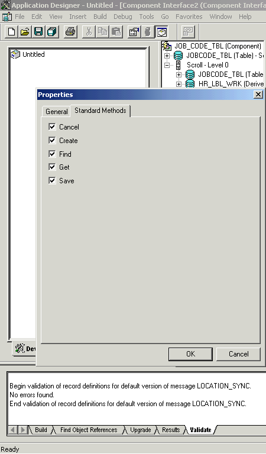

# Standard Methods in Component Interfaces
The standard methods for the component interface are as follows:  
  
- `Create`  
  
- `Find`  
  
- `Get`  
  
- `Save`  
  
  Only those methods in the underlying component are available. For example, if the underlying component does not contain `Add` capabilities, `Create` is unavailable.  
  
## Viewing or Changing Available Methods  
  
#### To view or change available methods  
  
1.  Open the component interface **Properties** dialog box.  
  
       
  
2.  Click the **Standard Methods** tab.  
  
3.  Select the desired methods, and then click **OK**.  
  
## See Also  
 [How to Create Component Interfaces](../core/how-to-create-component-interfaces.md)   
 [Appendix C: Using Component Interfaces](../core/appendix-c-using-component-interfaces.md)