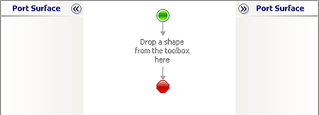

# Step 1: Add EAIOrchestration Project to the Solution
  
  
 **Time to complete:** 5 minutes  
  
 **Objective:** In this step, you add a second project to the EAI solution. Then you add an orchestration to the new project.  
  
 **Purpose:** You create a separate project for the orchestration. This is helpful when you have several different people working on one solution. You use the new orchestration to automate the business process in this lesson.  
  
## Prerequisites  
 Note the following requirements before you begin this step:  
  
-   Before you begin this step you must complete [Lesson 1: Define Schemas and a Map](../core/lesson-1-define-schemas-and-a-map.md).  
  
## Procedures  
 If you have closed the [!INCLUDE[btsVStudioNoVersion](../includes/btsvstudionoversion-md.md)] window, follow the procedure “To open the Visual Studio project” in [Step 2: Create the Inventory Request Schema](../core/step-2-create-the-inventory-request-schema.md) to open it.  
  
#### To add another project to your solution  
  
1.  From Visual Studio, on the **File** menu, point to **Add**, and then click **New Project**.  
  
2.  In the **New Project** dialog box, do the following:  
  
    |Use this|To do this|  
    |--------------|----------------|  
    |**Installed Templates**|Click **BizTalk Projects**, and then click **Empty BizTalk Server Project**.|  
    |**Name**|Type `EAIOrchestration`.|  
    |**Location**|Type `C:\BTSTutorials\EAISolution`.|  
  
3.  Click **OK**.  
  
#### To add an orchestration  
  
1.  In Solution Explorer, right-click **EAIOrchestration**, point to **Add**, and then click **New Item**.  
  
2.  In the **Add New Item - EAIOrchestration** dialog box, do the following:  
  
    |Use this|To do this|  
    |--------------|----------------|  
    |**Installed Templates**|Click **Orchestration Files**, and then click **BizTalk Orchestration**.|  
    |**Name**|Type **EAIProcess.odx**.|  
  
3.  Click **Add**.  
  
     Orchestration Designer opens. The following figure shows Orchestration Designer with the EAIProcess orchestration.  
  
       
  
## What did I just do?  
 In this step, you added a second project to the EAI solution. Then you added an orchestration to the new project.  
  
## Next Steps  
 You define the business process in [Step 2: Define the Business Process](../core/step-2-define-the-business-process.md).  
  
## See Also  
 [Step 2: Define the Business Process](../core/step-2-define-the-business-process.md)   
 [Step 3: Add Ports to the Orchestration](../core/step-3-add-ports-to-the-orchestration.md)   
 [Step 4: Build the EAIOrchestration Project](../core/step-4-build-the-eaiorchestration-project.md)
