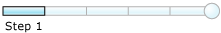

# Step 1: Create EAISchemas Project
  

 **Time to complete:** 5 minutes  

 **Objective:** In this step, you create a new [!INCLUDE[btsVStudioNoVersion](../includes/btsvstudionoversion-md.md)] solution and a project.  

 **Purpose:** You use the BizTalk project system to create part or all of a [!INCLUDE[btsVStudioNoVersion](../includes/btsvstudionoversion-md.md)] application or business solution. The core element of any such solution is a BizTalk project—a collection of items, such as schemas, orchestrations, Web message types, classes, pipelines, maps, and references that you can build and generate into an assembly before deploying it.  

## Prerequisites  
 Note the following requirements before you begin this step:  

-   Before you begin this step you must complete the steps in [Before You Begin the Tutorial](../core/before-you-begin-the-tutorial.md).  

## Procedures  

#### To create a new Visual Studio solution/project  

1. Start **Microsoft Visual Studio**.  

2. In [!INCLUDE[btsVStudioNoVersion](../includes/btsvstudionoversion-md.md)], on the **File** menu, point to **New**, and then click **Project**.  

3. In the **New Project** dialog box, do the following:  

   |             Use this              |                                To do this                                |
   |-----------------------------------|--------------------------------------------------------------------------|
   |      **Installed Templates**      | Click **BizTalk Projects**, then click **Empty BizTalk Server Project**. |
   |             **Name**              |                           Type **EAISchemas**.                           |
   |           **Location**            |                      Type **C:\tutorial\Lessons**.                       |
   |         **Solution Name**         |                          Type **EAISolution**.                           |
   | **Create directory for solution** |                                (selected)                                |

4. Click **OK**.  

5. On the **File** menu, click **Save All**.  

## What did I just do?  
 In this step, you opened a new project and a [!INCLUDE[btsBizTalkServerNoVersion](../includes/btsbiztalkservernoversion-md.md)] solution in [!INCLUDE[btsVStudioNoVersion](../includes/btsvstudionoversion-md.md)].  

## Next Steps  
 You create the schema for the inventory replenishment request message.  

## See Also  
 [Before You Begin the Tutorial](../core/before-you-begin-the-tutorial.md)   
 [Step 2: Create the Inventory Request Schema](../core/step-2-create-the-inventory-request-schema.md)   
 [Step 3: Create the Request Decline Schema](../core/step-3-create-the-request-decline-schema.md)   
 [Step 4: Create the Map](../core/step-4-create-the-map.md)   
 [Step 5: Build the EAISchemas Project](../core/step-5-build-the-eaischemas-project.md)   
 [Developer Tools](../core/developer-tools.md)   
 [Working with BizTalk Projects](../core/working-with-biztalk-projects.md)