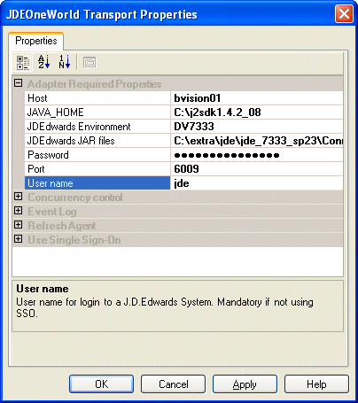

# Step 1: Reference the Schema DLL
In BizTalk, messages are immutable. Therefore, to change a property value you must create and modify a new message. You create and modify the new message by inserting a message assignment shape between the Receive and Send shapes.  
  
 First, however, you must reference the schema DLL to gain access to the J.D. Edwards EnterpriseOne context properties.  
  
### To reference the schema DLL  
  
1. Create a working folder, for example, c:\class\JDE\BeginDoc, for your project and a folder in which you will put the test XML, for example, c:\class\JDE\input.  
  
2. Create a Static Solicit-Response Send Port to send the request to J.D. Edwards EnterpriseOne.  
  
      
  
3. In the Solution Editor, right-click your project.  
  
   1. Select **Add**, select **Add Generated Items**, and then click **Add Adapter**.  
  
   2. Select the Microsoft BizTalk Adapter for J.D. Edwards EnterpriseOne and the port you just created.  
  
   3. In the **Add Adapter Wizard**, select **CSALES\B4200310**.  
  
   4. Click **Finish** to generate the schema containing the format for the Message.  
  
        
  
4. In Visual Studio, open the Solution Explorer.  
  
5. Right-click **References**, and then select **Add Reference**.  
  
6. On the **Add Reference** screen, click the **Browse** button.  
  
7. On the **Select Component** screen, navigate to %SystemDrive%\Program Files\Common Files\Microsoft BizTalk Adapters for Enterprise Applications\bin.  
  
8. Select **Microsoft.Adapters.JDEProperties.dll**, and then click **Open**.  
  
9. On the **Add Reference** screen, the DLL appears in the **Selected Components** section.  
  
       
  
10. Click **OK**.  
  
11. Double-click your orchestration to access the Orchestration Designer.  
  
     \- OR -  
  
     Select **View**, select **Other Windows**, and then click **Orchestration View**.  
  
     The Orchestration View appears.  
  
## See Also  
 [Step 2: Create the Orchestration](../core/step-2-create-the-orchestration2.md)   
 [Task 4: Configure the Construct Message Shape](../core/task-4-configure-the-construct-message-shape1.md)   
 [Task 5: Configure the Transform Shape](../core/task-5-configure-the-transform-shape2.md)   
 [Step 3: Complete and Run the Project](../core/step-3-complete-and-run-the-project1.md)   
 [Step 4: Create a Sample XML BeginDoc](../core/step-4-create-a-sample-xml-begindoc2.md)