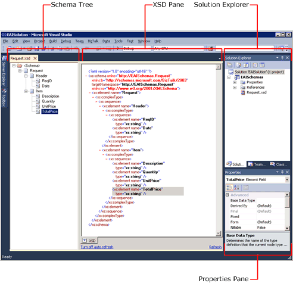

# Step 2: Create the Inventory Request Schema
  

 **Time to complete:** 7 minutes  

 **Objective:** In this step, you define the schema of the inventory replenishment message.  The warehouse system sends this message for requesting inventory replenishment.  This is one of the two schemas you must create for this project.  

 **Purpose:** XML not only structures and identifies information with standardized markup codes, but also has the ability to use schemas. A schema is an XML document that works like a dictionary and is used as a reference by other XML documents. The schema code defines the spelling of XML elements and the type of data enclosed by those elements. Using schemas provides an easy way for a program to process XML documents and ensures that the structure and type of information is correct.  

## Prerequisites  
 Note the following requirements before you begin this step:  

-   Before you begin this step you must complete [Step 1: Create EAISchemas Project](../core/step-1-create-eaischemas-project.md).  

## Procedures  
 In [Step 1: Create EAISchemas Project](../core/step-1-create-eaischemas-project.md), you created a new [!INCLUDE[btsVStudioNoVersion](../includes/btsvstudionoversion-md.md)] project.  If you close the [!INCLUDE[btsVStudioNoVersion](../includes/btsvstudionoversion-md.md)] window, you can use the following procedure to open the project.  Otherwise, you can skip this procedure, “To open the Visual Studio project”.  

#### To open the Visual Studio project  

1. Start **Microsoft Visual Studio**.  

2. In [!INCLUDE[btsVStudioNoVersion](../includes/btsvstudionoversion-md.md)], on the **File** menu, point to **Open**, and then click **Project/Solution**.  

3. In the **Open Project** dialog box, browse to the **C:\BTSTutorials\EAISolution\EAISolution.sln** solution file, and then click **Open**.  

   In the following procedure, you add a new schema file to the project for the inventory replenishment message.  

#### To add a new schema to the project  

1. In Solution Explorer, right-click the **EAISchemas** project, point to **Add**, and then click **New Item**.  

2. In the **Add New Item - EAISchemas** dialog box, do the following:  

   |        Use this         |                   To do this                   |
   |-------------------------|------------------------------------------------|
   | **Installed Templates** | Click **Schema Files**, then click **Schema**. |
   |        **Name**         |             Type **Request.xsd**.              |

3. Click **Add**. The schema tree and XSD pane appear. This area of [!INCLUDE[btsVStudioNoVersion](../includes/btsvstudionoversion-md.md)] is referred to as BizTalk Editor. In addition, your new schema appears in Solution Explorer below the EAISchemas project.  

      

#### To add elements to the schema  

1. In schema tree, click the **Root** node.  

2. In the Properties pane, change the value of the **Node Name** property to `Request`, and then press ENTER.  

3. In schema tree, right-click the **Request** node, point to **Insert Schema Node**, and then click **Child Record**.  

4. Type `Header` as the new name for the child record, and then press ENTER.  

5. Repeat step 3 and 4 to create a second child record for the **Request** node, and name it `Items`.  

6. In schema tree, right-click the **Header** node, point to **Insert Schema Node**, and then click **Child Field Element**.  

7. Type `ReqID` as the new name for the element, and then press ENTER.  

8. Repeat step 6 and 7 to create a second child field element for the **Header** node, and name it `OrderDate`.

9. Repeat step 6 and 7 to create a third child field element for the **Header** node, and name it `GrandTotal`.

10. In schema tree, right-click the **Items** node, point to **Insert Schemas Node**, and then click **Child Record**.  

11. Type `Item` as the new name for the child record, and then press ENTER.  

12. In schema tree, right-click the **Item** node, and add the following child field elements:  

    - `Description`  

    - `Quantity`  

    - `UnitPrice`  

      The completed Request.xsd should look similar to the following figure.  

        

    When you add nodes to a schema, BizTalk Editor gives a set of default values for their properties.  You must configure them based on the requirements.  

#### To configure the elements  

1. In schema tree, click **OrderDate** to select it.  

2. In the Properties pane, change **Data Type** to **xs:dateTime**.  

3. Repeat step 1 and 2 to configure the following properties:  

   |Element|Property|Value|  
   |-------------|--------------|-----------|  
   |**GrandTotal**|**Data Type**|**Xs:decimal**|  
   |**Item**|**Max Occurs**|**Unbounded**|  
   |**Item**|**Min Occurs**|**1**|  
   |**Quantity**|**Data Type**|**xs:unsignedInt**|  

   A schema can have many elements, but your application may only require that you use a few of them for your data processing. To save computer resources, BizTalk Server doesn't automatically read each schema element. If you want BizTalk Server to read data from a specific element, you must identify that element by using BizTalk Editor to promote its properties.  

   The orchestration that we will create in [Lesson 2: Define the Business Process](../core/lesson-2-define-the-business-process.md) will base on the GrandTotal field to route messages.  So we must promote the GrandTotal field.  

#### To promote an element  

1.  In Schema tree, right-click **GrandTotal**, point to **Promote**, and then click **Quick Promotions**.  

2.  Click **OK** to acknowledge adding a property schema.  

3.  On the **File** menu, click **Save All**.  

## What did I just do?  
 In this step, you defined the warehouse inventory replenishment message schema.  

## Next Steps  
 You define the request decline message schema.  

## See Also  
 [Step 1: Create EAISchemas Project](../core/step-1-create-eaischemas-project.md)   
 [Step 3: Create the Request Decline Schema](../core/step-3-create-the-request-decline-schema.md)   
 [Step 4: Create the Map](../core/step-4-create-the-map.md)   
 [Step 5: Build the EAISchemas Project](../core/step-5-build-the-eaischemas-project.md)   
 [Creating Schemas Using BizTalk Editor](../core/creating-schemas-using-biztalk-editor.md)   
 [About BizTalk Message Context Properties](../core/about-biztalk-message-context-properties.md)
