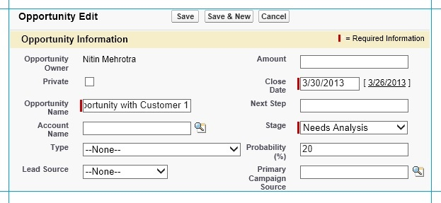
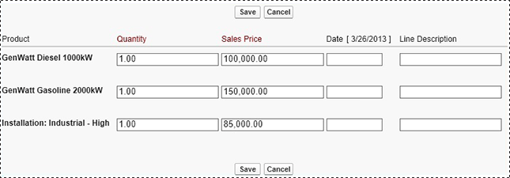
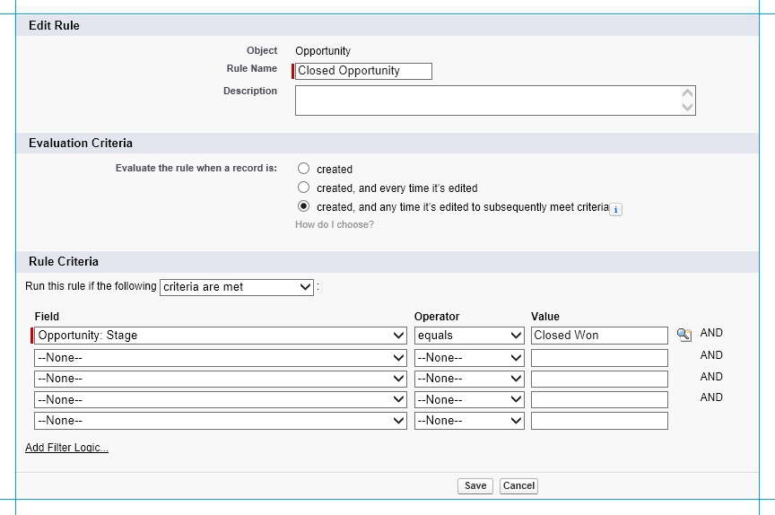
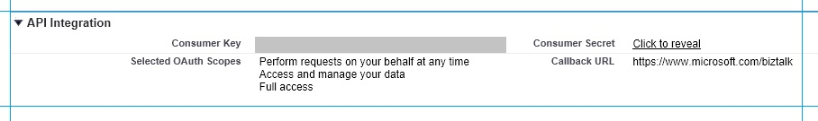

# Step 2: Set up the Salesforce System
In this step, you configure Salesforce to send notifications when an opportunity is successfully closed. Before you can send notifications, you need to perform the following steps:  
  
-   Create an account in Salesforce. An account represents a customer for Northwind.  
  
-   Create an opportunity for the account. An opportunity represents a prospective sales opportunity with the customer. As part of the opportunity, you also add the product details that the customer is interested in.  
  
-   Create a workflow in Salesforce.  
  
-   Create a Salesforce connected application definition.  
  
> [!NOTE]
>  The steps in this topic assume that you already have a Salesforce developer account. To create a new developer account in Salesforce, go to [http://go.microsoft.com/fwlink/?LinkId=296424](http://go.microsoft.com/fwlink/?LinkId=296424).  
  
### To create an Account in Salesforce  
  
1.  Log on to the Salesforce.com portal using your developer credentials.  
  
2.  On the portal, click the **Accounts** tab, and then click **New**.  
  
3.  On the **New Account** page, provide values for the various fields. Specifying a value for **Account Name** is mandatory. For this tutorial, specify the account name as `Customer1`.  
  
4.  Click **Save**.  
  
### To create an Opportunity for the customer  
  
1. On the Salesforce.com portal, click the **Opportunities** tab.  
  
2. In the **Recent Opportunities** section, click **New**.  
  
3. In the New Opportunity page, specify the following values:  
  
   1. Specify an **Opportunity Name**, for example, `Opportunity with Customer 1`.  
  
   2. Specify the **Account Name**. This represents the account with which this opportunity is associated. For this tutorial, set the Account to `Customer1`. You created this account in the previous procedure.  
  
   3. Specify a **Close Date**. This represents the date by which the opportunity should be closed.  
  
   4. Specify a **Stage**. This denotes the current stage for the opportunity. To start with, you can set the opportunity to anything, for example, **Needs Analysis**.  
  
         
  
      > [!NOTE]
      >  Make sure you do not set the stage to **Closed Won** to start with. For the scenario in this tutorial, every time the stage is set to **Closed Won** a notification is sent to a relay endpoint on [!INCLUDE[winazure](../includes/winazure-md.md)][!INCLUDE[sb](../includes/sb-md.md)]. We haven’t set up that part of the solution yet, so you should not set the stage to **Closed Won**.  
  
   5. Specify values for other optional fields and then click **Save**.  
  
   6. On the Opportunity page for Customer1, under the **Products** section, click **Add Product**.  
  
   7. From the list of products, select the products that the customer is interested in, and then click **Select**.  
  
   8. For each selected product, specify a quantity that the customer wants, and then click **Save**.  
  
         
  
## Create a Salesforce Workflow  
 In this step we create a workflow to send out a notification every time an opportunity is closed successfully. The notification is in the form of a SOAP message and is sent to a relay endpoint hosted on [!INCLUDE[winazure](../includes/winazure-md.md)][!INCLUDE[sb](../includes/sb-md.md)].  
  
#### To create a workflow for opportunities  
  
1. On the Salesforce portal, click your login name at the top right corner of the page, and then click **Setup**.  
  
2. In the left pane, under **App Setup**, expand **Create**, expand **Workflow & Approvals**, and then click **Workflow Rules**.  
  
   > [!NOTE]
   >  If you are opening the Workflow Rules page for the first time, you will be presented with some information to understand how workflows work in Salesforce. Read through the information and then click **Continue**.  
  
3. On the **All Workflow Rules** page, click **New Rule**.  
  
4. From the **Select Object** list, click **Opportunity**, and then click **Next**.  
  
5. In the next page, specify the following:  
  
   1.  Set the **Rule Name** as `Closed Opportunity`.  
  
   2.  Set the **Evaluation Criteria** as **created, and any time it’s edited to subsequently meet criteria**.  
  
   3.  For the **Rule Criteria**, set to run the rule when the **criteria are met**.  
  
   4.  Set **Field** to **Opportunity: Stage**, **Operator** to **equals**, and **Value** to `Closed Won`.  
  
          
  
   5.  Click **Save & Next**.  
  
6. Define the workflow action for the new rule:  
  
   1. On the **Specify Workflow Actions** page, click **Add Workflow Action** button and then click **New Outbound Message**.  
  
   2. Set the **Name** and **Unique Name** fields to `NewOp1`.  
  
   3. Specify a description, such as, the `Message sent when an opportunity is successfully closed`.  
  
   4. Specify the **Endpoint URL** as `https://btssalesforce.servicebus.windows.net/notifications/opportunity`.  
  
       Here, **btssalesforce** is your [!INCLUDE[sb](../includes/sb-md.md)] namespace that you created in earlier steps. **/notifications/opportunity/** represents the relay that we will create in later steps of this tutorial.  
  
      > [!NOTE]
      >  You must specify the [!INCLUDE[sb](../includes/sb-md.md)] namespace that you created earlier.  
  
   5. Make sure the **Protected Component** check box is clear and the **Send Session ID** check box is checked.  
  
   6. For **Opportunity fields to send** select the relevant fields from the **Available Fields** list and then click the **Add** button.  
  
   7. Click **Save** and then click **Done**.  
  
   8. In the left pane, under **App Setup**, expand **Create**, expand **Workflow & Approvals**, and then click **Workflow Rules**. Verify that the **Closed Opportunity** rule is listed there. Under the **Action** column for the **Closed Opportunity** rule, click **Activate** to activate the rule.  
  
## Create a Salesforce Connected Application  
 Creating a connected application definition generates a set of keys required to request OAuth tokens to access to connect to Salesforce. In the later stages of this tutorial, [!INCLUDE[btsBizTalkServerNoVersion](../includes/btsbiztalkservernoversion-md.md)] will be the connected application that queries Salesforce using the connected application definition.  
  
#### To create a connected application for Salesforce  
  
1. On the Salesforce portal, click your login name at the top right corner of the page, and then click **Setup**.  
  
2. In the left pane, under **App Setup**, expand **Create**, and then expand **Apps**. On the **Apps** page, under the **Connected Apps** section, click **New**.  
  
3. In the **New Connection App** page, specify the following:  
  
   1. For **Connected App Name**, specify `BizTalk_Salesforce`.  
  
   2. For **Developer Name**, specify your log on name.  
  
   3. For **Contact Email**, specify your e-mail.  
  
   4. For **Callback URL**, specify a valid URL.  
  
      > [!NOTE]
      >  Because of the way we authenticate with Salesforce in this scenario, the value you specify here is not used.  
  
   5. Under **Available OAuth Scopes**, select **Full access**, **Perform requests on your behalf at any time**, and **Access and manage your data** and then click the **Add** button to move them into the **Selected OAuth Scopes**.  
  
   6. Click **Save**. The page that appears contains information about the **Consumer Key** and **Consumer Secret**. You must make a note of these values. You will need these values while connecting to Salesforce from [!INCLUDE[btsBizTalkServerNoVersion](../includes/btsbiztalkservernoversion-md.md)].  
  
         
  
4. Finally, generate a security token required for connecting to Salesforce from unknown network locations.  
  
   1.  On the left pane of the Salesforce portal, under **Personal Setup**, expand **Personal Information**, and then click **Reset My Security Token**.  
  
   2.  Read the warning and then click **Reset Security Token**.  
  
   3.  You should receive the security token at the e-mail address you specified while creating your Salesforce account.  
  
## See Also  
 [Tutorial 6: Integrating BizTalk Server 2013 with Salesforce](Tutorial:%20Integrating%20BizTalk%20Server%202013%20with%20Salesforce.md)