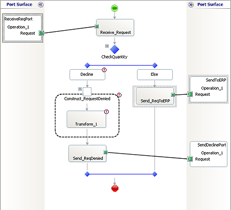

# Step 3: Add Ports to the Orchestration
  
  
 **Time to complete:** 10 minutes  
  
 **Objective:** In this step, you add three ports to the EAIProcess orchestration and configure them.  
  
 **Purpose:** Ports specify how your orchestration will send messages to and receive messages from other business processes. Each port has a type, a direction, and a binding, which together determine the direction of communication, the pattern of communication, the location to or from which the message is sent or received, and how the communication takes place. The three ports you create and configure in this step fulfill the following roles:  
  
- **ReceiveRequestPort** receives inventory replenishment request messages from the warehouse.  
  
- **SendToERP** forwards the request messages to the ERP system.  
  
- **SendDeclinePort** sends request decline messages back to the warehouse.  
  
  For more information, see [Using Ports in Orchestrations](../core/using-ports-in-orchestrations.md).  
  
## Prerequisites  
 Note the following requirements before you begin this step:  
  
-   Before you begin this step you must complete [Step 2: Define the Business Process](../core/step-2-define-the-business-process.md).  
  
## Procedures  
  
#### To create and configure ReceiveRequestPort  
  
1.  In Solution Explorer, double-click **EAIProcess.odx**.  
  
2.  In Orchestration Designer, from the orchestration Toolbox, drag the **Port** shape to the left-side **Port Surface**, parallel to the **ReceiveRequest** shape. The Port Configuration Wizard starts automatically.  
  
3.  On the **Welcome to the Port Configuration Wizard** page, click **Next**.  
  
4.  On the **Port Properties** page, do the following, and then click **Next**.  
  
    |Use this|To do this|  
    |--------------|----------------|  
    |**Name**|Type **ReceiveRequestPort**.|  
  
5.  On the **Select a Port Type** page, do the following, and then click **Next**.  
  
    |Use this|To do this|  
    |--------------|----------------|  
    |**Select the port type to be used for this port**|Select the **Create a new Port Type** option.|  
    |**Port Type Name:**|Type **ReceiveRequestPortType**.|  
    |**Communication Pattern**|Select **One-Way**.|  
    |**Access Restrictions**|Select **Internal - limited to this project**.|  
  
6.  On the **Port Binding** page, do the following, and then click **Next**.  
  
    |Use this|To do this|  
    |--------------|----------------|  
    |**Port direction of communication**|Select **I'll always be receiving messages on this port**.|  
    |**Port binding**|From select **Specify later**.|  
  
7.  On the **Completing the Port Wizard** page, click **Finish**.  
  
#### To create and configure SendDeclinePort  
  
1.  From the orchestration Toolbox, drag the **Port** shape to the left-side **Port Surface**, parallel to the **SendRequestDecline** shape.  
  
2.  Use the information in the following table to create the **SendDeclinePort** send port.  
  
    |Property|Value|  
    |--------------|-----------|  
    |**Name**|Type **SendDeclinePort**.|  
    |**Select the port type to be used for this port**|Select **Create a new Port Type**.|  
    |**Port Type Name**|Type **SendDeclinePortType**.|  
    |**Communication Pattern**|Select **One-Way**.|  
    |**Access Restrictions**|Select **Internal - limited to this project**.|  
    |**Port direction of communication**|From the drop-down list, select **I'll always be sending messages on this port**.|  
    |**Port bindings**|From the drop-down list, select **Specify later**.|  
  
#### To create and configure SendToERPPort  
  
1.  From the orchestration Toolbox, drag the **Port** shape to the right-side **Port Surface**, parallel to the **SendToERP** shape.  
  
2.  Use the information in the following table to complete the Port Configuration Wizard for the **SendToERP** send port.  
  
    |Property|Value|  
    |--------------|-----------|  
    |**Name**|Type **SendToERPPort**.|  
    |**Select the port type to be used for this port**|Select **Create a new Port Type**.|  
    |**Port Type Name**|Type **SendToERPPortType**.|  
    |**Communication Pattern**|Select the **One-Way** option.|  
    |**Access Restrictions**|Select the **Internal - limited to this project** option.|  
    |**Port direction of communication**|From the drop-down list, select **I'll always be sending messages on this port**.|  
    |**Port binding**|From the drop-down list, select **Specify later**.|  
  
#### To connect the ports to the action shapes  
  
-   In Orchestration Designer, on the design surface, drag the green arrow-shaped handle for each port to the corresponding green handle of the action shape:  
  
    |Connect this port|To this action shape|  
    |-----------------------|--------------------------|  
    |**ReceiveReqPort**|**Receive_Request**|  
    |**SendDeclinePort**|**Send_ReqDenied**|  
    |**SendToERP**|**Send_ReqToERP**|  
  
     The following figure shows the EAIProcess orchestration with all of the ports connected.  
  
       
  
## What did I just do?  
 In this step, you added three ports to the EAIProcess orchestration and configured them.  
  
## Next Steps  
 You build the project in [Step 4: Build the EAIOrchestration Project](../core/step-4-build-the-eaiorchestration-project.md).  
  
## See Also  
 [Step 1: Add EAIOrchestration Project to the Solution](../core/step-1-add-eaiorchestration-project-to-the-solution.md)   
 [Step 2: Define the Business Process](../core/step-2-define-the-business-process.md)   
 [Step 4: Build the EAIOrchestration Project](../core/step-4-build-the-eaiorchestration-project.md)