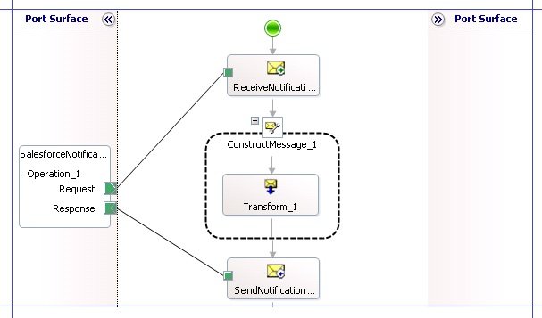

# Step 3a: Receive Salesforce Opportunity Notification into BizTalk Server
In this step, we start creating a [!INCLUDE[btsBizTalkServerNoVersion](../includes/btsbiztalkservernoversion-md.md)]. We should first include the message schema for the opportunities notification message that we’ll get from Salesforce and then start creating an orchestration to process the message.  
  
### To include the Salesforce opportunities notification schema  
  
1. Login to the Salesforce.com portal. On the Salesforce portal, click your login name at the top right corner of the page, and then click **Setup**.  
  
2. In the left pane, under **App Setup**, expand **Create**, expand **Workflow & Approvals**, and then click **Workflow Rules**.  
  
3. In the **All Workflow Rules** page, click the **Closed Opportunity** workflow that you created earlier.  
  
4. In the **Closed Opportunity** workflow rule page, click **NewOp1** outbound message workflow action.  
  
5. In the **NewOp1** outbound message workflow action page, right-click the link **Click for WSDL**, click **Save target as**, and then specify the location where you want to save the WSDL.  
  
   > [!NOTE]
   >  You must save the file with a .wsdl extension.  
  
6. Create a [!INCLUDE[btsBizTalkServerNoVersion](../includes/btsbiztalkservernoversion-md.md)] in [!INCLUDE[btsVStudioNoVersion](../includes/btsvstudionoversion-md.md)]. For this tutorial, let us name the project as `BtsSalesforceIntegration`.  
  
7. Right-click the [!INCLUDE[btsBizTalkServerNoVersion](../includes/btsbiztalkservernoversion-md.md)] project in the Solution Explorer, point to **Add**, and then click **Add Generated Items**.  
  
8. In the **Add Generated Items** dialog box, click **Consume WCF Service**, and then click **Add** to launch the **BizTalk WCF Service Consuming** wizard. On the welcome page, click **Next**.  
  
9. On the **Metadata Source** page, select the **Metadata Files (WSDL and XSD)** option, and then click **Next**.  
  
10. On the **Metadata Files** page, click **Add**, and then navigate to the location where you saved the WSDL file downloaded from the Salesforce portal. Select the WSDL file and then click **Next**.  
  
11. In the next page, set the namespace as `NotificationService` and then click **Import**. The wizard adds the schema files and an orchestration to the [!INCLUDE[btsBizTalkServerNoVersion](../includes/btsbiztalkservernoversion-md.md)] project. The message schema for receiving opportunity notifications from Salesforce is **NotificationService_soap_sforce_com_2005_09_outbound.xsd**.  
  
### To create an orchestration to receive the notification message  
  
1. After you complete the **BizTalk WCF Service Consuming** wizard, an orchestration (**NotificationService.odx**, in this example) is added to the [!INCLUDE[btsBizTalkServerNoVersion](../includes/btsbiztalkservernoversion-md.md)] project.  
  
2. Open the orchestration file and in the Orchestration view, add two new message variables. Name them `NotificationMessage` and `NotificationAck`. Set the message type for these message variables as follows:  
  
   1.  Set **NotificationMessage** to *NotificationService.NotificationService_soap_sforce_com_2005_09_outbound.notifications*. This message variable represents the opportunity notification message received from Salesforce.  
  
   2.  Set **NotificationAck** to *NotificationService.NotificationService_soap_sforce_com_2005_09_outbound.notificationsResponse*. This message variable represents the opportunity notification acknowledgement message sent back to Salesforce.  
  
3. Add a receive shape to the orchestration. Set the following properties on the shape:  
  
   1.  Set **Activate** to **True**.  
  
   2.  Set **Name** to *ReceiveNotificationMessage*.  
  
   3.  Set **Message** to *NotificationMessage*.  
  
4. Add a Construct Message shape after the Receive shape. Name the message shape as `ConstructNotificationResponse` and set the **Messages Constructed** property to `NotificationAck`. As part of the construct message, we’ll also create a map to generate a notification acknowledgement message to be sent back to Salesforce.  
  
   1.  Within the Construct Message shape, add a Transform shape. Double-click the Transform shape and in the Transform Configuration dialog box, select the **New Map** option.  
  
   2.  Specify the map name as `BtsSalesforceIntegration.MapNotificationResponse`.  
  
   3.  Set Source as **NotificationMessage** and Destination as **NotificationAck**.  
  
   4.  Make sure the check box **When I click OK, launch the BizTalk Mapper** is selected.  
  
   5.  In **MapNotificationResponse.btm**, we’ll create a notification response to be sent back to Salesforce. Every time Salesforce sends a notification, it expects an acknowledgement in return. The schema of the notification response message shows that the **Ack** element in the response is of type Boolean. So, in the map, you must drop a **Value Mapping** functoid and set its two input values (Condition and Result) to `true`. Click **OK** to save the functoid.  
  
   6.  Connect the **Value Mapping** functoid to the **Ack** element in the destination schema.  
  
5. In the orchestration, after the Construct Message shape, add a Send shape that will be used to send the acknowledgement back to Salesforce.  
  
   -   Set **Name** to *SendNotificationAck*.  
  
   -   Set **Message** to *NotificationAck*.  
  
6. In the orchestration, add a port to receive Salesforce notification message and send the acknowledgement in response. In the Port Configuration wizard, select the following options:  
  
   - Specify the port name as `SalesforceNotificationPort`.  
  
   - Select the option to create a new port type.  
  
   - Set **Communication Pattern** to *Request-Response*.  
  
   - Set **Port direction of communication** to *I’ll be receiving a request and sending a response* and set **Port binding** to *Specify later*.  
  
     Connect the **Request** operation of port to the Receive shape (*ReceiveNotificationMessage*) and the **Response** operation of the port to the Send shape (*SendNotificationAck*). The following screenshot depicts the part of the orchestration that receives an opportunity notification from Salesforce and sends an acknowledgement back:  
  
       
  
   By now, we have set up the solution where an opportunity notification is received from Salesforce and an acknowledgement is sent back. In the subsequent topics, we’ll build on this solution to start processing the opportunity notification to get more details about the kind of sales opportunity available.  
  
## See Also  
 [Step 3: Create the BizTalk Server Solution in Visual Studio](../core/step-3-create-the-biztalk-server-solution-in-visual-studio.md)