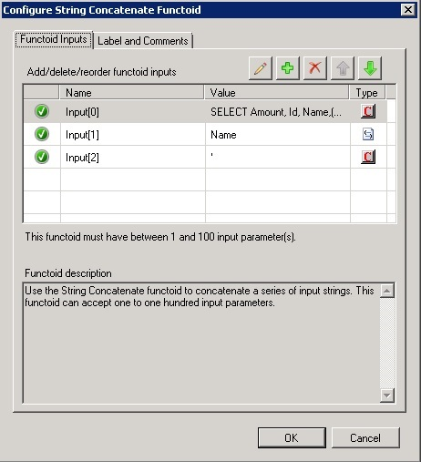
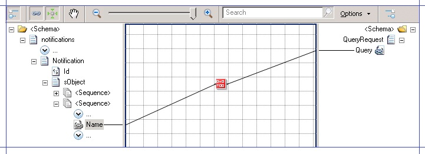
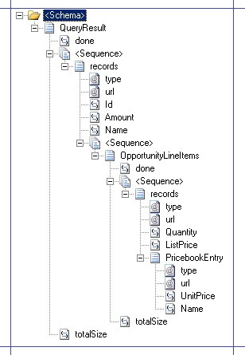
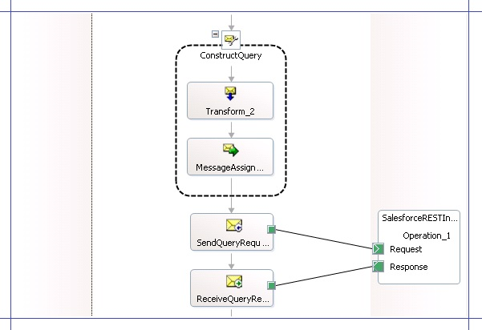

# Step 3b: Retrieve Opportunity Details from Salesforce using the WCF-WebHttp Adapter
In this section, we’ll enhance the orchestration to process the incoming opportunity notification, extract the opportunity name from the notification, and use that to create a request query to send to Salesforce. This retrieves specific details about the products associated with the opportunity. The query response from Salesforce is received back into [!INCLUDE[btsBizTalkServerNoVersion](../includes/btsbiztalkservernoversion-md.md)]. To achieve this, we’ll perform the following steps:  
  
-   Create a schema and message variables to send a query message to Salesforce.  
  
-   Create a map to use the values from the opportunity notification for creating a query to retrieve product details associated with the opportunity.  
  
-   Create a schema to receive a query response from Salesforce.  
  
-   Create message variables for the request and response schemas.  
  
## Create Schema and Message Variables to Send Query Messages to Salesforce  
 To retrieve product details from Salesforce by using the information available through an Opportunity notification, we need to send a query to Salesforce. The query is sent to Salesforce as an XML message. So, in the following procedure we create a schema for the request message. In the subsequent procedure, we will map the opportunity notification schema with this schema to construct a query for retrieving product details for the opportunity.  
  
#### To create a schema for sending query request  
  
1. Add a new schema to the [!INCLUDE[btsBizTalkServerNoVersion](../includes/btsbiztalkservernoversion-md.md)] project. Name it `QueryRequest.xsd`.  
  
2. Rename the root node to `QueryRequest`. Add a child field element under the QueryRequest record and name it `Query`.  
  
3. Promote the **Query** element in the schema so that it is available for use within the orchestration. In the later steps we will use this promoted element to assign the query string.  
  
    Right-click the **Query** element, point to **Promote**, and then click **Quick Promotions**. This results in creating a **PropertySchema.xsd** schema with a **Query** element. Note the namespace for the PropertySchema. You will need this in the future steps while configuring the physical ports in [!INCLUDE[btsBizTalkServerNoVersion](../includes/btsbiztalkservernoversion-md.md)] Administration console.  
  
4. Save all changes.  
  
## Map the Opportunity Notification Schema to the Query Schema  
 To retrieve the product details associated with the opportunity, we need to send a query similar to the following to Salesforce:  
  
```  
SELECT Amount, Id, Name,(SELECT Quantity, ListPrice, PricebookEntry.UnitPrice, PricebookEntry.Name FROM OpportunityLineItems) FROM Opportunity Where Name = '<opportunity_name>'  
```  
  
 In the previous procedure we already created the schema of the query message. In this procedure, we map the opportunity notification schema to the query request schema and use functoids to construct this query. This query will be passed as a value to the **Query** element in the **QueryRequest.xsd** schema.  
  
#### To map the opportunity notification  
  
1. Add a map to the [!INCLUDE[btsBizTalkServerNoVersion](../includes/btsbiztalkservernoversion-md.md)] project. Name the map `Notification_QueryRequest.btm`.  
  
2. Set the source schema to **NotificationService_soap_sforce_com_2005_09_outbound.xsd**. Set the destination schema to **QueryRequest**.xsd.  
  
3. Add a **String Concatenate** functoid to the mapping surface. Open the **Configure String Concatenate Functoid** dialog box and specify the input values as follows:  
  
   |||  
   |-|-|  
   |Input[0]|SELECT Amount, Id, Name,(SELECT Quantity, ListPrice, PricebookEntry.UnitPrice, PricebookEntry.Name FROM OpportunityLineItems) FROM Opportunity Where Name = '|  
   |Input[1]|Connect the Name element in the source schema to the functoid to use the value of the Name element as the second input.|  
   |Input[2]|' **Note:**  For the last input value, specify only a closing single quote (').|  
  
    The following screenshot depicts the configuration for the **String Concatenate** functoid.  
  
      
  
    When the three input parameters are concatenated, it will form the required query to be sent to Salesforce.  
  
4. Connect the String Concatenate functoid to the Query element in the destination schema, as shown in the following screenshot.  
  
      
  
5. Save changes to the map.  
  
## Creating Schema to Receive the Query Response Message  
 In this section, we create the schema to receive the query response message from Salesforce. In this section, we manually create the schema for the query response.  
  
#### To create a schema to receive the query response  
  
1. Add a new schema to the [!INCLUDE[btsBizTalkServerNoVersion](../includes/btsbiztalkservernoversion-md.md)] project and name it `QueryResult.xsd`.  
  
2. The Salesforce [QueryResult](http://go.microsoft.com/fwlink/?LinkId=287017) object depicts the query response received from Salesforce. So, we’ll build a schema to depict the following:  
  
   ```  
   <?xml version="1.0" encoding="utf-16" ?>  
   - <xs:schema xmlns="http://BtsSalesforceIntegration.QueryResult" xmlns:b="http://schemas.microsoft.com/BizTalk/2003" targetNamespace="http://BtsSalesforceIntegration.QueryResult" xmlns:xs="http://www.w3.org/2001/XMLSchema">  
     - <xs:element name="QueryResult">  
       - <xs:complexType>  
         - <xs:sequence>  
           <xs:element name="done" type="xs:string" />  
           - <xs:sequence>  
             - <xs:element name="records">  
               - <xs:complexType>  
                 - <xs:sequence>  
                   <xs:element name="Id" type="xs:string" />  
                   <xs:element name="Amount" type="xs:string" />  
                   <xs:element name="Name" type="xs:string" />  
                   - <xs:sequence>  
                     - <xs:element name="OpportunityLineItems">  
                       - <xs:complexType>  
                         - <xs:sequence>  
                           <xs:element name="done" type="xs:string" />  
                           - <xs:sequence minOccurs="1" maxOccurs="unbounded">  
                             - <xs:element name="records">  
                               - <xs:complexType>  
                                 - <xs:sequence>  
                                   <xs:element name="Quantity" type="xs:string" />  
                                   <xs:element name="ListPrice" type="xs:string" />  
                                   - <xs:element name="PricebookEntry">  
                                     - <xs:complexType>  
                                       - <xs:sequence>  
                                         <xs:element name="UnitPrice" type="xs:string" />  
                                         <xs:element name="Name" type="xs:string" />  
                                       </xs:sequence>  
                                       <xs:attribute name="type" type="xs:string" />  
                                       <xs:attribute name="url" type="xs:string" />  
                                     </xs:complexType>  
                                   </xs:element>  
                                 </xs:sequence>  
                                 <xs:attribute name="type" type="xs:string" />  
                                 <xs:attribute name="url" type="xs:string" />  
                               </xs:complexType>  
                             </xs:element>  
                           </xs:sequence>  
                           <xs:element name="totalSize" type="xs:string" />  
                         </xs:sequence>  
                       </xs:complexType>  
                     </xs:element>  
                   </xs:sequence>  
                 </xs:sequence>  
                 <xs:attribute name="type" type="xs:string" />  
                 <xs:attribute name="url" type="xs:string" />  
               </xs:complexType>  
             </xs:element>  
           </xs:sequence>  
           <xs:element name="totalSize" type="xs:string" />  
         </xs:sequence>  
       </xs:complexType>  
     </xs:element>  
   </xs:schema>  
   ```  
  
    The schema structure should look like the following:  
  
      
  
3. Save changes to the schema.  
  
## Create Message Variables for QueryRequest and QueryResult Schemas  
 After you have created the QueryRequest and QueryResult schemas, you must create two message variables in the orchestration to represent the two message types.  
  
#### To create message variables  
  
1.  Open the **NotificationService.odx** orchestration and in the orchestration view, add two new messages. Set the message names as `QueryRequestMsg` and `QueryResultMsg`.  
  
2.  Set the message type for **QueryRequestMsg** as **BtsSalesforceIntegration.QueryRequest**.  
  
3.  Set the message type for **QueryResultMsg** as **BtsSalesforceIntegration.QueryResult**.  
  
4.  Save changes to the orchestration.  
  
## Update the Orchestration to Send Message to Salesforce and Receive a Response  
 In the topic [Step 3a: Receive Salesforce Opportunity Notification into BizTalk Server](../core/step-3a-receive-salesforce-opportunity-notification-into-biztalk-server.md), we built the orchestration that receives opportunity notifications from Salesforce and sends an acknowledgement. In this step, we build on this orchestration to send a query request to Salesforce to get product details related to the opportunity and receive a response. We have already created the schemas (QueryRequest.xsd and QueryResult.xsd) and the message variables (QueryRequestMsg and QueryResultMsg) that we’ll use in this step.  
  
#### To send a query request to Salesforce and receive a response  
  
1. Add a Construct Message shape after the **SendNotificationAck** shape. Set the name of the shape to `ConstructQuery` and set the **Messages Constructed** property to **QueryRequestMsg**.  
  
2. Within the **ConstructQuery** shape, add a **Transform** shape. Double-click the Transform shape to open the Transform Configuration dialog box. In the dialog box, select the **Existing Map** option, and then from the drop-down select **BtsSalesforceIntegration.Notification_QueryRequest**. Set **Source** to **NotificaitonMessage**, **Destination** to **QueryRequestMsg**, and then click **OK**.  
  
3. Within the **ConstructQuery** shape, after the Transform shape, add a Message Assignment shape. Double-click the Message Assignment shape and add the following expression:  
  
   ```  
   QueryRequestMsg(BtsSalesforceIntegration.PropertySchema.Query) = QueryRequestMsg.Query;  
   ```  
  
    By doing this, we pass on the value of the **Query** element in the **QueryRequestMsg** schema to the promoted element **Query** in the property schema. While configuring the WCF-WebHttp port, we’ll use this element to dynamically pass on the query value to the request message.  
  
4. After the **ConstructQuery** shape, add a Send shape. Name the shape `SendQueryRequest` and set the message type as **QueryRequestMsg**.  
  
5. After the Send shape, add a Receive shape and name it `ReceiveQueryResult`. Set the message type of the shape to **QueryResultMsg**.  
  
6. Add a port to send query requests to Salesforce and receive the query result in response. In the Port Configuration wizard, select the following options:  
  
   - Specify the port name as `SalesforceRESTInterface`.  
  
   - Select the option to create a new port type.  
  
   - Set **Communication Pattern** to *Request-Response*.  
  
   - Set **Port direction of communication** to *I’ll be sending a request and receiving a response* and set **Port binding** to *Specify later*.  
  
     Connect the **Request** operation of port to the Send shape (*SendQueryRequest*) and the **Response** operation of the port to the Receive shape (*ReceiveQueryResult*). The following screenshot depicts the part of the orchestration that represents the process of sending the query request to Salesforce and receiving a response.  
  
       
  
   In this topic, we updated the orchestration to send a query request to Salesforce and receive more details (such as products, quantity, etc.) about the opportunity that is created in Salesforce. In the subsequent topics, we will update this solution to enter the Salesforce response into an on-premise SQL Server database.  
  
## See Also  
 [Step 3: Create the BizTalk Server Solution in Visual Studio](../core/step-3-create-the-biztalk-server-solution-in-visual-studio.md)