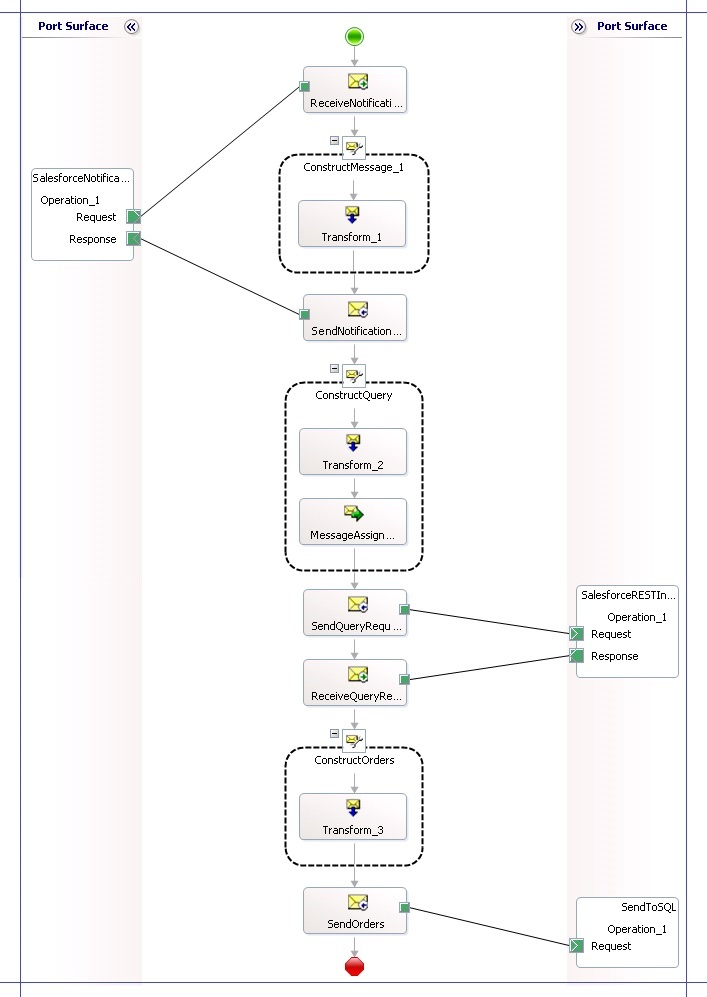

# Step 3c: Insert Opportunity Details into a SQL Server Database
By now we have built the orchestration to send a query to Salesforce and receive a response. In this section, we’ll update that orchestration to insert the response from Salesforce into an **OrderDetails** table in an on-premise SQL Server database, **Orders**. To achieve this, we’ll perform the following broad set of steps:  
  
- Create an **OrderDetails** table in an **Orders** database in an on-premise SQL Server database.  
  
- Use the [!INCLUDE[consumeadapterservshort](../includes/consumeadapterservshort-md.md)] available with [!INCLUDE[adapterpacknoversion](../includes/adapterpacknoversion-md.md)] to generate the schema for the Insert operation on the **OrderDetails** table.  
  
- Create a map to transform the Salesforce response message to the message for inserting into **OrderDetails** table in SQL Server.  
  
- Update the orchestration to use the transform to insert the response message into the **OrderDetails** table.  
  
## Create SQL Server Database and Table  
  
#### To create the database and table  
  
1.  Open SQL Server Management Studio and connect as an administrator.  
  
2.  Right-click the **Databases** node and click **New Database**. Specify the database name as `Orders` and specify other details to create a new database.  
  
3.  Open a query editor and run the following query to create an **OrderDetails** table in the **Orders** database:  
  
    ```  
    USE [Orders]  
    GO  
    /****** Object:  Table [dbo].[OrderDetails]    Script Date: 07-12-2012 22:15:47 ******/  
    SET ANSI_NULLS ON  
    GO  
    SET QUOTED_IDENTIFIER ON  
    GO  
    SET ANSI_PADDING ON  
    GO  
    CREATE TABLE [dbo].[OrderDetails]([ID] [int] IDENTITY(1,1) NOT NULL,  
    [TITLE] [varchar](200) NULL,  
    [ProductName] [varchar](200) NULL,  
    [Quantity] [float] NULL,  
    [Amount] [float] NULL,  
    PRIMARY KEY CLUSTERED   
    (  
    [ID] ASC  
    )WITH (PAD_INDEX = OFF, STATISTICS_NORECOMPUTE = OFF, IGNORE_DUP_KEY = OFF, ALLOW_ROW_LOCKS = ON, ALLOW_PAGE_LOCKS = ON) ON [PRIMARY]) ON [PRIMARY]  
    GO  
    SET ANSI_PADDING OFF  
    GO  
    ```  
  
## Create Schema for Insert Operation on OrderDetails Table  
 Installing [!INCLUDE[adapterpacknoversion](../includes/adapterpacknoversion-md.md)] provides a [!INCLUDE[consumeadapterservshort](../includes/consumeadapterservshort-md.md)] that can be used within a [!INCLUDE[btsBizTalkServerNoVersion](../includes/btsbiztalkservernoversion-md.md)] project to generate the schema for the Insert operation on the **OrderDetails** table. This section provides steps to follow to create the message schema.  
  
#### To create the schema for Insert operation  
  
1. Right-click the **BtsSalesforceIntegration** project, point to **Add**, and then click **Add Generated Items**. In the **Add Generated Items** dialog box, click **Consume Adapter Service**, and then click **Add**.  
  
2. In the [!INCLUDE[consumeadapterservshort](../includes/consumeadapterservshort-md.md)], from the Select a binding drop-down, click **sqlBinding**, and then click **Configure**.  
  
3. In the **Configure Adapter** dialog box, under **Security** tab, for **Client credential type**, select **Windows** to use Windows authentication to connect to SQL Server database.  
  
4. In the **Configure Adapter** dialog box, under **URI Properties** tab, for **Initial Catalog** specify the database name (Orders) to connect to. For **Server** specify the computer name where SQL Server you are connecting to is installed. If the SQL Server database is on the same computer as the [!INCLUDE[btsBizTalkServerNoVersion](../includes/btsbiztalkservernoversion-md.md)] project, you can just put a period (**.**). Click **OK**.  
  
5. In the [!INCLUDE[consumeadapterservshort](../includes/consumeadapterservshort-md.md)] click **Connect**. After the connection is established, select the contract type as **Client(Outbound operations)**. Under the **Select a category** box, expand **Tables**, click **OrderDetails** table, and in the right pane click **Insert** and then click **Add**.  
  
6. Specify a **Filename Prefix** if you want to prefix the generated schemas with an identifier. For this tutorial, let’s specify the prefix as **InsertOrders** and then click **OK**.  
  
    A bunch of schemas are added to the project. The schema that we’ll use for inserting messages into the **OrderDetails** table is **InsertOrdersTableOperation.dbo.OrderDetails.xsd**.  
  
## Map Salesforce Response and Insert Schemas  
 Now that we have both the schemas (response from Salesforce and inserting into **OrderDetails**), we must map the response schema from Salesforce into the insert schema for **OrderDetails** so that the response message from Salesforce can be inserted in the SQL Server database table.  
  
#### To map the schemas  
  
1.  Right-click the **BtsSalesforceIntegration** project, point to **Add**, click **New Item**, and then click **Map**. Specify the map name as `QueryResult_Orders.btm` and then click **Add**.  
  
2.  On the map surface, for the source schema, select **QueryResult** and for the destination schema, select **InsertOrdersTableOperation.dbo.OrderDetails.xsd** and then within that, the **Insert** node.  
  
3.  Map the two schemas as shown in the following screenshot:  
  
       
  
     Notice that the map uses a **Looping** functoid between the **records** and the **OrderDetails** link. This ensures that all one or more than one occurrences of nodes under **records** are mapped to similar occurrences of nodes under the **OrderDetails**.  
  
4.  Save changes to the map.  
  
## Update the Orchestration to Insert Messages into SQL Server  
 In this section, we’ll use the map in the orchestration to transform the Salesforce response message into a message for inserting order details in a SQL Server table. We’ll also add a port to send that message to SQL Server.  
  
#### To update the orchestration  
  
1. Create a message variable for the insert schema. From the orchestration view, right-click the **Messages** node, and then click **New Message**. Set the message name as **InsertOrders** and message type as **BtsSalesforceIntegration.InsertOrdersTableOperation_dbo_OrderDetails.Insert**.  
  
2. Add a Construct Message shape after the **ReceiveQueryResult** shape. Set the name of the shape to `ConstructOrders` and set the **Messages Constructed** property to **InsertOrders**.  
  
3. Within the **ConstructOrders** shape, add a **Transform** shape. Double-click the Transform shape to open the Transform Configuration dialog box. In the dialog box, select the **Existing Map** option, and then from the drop-down select **BtsSalesforceIntegration.QueryResult_Orders**. Set **Source** to **QueryResultMsg**, **Destination** to **InsertOrders**, and then click **OK**.  
  
4. After the **ConstructOrders** shape, add a Send shape. Name the shape `SendOrders` and set the message type as **InsertOrders**.  
  
5. Add a port to insert order details into Salesforce. In the Port Configuration wizard, select the following options:  
  
   - Specify the port name as `SendToSQL`.  
  
   - Select the option to create a new port type.  
  
   - Set **Communication Pattern** to *One-Way*.  
  
   - Set **Port direction of communication** to *I’ll always be sending messages on this port* and set **Port binding** to *Specify later*.  
  
     Connect the **Request** operation of port to the **SendOrders** Send shape to complete the orchestration. The following screenshot depicts the completed orchestration, end-to-end.  
  
       
  
     Add a strong name key file to the project and save changes to the project.  
  
   With the steps in this topic, we have completed the orchestration, to receive an opportunity notification from Salesforce, query Salesforce for more details about the opportunity, and then insert the query response into a SQL Server database. In the subsequent topics, we’ll build some other key components of the solution that are used to authenticate with Salesforce and process Salesforce response within BizTalk Server.  
  
## See Also  
 [Step 3: Create the BizTalk Server Solution in Visual Studio](../core/step-3-create-the-biztalk-server-solution-in-visual-studio.md)