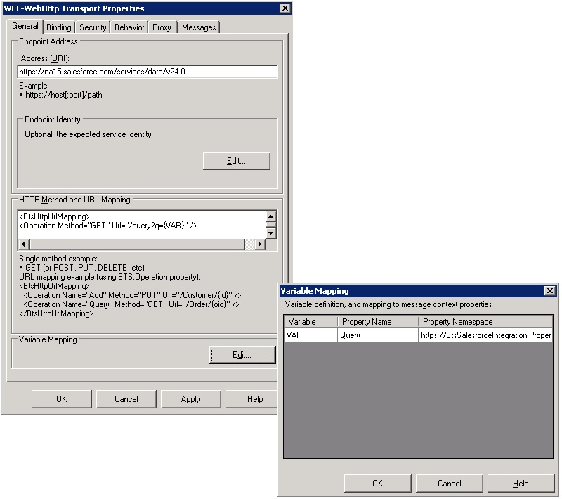
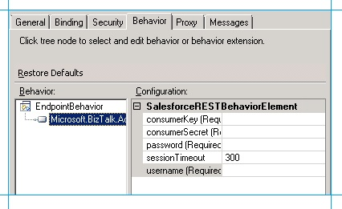

# Step 4: Configure the BizTalk Server Solution
In the previous step, you created and deployed a [!INCLUDE[btsBizTalkServerNoVersion](../includes/btsbiztalkservernoversion-md.md)] application to receive Salesforce notification into [!INCLUDE[btsBizTalkServerNoVersion](../includes/btsbiztalkservernoversion-md.md)] and insert the details into an on-premise SQL Server database. In this step, we’ll configure the application in [!INCLUDE[btsBizTalkServerNoVersion](../includes/btsbiztalkservernoversion-md.md)] Administration console. Configuring the application primarily involves creating physical ports corresponding to the logical ports we created in the orchestration. It also involves binding the physical port to the logical ports. We’ll perform the following steps to configure the [!INCLUDE[btsBizTalkServerNoVersion](../includes/btsbiztalkservernoversion-md.md)] application:  
  
- Configure a request-response WCF-BasicHttpRelay receive location to receive opportunity notifications from Salesforce.  
  
- Configure a request-response WCF-WebHttp send port to send query to Salesforce for retrieving product details related to the received opportunity notification. This send port also receives the query response from Salesforce.  
  
- Configure a one-way WCF-SQL send port to insert the query response from Salesforce into an on-premise SQL Server database.  
  
- Configure the [!INCLUDE[btsBizTalkServerNoVersion](../includes/btsbiztalkservernoversion-md.md)] application by associating the logical port in the orchestration with the physical ports created in the [!INCLUDE[btsBizTalkServerNoVersion](../includes/btsbiztalkservernoversion-md.md)] Administration console.  
  
### To configure the WCF-BasicHttpRelay receive location  
  
1. Open the [!INCLUDE[btsBizTalkServerNoVersion](../includes/btsbiztalkservernoversion-md.md)] Administration console. Expand the Applications node and look for the **SalesforceIntegration** application. This application is created when you deployed the [!INCLUDE[btsBizTalkServerNoVersion](../includes/btsbiztalkservernoversion-md.md)] project from Visual Studio.  
  
2. Expand the **SalesforceIntegration** application, right-click **Receive Ports**, point to **New**, and then click **Request-Response Receive Port**. Specify the port name as `ReceiveOppNotification` and from the left-pane, click **Receive Locations**.  
  
3. In the Receive Location Properties dialog box, specify the following values:  
  
   |||  
   |-|-|  
   |Name|Enter `ReceiveOppNotification`.|  
   |Type|Select **WCF-BasicHttpRelay**|  
   |Receive Handler|Select **BizTalkServerApplication**|  
   |Receive Pipeline|Select **XMLReceive**|  
   |Send Pipeline|Select **PassThruTransmit**|  
  
    Click **Configure** against the port type.  
  
4. In the WCF-BasicHttpRelay Transport Properties dialog box, specify the following values:  
  
   1. On the **General** tab, for **Address (URI)**, enter `https://btssalesforce.servicebus.windows.net/notifications/opportunity`. Here, **btssalesforce** is namespace you created in [Step 1: Create a Service Bus Namespace](../core/step-1-create-a-service-bus-namespace.md). The URL you specify here is the same URL you specified while creating a workflow in Salesforce in [Step 2: Set up the Salesforce System](../core/step-2-set-up-the-salesforce-system.md). You set up a workflow in which every time the stage of an opportunity is set to Closed Won, Salesforce sends a notification to the URL *<https://btssalesforce.servicebus.windows.net/notifications/opportunity>*. We specify the same URL here as part of this receive location configuration. When the receive location is enabled, the relay endpoint specified by the URL is created in [!INCLUDE[winazure](../includes/winazure-md.md)].  
  
   2. On the **Security** tab, specify the following:  
  
      -   For **Security mode**, select **Transport** and for **Relay client authentication type**, select **None**.  
  
      -   Select the **Enable service discovery** check box to publish the service behavior in the [Service Registry](http://msdn.microsoft.com/library/windowsazure/dd582704.aspx). Specify the **Display name** which denotes the name with which the service is published to the registry. You can set the **Discovery mode** to public or private. For this tutorial, set **Display name** to `SF Outbound Notification` and **Discovery mode** to **Public**.  
  
      -   Under Access control service box, click **Edit**. For **Access Control Service STS Uri**, enter `https://btssalesforce-sb.accesscontrol.windows.net/`. For **Issuer Name** and **Issuer Key**, enter the values that you saved in [Step 1: Create a Service Bus Namespace](../core/step-1-create-a-service-bus-namespace.md) for **Default User** and **Default Key** fields.  
  
   3. Click **OK** until you exit all open dialog boxes.  
  
### To configure the WCF-WebHttp send port  
  
1. Expand the **SalesforceIntegration** application, right-click **Send Ports**, point to **New**, and then click **Static Solicit-Response Send Port**.  
  
2. In the Send Port Properties dialog box, specify the following values:  
  
   |||  
   |-|-|  
   |Name|Enter `SalesforceREST`.|  
   |Type|Select **WCF-WebHttp**|  
   |Send Handler|Select **BizTalkServerApplication**|  
   |Send Pipeline|Select **PassThruTransmit**|  
   |Receive Pipeline|Select **AddNamespace** and click the ellipsis button against the pipeline to configure the pipeline.<br /><br /> -   Under **Stage 1: Decode**, for **NamespaceBase**, enter `http://BtsSalesforceIntegration.QueryResult`. This is the namespace of the QueryResult.xsd schema that you created in [Step 3b: Retrieve Opportunity Details from Salesforce using the WCF-WebHttp Adapter](../core/step-3b-retrieve-opportunities-from-salesforce-using-the-wcf-webhttp-adapter.md). When the **AddNamespace** receive pipeline receives the response from Salesforce, it adds this namespace to the response message. By default, the response message from Salesforce does not include any namespace.<br />     For **NamespacePrefix**, enter `sf`.<br />-   Under **Stage 2: Disassemble**, accept the default values and then click **OK**.|  
  
    On the Send Port Properties dialog box, click **Configure** against the port type.  
  
3. In the WCF-WebHttp Transport Properties dialog box, specify the following values:  
  
   1. On the **General** tab, do the following:  
  
      - for **Address (URI)**, enter `https://<Salesforce_instance_name>.salesforce.com/services/data/v24.0`. You can retrieve the Salesforce instance name by copying the text between https:// and Salesforce.com in the address bar where you have the Salesforce.com portal open. For example, if the URL in the Salesforce portal is *https://*<em>na15</em>*.salesforce.com/home/home.jsp*, the Salesforce instance name is **na15**.  
  
      - Under **HTTP Method and URL Mapping** box, specify the following:  
  
        ```  
        <BtsHttpUrlMapping>  
        <Operation Method="GET" Url="/query?q={VAR}" />  
        </BtsHttpUrlMapping>  
        ```  
  
         Here’s how this setting is used— To query Salesforce for retrieving more information about the opportunity notification, we must perform a GET operation on the Salesforce REST endpoint (specified in the **Address** field) and append the query to retrieve the opportunity details. So, the URL should look like:  
  
        ```  
        https://na15.salesforce.com/services/data/v24.0/query?q=<query_string>  
        ```  
  
         We already have the Salesforce REST endpoint as part of the **Address (URI)** field. So, as part of **HTTP Method and URL Mapping** property, we specify using the GET method and appending the **{VAR}** as a variable.  
  
      - In the **Variable Mapping** box, click **Edit**. In this box you specify how the value for the **{VAR}** variable is deduced at runtime.  
  
         In [Step 3b: Retrieve Opportunity Details from Salesforce using the WCF-WebHttp Adapter](../core/step-3b-retrieve-opportunities-from-salesforce-using-the-wcf-webhttp-adapter.md), we had promoted the Query property, which resulted in creating a **PropertySchema.xsd**. We’ll use the **Query** element in that schema to pass the query string by mapping that element to the {VAR} variable in the URL.  
  
         In the Variable Mapping dialog box, the **Variable** column lists the name of the variable you specified earlier, for example, **VAR**. In the **Property Name** column, specify the name of the promoted property that has the query string to be passed to the variable. In this tutorial, that property name is **Query**. Finally, for **Property Namespace**, specify the namespace for the **PropertySchema.xsd**, which is `https://BtsSalesforceIntegration.PropertySchema`. Click **OK**.  
  
           
  
   2. On the **Security** tab, for **Security mode**, select **Transport**.  
  
   3. On the **Behavior** tab, use the custom behavior that you created in [Step 3d: Enabling BizTalk Server to Send and Receive Messages from Salesforce](../core/step-3d-enabling-biztalk-server-to-send-and-receive-messages-from-salesforce.md) to authenticate with Salesforce. To use the behavior, do the following:  
  
      -   Right-click **EndpointBehavior** and then select **Add extension**.  
  
      -   In the **Select Behavior Extension** dialog box, select **Microsoft.BizTalk.Adapter.Behaviors.Demo.Salesforce**. We had used this behavior name while adding the behavior to the machine.config.  
  
      -   Select the newly added behavior and then specify the following values:  
  
          |||  
          |-|-|  
          |consumerKey (Required)|Specify the consumer key for your Salesforce account. You can retrieve the consumer key by going to the Salesforce connected application you created in [Step 2: Set up the Salesforce System](../core/step-2-set-up-the-salesforce-system.md).|  
          |consumerSecret (Required)|Retrieve the consumer secret from the Salesforce connected application you created in [Step 2: Set up the Salesforce System](../core/step-2-set-up-the-salesforce-system.md).|  
          |Password (Required)|Specify the password for the Salesforce account. To connect to Salesforce from a third party application, you must specify the password in the format password followed by the security token. For example, if the password is **password** and the token is **XXXXXX**, you must enter `passwordXXXXXX`.|  
          |sessionTimeout|This has a default value of 300.|  
          |Username (Required)|Specify the Salesforce developer login account.|  
  
             
  
   4. On the **Messages** tab, under **Outbound Message** box, for **Suppress Body for Verbs**, enter `GET`. This ensures for the GET method, there is no message payload in the request being sent to Salesforce.  
  
   5. Click **OK** until you exit all open dialog boxes.  
  
### To configure the WCF-SQL send port  
  
1.  Expand the **SalesforceIntegration** application, right-click **Send Ports**, point to **New**, and then click **Static One-way Send Port**.  
  
2.  In the Send Port Properties dialog box, specify the following values:  
  
    |||  
    |-|-|  
    |Name|Enter `SendToSQL`.|  
    |Type|Select **WCF-SQL**|  
    |Send Handler|Select **BizTalkServerApplication**|  
    |Send Pipeline|Select **XMLTransmit**|  
  
     On the Send Port Properties dialog box, click **Configure** against the port type.  
  
3.  In the WCF-SQL Transport Properties dialog box, specify the following values:  
  
    1.  On the **General** tab, do the following:  
  
        -   Under `Endpoint Address`, click **Configure**. For the **InitialCatalog** property, specify the database name that contains the table where the data from Salesforce response must be entered. For this tutorial enter this value as `Orders`. For **Server** property, enter the server name where SQL Server database is installed.  
  
        -   Under **SOAP Action header**, specify the action to be used for inserting into the **OrderDetails** table. You must enter `TableOp/Insert/dbo/OrderDetails`.  
  
    2.  On the Credentials tab, if you leave everything blank the adapter uses Windows Authentication to connect to the SQL Server database. If you want to use any other form of authentication, you can specify the relevant values.  
  
    3.  Click **OK** until you exit all open dialog boxes.  
  
### To configure the BizTalk Server application  
  
1. In the [!INCLUDE[btsBizTalkServerNoVersion](../includes/btsbiztalkservernoversion-md.md)] Administration console, right-click the **SalesforceIntegration** application, and then click **Configure**.  
  
2. In the Configure Application dialog box, select the **NotificationServiceClient** orchestration, and from the right pane do the following:  
  
   1. For Host, select **BizTalkServerApplication**.  
  
   2. Map the logical receive port **SalesforceNotificationPort** to the physical receive port, **ReceiveOppNotification**.  
  
   3. Map the logical send port **SalesforceRESTInterface** to the physical send port, **SalesforceREST**.  
  
   4. Map the logical send port **SendToSQL** to the physical send port, **SendToSQL**.  
  
      Click **OK**.  
  
3. Right-click the **SalesforceIntegration** application and then click **Start**. This starts the **NotificationServiceClient** orchestration, enables the receive location, and starts the send port.  
  
   In this topic, we finished configuring the solution in [!INCLUDE[btsBizTalkServerNoVersion](../includes/btsbiztalkservernoversion-md.md)] Administration console by associating the logical ports in the orchestration with the physical ports.