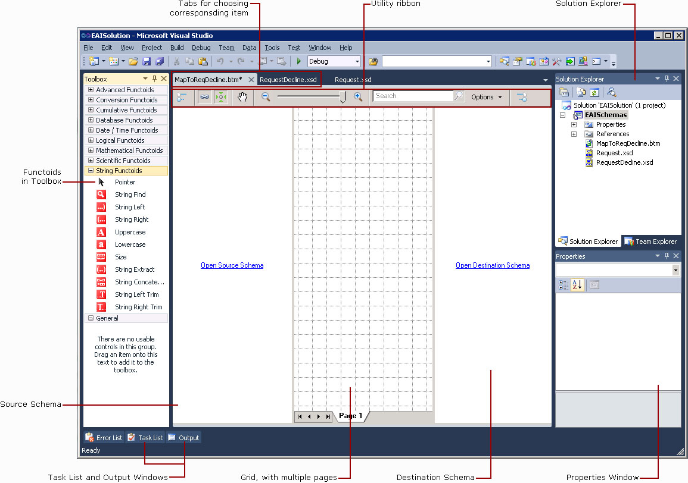

# Step 4: Create the Map
  
  
 **Time to complete:** 6 minutes  
  
 **Objective:** In this step, you create a map that transforms Request message to RequestDecline message.  
  
 **Purpose:** The map ensures that the request ID number and the grand total are included in the request decline message returned to the warehouse inventory system. You use BizTalk Mapper to link fields in an incoming message to fields defined for the outgoing message. This is necessary because these two messages do not have the same schema structure.  
  
## Prerequisites  
 Note the following requirements before you begin this step:  
  
-   Before you begin this step you must complete [Step 2: Create the Inventory Request Schema](../core/step-2-create-the-inventory-request-schema.md) and [Step 3: Create the Request Decline Schema](../core/step-3-create-the-request-decline-schema.md).  
  
## Procedures  
 The map depends on the Request schema and the RequestDecline schema.  You much compile the project with the schema before you can use them on a map.  
  
#### To compile the EAISchemas project  
  
-   In Solution Explorer, right-click **EAISchemas**, and then click **Build**.  
  
#### To create the map  
  
1.  In Solution Explorer, right-click the **EAISchemas** project, point to **Add**, and then click **New Item**.  
  
2.  In the **Add New Item - EAISchemas** dialog box, do the following:  
  
    |Use this|To do this|  
    |--------------|----------------|  
    |**Installed Templates**|Click **Map Files**, and then click **Map**.|  
    |**Name**|Type **MapToReqDecline.btm**.|  
  
3.  Click **Add**.  
  
     The following figure shows the Source Schema, Destination Schema, and Mapper Grid.  
  
       
  
4.  In the **Source Schema** pane, click **Open Source Schema**.  
  
5.  In the **BizTalk Type Picker** dialog box, expand **EAISchemas**, expand **Schemas**, click **EAISchemas.Request**, and then click **OK**.  
  
6.  In the **Source Schema** pane, right-click **\<Schema>**, and then click **Expand Tree Node**.  
  
7.  In the **Destination Schema** pane, click **Open Destination Schema**.  
  
8.  In the **BizTalk Type Picker** dialog box, expand **EAISchemas**, expand **Schemas**, click **EAISchemas.RequestDecline**, and then click **OK**.  
  
9. In the **Destination Schema** pane, right-click **\<Schema>**, and then click **Expand Tree Node**.  
  
10. In the **Source Schema** pane, drag the **ReqID** field to the **ReqID** in the **Destination Schema** pane. A line appears connecting the two elements.  
  
11. In the **Source Schema** pane, drag the **GrandTotal** field to the **GrandTotal** field in the **Destination Schema** pane to map the data from one schema to the other.  
  
12. On the **File** menu, click **Save All** to save your work.  
  
## What did I just do?  
 In this step, you created a map that transforms Request message to RequestDecline message.  
  
## Next Steps  
 You build the EAISchemas project.  
  
## See Also  
 [Step 1: Create EAISchemas Project](../core/step-1-create-eaischemas-project.md)   
 [Step 2: Create the Inventory Request Schema](../core/step-2-create-the-inventory-request-schema.md)   
 [Step 3: Create the Request Decline Schema](../core/step-3-create-the-request-decline-schema.md)   
 [Step 4: Create the Map](../core/step-4-create-the-map.md)   
 [Step 5: Build the EAISchemas Project](../core/step-5-build-the-eaischemas-project.md)   
 [Creating Maps Using BizTalk Mapper](../core/creating-maps-using-biztalk-mapper.md)