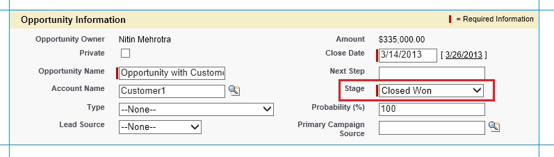
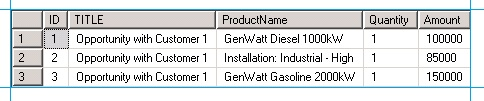

# Step 5: Test the Solution
This solution aims at automating the process of sending notifications to [!INCLUDE[btsBizTalkServerNoVersion](../includes/btsbiztalkservernoversion-md.md)], every time a new opportunity is closed in Salesforce by setting the stage of the opportunity as **Closed Won**. After the notification is received [!INCLUDE[btsBizTalkServerNoVersion](../includes/btsbiztalkservernoversion-md.md)] sends a query to Salesforce to retrieve product details related to the opportunity, and then inserts the response from Salesforce into a SQL Server database table called **OrderDetails**. So, to test this solution, we will update the stage of an opportunity to **Closed Won** and as a result, relevant records must get inserted in the OrderDetails table in the Orders database.  
  
### To test the solution  
  
1. Log in to `https://login.salesforce.com/?lt=de`, using the Salesforce developer login credentials.  
  
2. In the navigation bar, click **Opportunities**, and then click **Opportunity with Customer 1**. You had created this opportunity in [Step 2: Set up the Salesforce System](../core/step-2-set-up-the-salesforce-system.md).  
  
3. In the **Opportunity Detail** section, take a note of the associated products in the **Products (Standard)** section. The values you under this section will finally get inserted into the SQL Server database. Under the **Opportunity Detail** section click the **Edit** button and change the value of **Stage** field to **Closed Won**. Click **Save**.  
  
      
  
4. In SQL Server Management Studio, run a query on the **OrderDetails** table to select all rows.  
  
      
  
    Notice that it lists the products that are listed in the opportunity for which you changed the stage.  
  
      
  
   You can see that the records entered in the **OrderDetails** table correspond to the sales opportunity created in Salesforce for a given set of products. You can repeat these steps by creating new opportunities and associating new products with the opportunity.