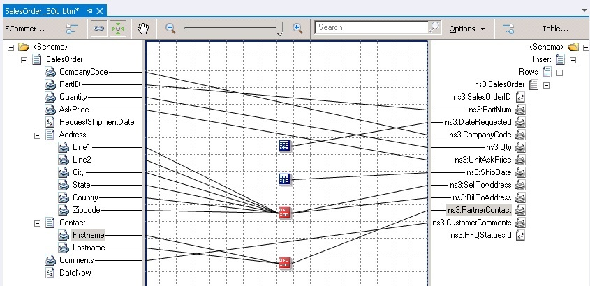

# Step 6 (On Premises): Create a Transform to Map the Message from the Queue to the Insert Schema
The message that is received by [!INCLUDE[btsBizTalkServerNoVersion](../includes/btsbiztalkservernoversion-md.md)] from the Service Bus Queue will be of the **ECommerceSalesOrder.xsd** schema. However, to insert a message into the **SalesOrder** table, the message must be of **Insert** schema that you generated in [Step 5 (On Premises): Generate the Schema for Inserting a Message inito SalesOrder Table](../core/step-5-generate-the-schema-for-inserting-a-message-into-salesorder-table.md). So, in this topic, we create a map to transform the **ECommerceSalesOrder.xsd** schema into the Insert operation schema.  

### To create a map  

1. In the [!INCLUDE[btsBizTalkServerNoVersion](../includes/btsbiztalkservernoversion-md.md)] you already created, right-click the project, point to **Add**, and then click **New Item**. In the **New Item** dialog box, select **Map**, enter the map name as `SalesOrder_SQL.btm`, and then click **Add**.  

2. In the map, for the source schema, select **ECommerceSalesOrder.xsd**. For the destination schema, select **TableOperations.SalesOrder.xsd (Insert)** schema.  

3. Directly map the following nodes in the source and destination schemas:  

   | Source Schema | Destination Schema |
   |---------------|--------------------|
   |  CompanyCode  |    CompanyCode     |
   |    PartId     |      PartNum       |
   |   Quantity    |        Qty         |
   |   AskPrice    |    UnitAskPrice    |
   |   Comments    |  CustomerComments  |

4. Use the **Date and Time** functoid to map values to the **DateRequested** and **ShipDate** elements in the destination schema. These nodes are not mapped to the respective nodes in the source schema. Instead, the current date and time is passed on to these nodes by using the **Date and Time** functoid.  

   1.  Drag and drop a **Date and Time** functoid from toolbox to the mapper surface.  

   2.  Connect the functoid to the **DateRequested** element in the destination schema.  

   3.  Drag and drop another **Date and Time** functoid and connect it to the **ShipDate** element in the destination schema.  

5. Map the following nodes in the source and destination schemas using a **String Concatenate** functoid:  

   |Source Schema|Destination Schema|  
   |-------------------|------------------------|  
   |Address\Line1|SellToAddress   BillToAddress|  
   |Address\Line2|SellToAddress   BillToAddress|  
   |Address\City|SellToAddress   BillToAddress|  
   |Address\State|SellToAddress   BillToAddress|  
   |Address\Country|SellToAddress   BillToAddress|  
   |Address\ZipCode|SellToAddress   BillToAddress|  
   |Contact\FirstName|PartnerContact|  
   |Contact\LastName||  

    Perform the following steps for each of the string concatenation mapping sets:  

   1.  Drag and drop a **String Concatenate** functoid from toolbox to the mapper surface.  

   2.  Add each element from the source tree as an input to the **String Concatenate** functoid.  

   3.  Drag and configure the output of the **String Concatenate** functoid to the element in the destination schema.  

        The completed map resembles the following:  

          

## See Also  
 [Tutorial 4: Creating a Hybrid Application Using BizTalk Server 2013](../core/tutorial-4-creating-a-hybrid-application-using-biztalk-server-2013.md)