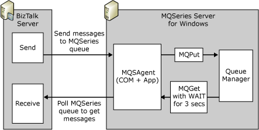

# Structure of the MQSeries Adapter
The MQSeries adapter has two parts: the adapter running under [!INCLUDE[btsBizTalkServerNoVersion](../includes/btsbiztalkservernoversion-md.md)] and a COM+ application, MQSAgent, running under MQSeries Server for Windows. The following figure shows this relationship.  
  
   
  
 The adapter communicates with the MQSAgent application. The MQSAgent application, in turn, communicates with MQSeries Server for Windows. You can install the agent on the same computer as the adapter if you install MQSeries Server for Windows on the computer.  
  
 The send part of the adapter sends the message to the MQSAgent. MQSAgent then, using **MQPut**, sends the message to the MQSeries Queue Manager.  
  
 The receive part of the adapter polls the MQSAgent to see if there are messages. When there is a message, the MQSAgent performs an **MQGet** to retrieve the message. MQSAgent includes a hard-coded three-second wait for retrieving the message from the Queue Manager.  
  
> [!NOTE]
>  You can set the polling interval of the adapter. When you set the polling interval to less than three seconds, the wait interval is set to the polling interval.  
  
 Both the send and receive message actions may occur in transactions. This enables the adapter to roll back the message and, possibly, to retry the send or receive operations. For more information about transactions, see [MQSeries Adapter Batching and Transaction Handling](../core/mqseries-adapter-batching-and-transaction-handling.md).  
  
 Because the adapter works across more than one computer, there is a possible security problem. A hostile program could impersonate the agent and capture data. For more information about enhanced protection for the adapter and agent, see [MQSeries Adapter Security](../core/mqseries-adapter-security.md).  
  
## See Also  
 [MQSeries Adapter Architecture](../core/mqseries-adapter-architecture.md)   
 [What Is the MQSeries Adapter?](../core/what-is-the-mqseries-adapter.md)