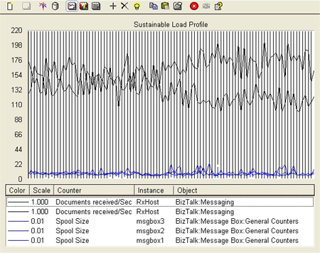

# Sustainable Load Test
The information in this topic refers to the tests explained in [Test Scenarios for Measuring MST of the Engine](../core/test-scenarios-for-measuring-mst-of-the-engine.md).  
  
 For the first test, the system was driven to MST so that observations of a healthy system can be made.  
  
 The following graph shows key indicators after using this approach to find the maximum sustainable throughput of the test system.  
  
 **Load profile of sustainable load test**  
  
   
  
 This graph shows that, for the hour of the test, the spool depth was stable and not growing:  
  
- The black lines at the top of the graph show the total messages received per second by the system (for example, for both of the receiving servers).  
  
- The lines at the bottom of the graph indicate the MessageBox spool depth on each of the SQL Servers.  
  
  Once the system is driven to the point of the maximum stable spool depth, MST is measured by the number of messages received per second. For this scenario, on the hardware described, an MST of 290 messages per second was achieved.  
  
> [!NOTE]
>  Once the system is driven to a point where the spool depth is no longer stable over time, MST has been exceeded. Several test runs with varying load may be required to evaluate the maximum load at which spool depth remains stable and your system can handle the message backlog without incurring additional message backlog.  
  
 Part of any analysis of a BizTalk deployment performance should include checking some key indicators to understand resource bottlenecks. The key measures and their values used for this deployment running under maximum sustainable throughput were as follows:  
  
 **CPU Utilization**  
  
|Server|Average CPU Utilization|  
|------------|-----------------------------|  
|BizTalk Servers|55%|  
|SQL Server (Master MessageBox Server)|76%|  
|SQL Server (Other MessageBox Servers)|83%|  
  
 **Physical Disk Idle Time**  
  
|Server|Average Disk Idle Time|  
|------------|----------------------------|  
|Average for all SQL Servers|69%|  
  
 **SQL Locks on SQL Server**  
  
|Parameter|Value|  
|---------------|-----------|  
|Average Total Lock Timeouts per second (per SQL Server)|1980|  
|Average Total Lock Wait Time (ms)|495|  
  
 During this test no errors were generated in the BizTalk or SQL Server application log.  
  
 From this data, we can draw the following conclusions:  
  
- There are no obvious resource bottlenecks in our system.  
  
- All of these indicators are well within healthy limits.  
  
- CPU and Disk Idle Times show that there is plenty of headroom and they are not even close to being pegged.  
  
- The SQL lock indicators look good, **Lock Timeouts/sec** doesn’t start to become an issue until around 5000 or so (depending on your SQL Server) and Lock Wait times under 1 second are also healthy.  
  
  Now that we have shown how to find the maximum sustainable throughput and seen what the key indicators look like for a sustainable, healthy system, let’s explore some behavior associated with a system that is receiving faster than it is processing and collecting garbage. Proceed to [Overdrive Load Test](../core/overdrive-load-test.md).  
  
## See Also  
 [Test Scenarios for Measuring MST of the Engine](../core/test-scenarios-for-measuring-mst-of-the-engine.md)   
 [Overdrive Load Test](../core/overdrive-load-test.md)