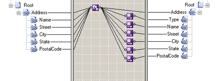

# Table-Driven Looping Example
This section briefly describes a map using the **Table Looping** and **Table Extractor** functoids. For detailed information about selecting, placing, linking, and configuring the functoids, see [How to Add Table Looping and Table Extractor Functoids to a Map](../core/how-to-add-table-looping-and-table-extractor-functoids-to-a-map.md).  
  
 Suppose you have a list of addresses that you need to use in a document requiring separate ship-to and bill-to addresses. The addresses might appear like the following code.  
  
```  
<ns0:Root xmlns:ns0="http://TableLoopingSample.Addresses">  
    <Address>  
        <Name>Kelly Focht</Name>  
        <Street>456 1st Ave</Street>  
        <City>Miami</City>  
        <State>FL</State>  
        <PostalCode>81406</PostalCode>  
    </Address>  
    <Address>  
        <Name>Wendy Wheeler</Name>  
        <Street>7890 Broadway</Street>  
        <City>Columbus</City>  
        <State>OH</State>  
        <PostalCode>46290</PostalCode>  
    </Address>  
</ns0:Root>  
```  
  
 One form the output could take would be the following code, duplicating the addresses but marking them with attributes.  
  
```  
<ns0:Root xmlns:ns0="http://TableLoopingSample.POAddresses">  
    <Address Type="ShipTo">  
        <Name>Kelly Focht</Name>  
        <Street>456 1st Ave</Street>  
        <City>Miami</City>  
        <State>FL</State>  
        <PostalCode>81406</PostalCode>  
    </Address>  
    <Address Type="BillTo">  
        <Name>Kelly Focht</Name>  
        <Street>456 1st Ave</Street>  
        <City>Miami</City><State>FL</State>  
        <PostalCode>81406</PostalCode>  
    </Address>  
    <Address Type="ShipTo">  
        <Name>Wendy Wheeler</Name>  
        <Street>7890 Broadway</Street>  
        <City>Columbus</City>  
        <State>OH</State>  
        <PostalCode>46290</PostalCode>  
    </Address>  
    <Address Type="BillTo">  
        <Name>Wendy Wheeler</Name>  
        <Street>7890 Broadway</Street>  
        <City>Columbus</City>  
        <State>OH</State>  
        <PostalCode>46290</PostalCode>  
    </Address>  
</ns0:Root>  
```  
  
 `The following figure shows a map using the`  **Table** **Looping**  `functoid and`  **Table** **Extractor**  `functoids to generate the desired output instance message.`  
  
   
TableLooping and Extractor Functoids  
  
 Notice that the **Table Looping** functoid links to the record-level element in both the input and output schemas. The link ensures the creation of the enclosing structure and, thus, the creation of the elements within the record. Also notice that there is one **Table Extractor** functoid for each field in the output schema.  
  
 The link to the record in the input schema is the first parameter in the **Configure \<Functoid\> Functoid**dialog box.  
  
 The second parameter is the number of columns in the grid table of the functoid: one column each for the address type, name, street, city, state, and postal code. Following the second parameter is a list of all of the values that may appear in the grid table. These include string constants for the address type ("ShipTo", "BillTo"), as well as links to the fields of the address. Notice that the links to the address fields have names. Naming the links in the map simplifies constructing the table. Otherwise, full paths appear in the **Configure Table Looping Functoid** dialog box.  
  
 After you have configured the **Table Looping** functoid, you can construct the table using the **Configure Table Looping Functoid** dialog box. The dialog appears when you click the ellipsis (**…**) button associated with the **Table Looping Grid** property in the **Properties** window.  
  
 Notice that there are six columns as specified in the **Configure Table Looping Functoid** dialog: one column for each field in the output schema. The dropdown shows the possible values for a field, also as specified by the third and following parameters in the **Configure Table Looping Functoid** dialog. The table has two rows, one for each type of record in the output schema. Because there are two rows, this map produces two records for every input record. If there were four rows, there would be four output records for each input record.  
  
 As the **Table Looping** functoid takes each record, it fills in the table with the values from the record, and then sends one row at a time to the **Table Extractor** functoids. The **Table Extractor** functoids each extract one value from the table row and pass it on to the linked field in the output instance message.  
  
## See Also  
 [Table Looping Functoid](../core/table-looping-functoid.md)   
 [Table Extractor Functoid](../core/table-extractor-functoid.md)   
 [Table-Driven Looping Configuration](../core/table-driven-looping-configuration.md)   
 [How to Add Table Looping and Table Extractor Functoids to a Map](../core/how-to-add-table-looping-and-table-extractor-functoids-to-a-map.md)   
 [Advanced Functoids](../core/advanced-functoids.md)   
 [Index Functoid](../core/index-functoid.md)   
 [Iteration Functoid](../core/iteration-functoid.md)   
 [Looping Functoid](../core/looping-functoid.md)   
 [Record Count Functoid](../core/record-count-functoid.md)
