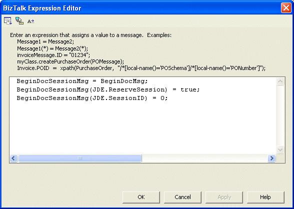

# Task 4: Configure the Construct Message Shape
The Construct Messages hold messages assignments with the instructions for the Begin, Edit, and End Doc code.  
  
 Use the following procedure to configure the Construct Message shape.  
  
### To configure the Construct Message shape  
  
1. Drag a Construct Message shape inbetween ReceiveBeginDoc and SendBeginDoc.  
  
   -   **Messages Constructed:** BeginDocSessionMsg  
  
   -   **Name:** ConstructBeginDocMessageWithSession  
  
   1. Drag a Message Assignment shape into your orchestration where you want to create a new message.  
  
   2. Double-click the inner MessageAssignment_1 shape.  
  
       The BizTalk Expression Editor appears.  
  
   3. Type in your code, for example:  
  
      ```  
      BeginDocSessionMsg = BeginDocMsg;  
      BeginDocSessionMsg(JDE.ReserveSession) = true;  
      BeginDocSessionMsg(JDE.SessionID) = 0;  
      ```  
  
       This tells the adapter you want to start a session. The SessionID is initialized as 0 but when the response comes back the ID will be assigned by the J.D. Edwards EnterpriseOne Server.  
  
        
  
2. Drag a Construct Message before SendEditLine.  
  
   - **Messages Constructed:** EditLineSessionMsg  
  
   - **Name:** ConstructEditLineMessageWithSession  
  
       
  
   1. Drag a Message Assignment shape into your orchestration where you want to create a new message.  
  
   2. Double-click the inner MessageAssignment_1 shape.  
  
       The BizTalk Expression Editor appears.  
  
   3. Type in your code, for example:  
  
      ```  
      EditLineSessionMsg = EditLineMsg;  
      EditLineSessionMsg(JDE.ReserveSession) = true;  
      EditLineSessionMsg(JDE.SessionID) =  
      BeginDocResponseMsg(JDE.SessionID);  
      ```  
  
        
  
3. Drag a Construct Message shape before SendEndDoc.  
  
   -   **Messages Constructed:** EndDocSessionMsg  
  
   -   **Name:** ConstructEndDocMessageWithSession  
  
   1.  Drag a Message Assignment shape into your orchestration where you want to create a new message.  
  
   2.  Double-click the inner MessageAssignment_1 shape.  
  
        The BizTalk Expression Editor appears.  
  
   3.  Type in your code, for example:  
  
       ```  
       EndDocSessionMsg = EndDocMsg;  
       EndDocSessionMsg(JDE.ReserveSession) = false;  
       EndDocSessionMsg(JDE.SessionID) =  
          BeginDocResponseMsg(JDE.SessionID);  
       ```  
  
## See Also  
 [Task 1: Create the Ports](../core/task-1-create-the-ports1.md)   
 [Task 2: Create the Messages](../core/task-2-create-the-messages2.md)   
 [Task 3: Configure the Send and Receive Shapes](../core/task-3-configure-the-send-and-receive-shapes2.md)   
 [Task 5: Configure the Transform Shape](../core/task-5-configure-the-transform-shape2.md)