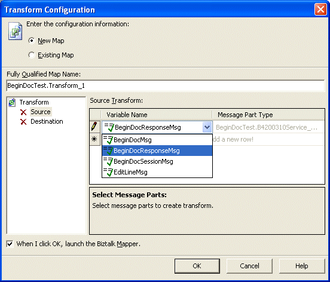
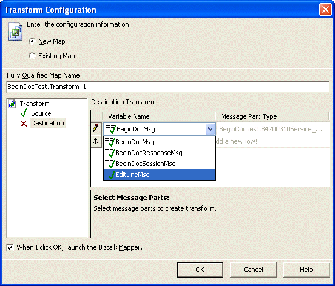

# Task 5: Configure the Transform Shape
Use the following procedure to configure the Transform shape.  
  
### To configure the Transform shape  
  
1. Drag a Construct Message shape after ReceiveBeginDocResponse.  
  
   - **Messages Constructed:** EditLineMsg  
  
   - **Name:** ConstructEditLineMessageWithData  
  
     Right-click in the middle, select **Insert Shape**, and then select **Transform**.  
  
       
  
     Using Transform, map data from the data you are sending to the data that is sent.  
  
     For your work environment you would send a document (instead of BeginDoc) with all values possible allowing you to construct all possible messages, BeginDoc, EditLine, and EndDoc. For this example, however, there is only hard coded data.  
  
2. Double-click **Transform_1** to open.  
  
   1.  Select Source and click in the Add row under **Variable Name** and select **BeginDocResponseMsg**.  
  
          
  
   2.  Select **Destination** and click in the Add row under **Variable Name**, select **EditLineMsg**, and click **OK**.  
  
          
  
3. In the Solution Explorer, double-click **Transform_1.btm** to open the mapping tool. Link the following four items:  
  
   - mnCMJobNo  
  
   - szCMComputerID  
  
   - mnProcessID  
  
   - mnTransactionID  
  
       
  
     For ease of use, this example has hardcoded values. Click the item in the Destination Schema and set the following Value.  
  
       
  
   ```  
   <?xml version="1.0" encoding="utf-8"?>  
   <ns0:F4211FSEditLine xmlns:ns0="http://schemas.microsoft.com/  
         [JDE://CSALES/B4200310]">  
      <ns0:cCMLineAction>A</ns0:cCMLineAction>  
      <ns0:cCMProcessEdits>1</ns0:cCMProcessEdits>  
      <ns0:cCMWriteToWFFlag>2</ns0:cCMWriteToWFFlag>  
      <ns0:szItemNo>210</ns0:szItemNo>  
      <ns0:mnQtyOrdered>1</ns0:mnQtyOrdered>  
      <ns0:cSalesTaxableYN>N</ns0:cSalesTaxableYN>  
      <ns0:szTransactionUOM>EA</ns0:szTransactionUOM>  
      <ns0:szCMProgramID>XMLInterop</ns0:szCMProgramID>  
      <ns0:szCMVersion>ZJDE0001</ns0:szCMVersion>  
   </ns0:F4211FSEditLine>  
   ```  
  
4. Drag a Construct Message after ReceiveEditLine.  
  
   - **Messages Constructed:** EndDocMsg  
  
   - **Name:** ConstructEndDocMessageWithData  
  
     Right-click in the middle and select **Insert Shape**, and then select **Transform**.  
  
5. Double-click **Transform_2** to open.  
  
   1.  Select **Source** and click in the Add row under **Variable Name** and select **BeginDocResponseMsg**.  
  
   2.  Select **Destination** and click in the Add row under **Variable Name**, select **EndDocMsg**, and click **OK**.  
  
6. In the Solution Explorer, double-click **Transform_2.btm** to open the mapping tool. Link the following four items:  
  
   - mnCMJobNo  
  
   - szCMComputerID  
  
   - mnProcessID  
  
   - mnTransactionID  
  
     For ease of use, this example has hardcoded values. Click the item in the Destination Schema and set the following Value.  
  
   ```  
   <?xml version="1.0" encoding="utf-8"?>  
   <ns0:F4211FSEndDoc xmlns:ns0="http://schemas.microsoft.com/  
       [JDE://CSALES/B4200310]">  
      <ns0:szCMProgramID>XMLInterop</ns0:szCMProgramID>  
      <ns0:szCMVersion>ZJDE0001</ns0:szCMVersion>  
      <ns0:cCMUseWorkFiles>2</ns0:cCMUseWorkFiles>  
   </ns0:F4211FSEndDoc>  
   ```  
  
## See Also  
 [Task 1: Create the Ports](../core/task-1-create-the-ports2.md)   
 [Task 2: Create the Messages](../core/task-2-create-the-messages1.md)   
 [Task 3: Configure the Send and Receive Shapes](../core/task-3-configure-the-send-and-receive-shapes1.md)   
 [Task 4: Configure the Construct Message Shape](../core/task-4-configure-the-construct-message-shape2.md)