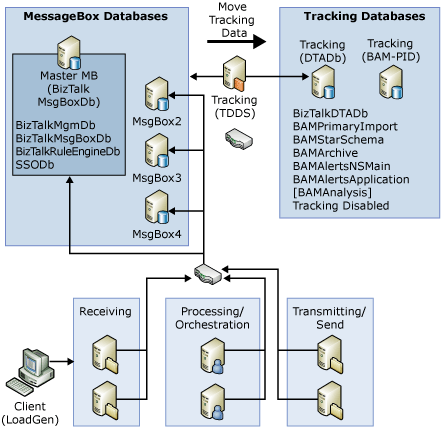
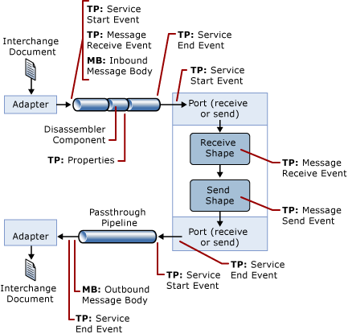
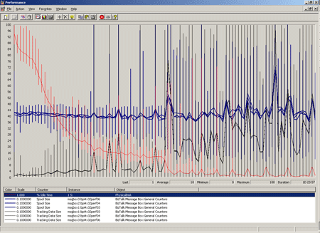

# Test Scenarios for Measuring MST of DTA Tracking
To show how all of this works in practice and to introduce a simple technique for measuring maximum sustainable throughput (MST) for tracking, we will now present a test scenario for which the tracking MST has been measured. Not only will we provide the techniques involved, but you can use the data presented as a starting point to estimate tracking performance for other systems.  
  
> [!IMPORTANT]
>  Readers should be aware that the information contained in this topic represents the current view of Microsoft on the issues discussed as of the date of publication. Because we must respond to changing market conditions and technologies, Microsoft cannot guarantee the accuracy of any information presented after the date of publication.  
  
## Test Scenario Topology and Configuration  
 The following figure shows the topology and configuration for the test scenario.  It is a sizable build-out with four MessageBox database servers, a dedicated BizTalkDTADb database server, and a total of seven servers running [!INCLUDE[btsBizTalkServerNoVersion](../includes/btsbiztalkservernoversion-md.md)]. Note that the BAM server pictured in the figure was not in use for this test scenario.  
  
 **BizTalkDTADb Sustainable Throughput**  
  
   
  
 **Hardware specification (BizTalk Server)**  
  
- CPU: Dual 3 GHz (Cache: L2: 512 KB/L3: 1 MB)  
  
- Memory: 2 GB of RAM  
  
- HDD: 2 X 32 GB/15 K  
  
  **Hardware specification (SQL Server)**  
  
- CPU: Quad 2 GHz (L2: 512 KB/L3: 1 MB)  
  
- Memory: 4 GB of RAM  
  
- HDD: 2 X 32 GB/15 K + SAN  
  
  The next figure provides an overview of the test scenario architecture, where  
  
- **TP** = Track Point, a point at which some elements are tracked such as events or message properties.  
  
- **MB** = Message Body, a point at which a message body is tracked.  
  
  The following solution architecture shows a tracking configuration with three main configuration components:  
  
- **Default DTA Tracking**. All of the event track points in the figure are on by default when [!INCLUDE[btsBizTalkServerNoVersion](../includes/btsbiztalkservernoversion-md.md)] is installed.  
  
- **Message Properties**. The track point associated with the dis-assembler (DA) component in the inbound pipeline represents the tracking of 10 properties from the inbound message. For more information about how to promote properties for tracking, see [Promoting Properties](../core/promoting-properties.md).  
  
- **Message Body**. The two message body (MB) points from the figure represent the points at which message bodies are tracked. For more information on how to set up message body tracking, see [Configuring Tracking Using the BizTalk Server Administration Console](http://msdn.microsoft.com/en-us/49b7f9d3-60b5-41bd-ba8b-029253926bef).  
  
  **Test Scenario Architecture**  
  
    
  
## Test Techniques  
 The file adapter was used for both receiving and sending. We used the Load Generation tool, LoadGen 2007, to deliver messages to the inbound file share. The LoadGen tool was configured to deliver files at a specific rate so that we could vary the load while searching for our tracking MST level. For more information about the LoadGen tool, see [Using the Microsoft BizTalk LoadGen 2007 Tool](../core/using-the-microsoft-biztalk-loadgen-2007-tool.md).  
  
 For our tests, we assumed a requirement of 24 hrs retention in the BizTalkDTADb database. That is, anything older than 24 hrs was purged from the database. The archive and purge SQL job is designed so that only the data that has been archived is purged so that no data is lost during the process.  
  
 To fully test the system with this requirement, it was necessary to run the load for at least 25 hours so that at least one archive and purge cycle was included. We elected to run for a full 48 hours to monitor the system for 24 hours after the first archive to be sure it was sustainable. The first 24 hours was required in order to build up data that was old enough to be archived (every 24 hours) to simulate steady state. The system was monitored during the second 24 hours to determine that all processes (for example, TDDS, archiving and purging) were able to keep up with the throughput.  
  
 Drawing from our understanding of the tracking behavior, there are just a few key performance indicators (KPI) that typically need to be monitored to determine sustainability:  
  
- **The physical disk idle time for BizTalkDTADb database data file**. If the physical disk idle time approaches 0, this is a good sign that the BizTalkDTADb database is saturated with either the influx of tracked data, archiving activity, and/or purging activity.  
  
- **The trackingdata table depth**. If the trackingdata table starts to grow monotonically, that is, continues to grow unbounded, then it is a clear sign that, at the current throughput rate, TDDS is not able to insert data into the BizTalkDTADb database fast enough to keep up.  
  
- **The spool depth**. There are a number of things that can cause the spool to grow. One of the situations that can cause spool growth is if the SQL job that copies tracked message bodies from the MessageBox database to the BizTalkDTADb database gets behind. Because the messages that need to be tracked cannot be removed from the MessageBox database (by the MessageBox cleanup jobs) until they have been successfully copied to the BizTalkDTADb database, if the copy job gets behind, it results in spool build up.  
  
  For the majority of systems, monitoring just these three performance indicators under load provides enough information to determine if the load is sustainable or not.  
  
  **Key Performance Indicators Under Sustainable Load**  
  
    
  
  Using the sample scenario, with a load of 20 messages received per second, we acquired 48 hours worth of key performance indicators as shown in the generated Perfmon graph. Note from the graph, the following trends that indicate sustainability:  
  
- **BizTalkDTADbdata depth (black lines)**. With our three publishing MessageBox databases, we can see that, even after the first archive at 24 hours, the depth of the trackingdata table stabilizes and does not continue to trend up.  
  
- **Spool depth (blue lines)**. The spool depth is very stable throughout the run indicating that, even with archiving and purging taking resources, the tracked messages, which are each 10 kilobytes in size, are copied to the BizTalkDTADb database without falling behind.  
  
- **BizTalkDTADb database data file Physical Disk Idle Time (red line)**. For the first 24 hours before archive and purge have any work to do, the BizTalkDTADb database is accumulating more and more data which results in more and more disk I/O as data is inserted by TDDS. This is clearly seen as a steady decline in the physical disk idle time.  
  
   At 24 hours into the run, a clear drop in I/O idle time is observed, which coincides with the first time that archive and purge have work to do. After the first archive, purge has work to do every minute to purge data older than 24 hours (remember, there is still load on the system), which results in a near zero idle time.  
  
   A key point here is that, after the first archive has taken place, that is, the system has passed the first "live BizTalkDTADb database data retention" window, the disk idle time will be very near zero when the system is at or near MST. This is because the bottleneck for the BizTalkDTADb database is almost always the speed of the disk I/O subsystem.  
  
  In many cases, it can be beneficial to measure MST with tracking off as a baseline for the system. In our case, for example, the MST with all tracking turned off was 290 messages per second, which is many times the MST of the system with tracking turned on with the features and DTA data retention window stated above. This tells us that the system with tracking turned on is significantly under utilized. That is, we do not need to build a system capable of 290 messages/sec when tracking the things we need to track will only support an MST of 20 messages/sec. Stated another way, assuming the BizTalkDTADb database hardware doesn’t change, many fewer BizTalk and MessageBox database servers would be required to achieve a throughput of 20 messages per second than what we have in our scenario.  
  
## Searching for Maximum Sustainable Throughput  
 Now that we have seen what the KPI look like for a system running at MST, let’s back up and discuss how we arrived at our 20 messages/sec MST for the sample scenario. It is a simple iterative, "binary search" approach as follows:  
  
- **Pick a starting point**. Unless you already have experience with performance testing on [!INCLUDE[btsBizTalkServerNoVersion](../includes/btsbiztalkservernoversion-md.md)], you will need to avail yourself of the information available on what has been achieved on other systems.  
  
   For example, we have provided all of the hardware, configuration, and solution architecture for the sample scenario in this topic. Using that, and the type of tracking we had turned on (default + 10 properties + 10KB message bodies) and the MST we achieved (20 msgs/sec) with a 24 hour DTA data retention window, compare that to your setup and requirements.  
  
   You should at least be able to estimate if the MST for your solution will be higher or lower than what we achieved. Various technical case studies may also be available to which you can compare your system. For examples, see the case studies available on the BizTalk Server Developer Center, at [http://go.microsoft.com/fwlink/?LinkId=49339](http://go.microsoft.com/fwlink/?LinkId=49339).  
  
- **Run the system under the estimated MST load and monitor the KPI**. Typically, starting out on the high side of your expected MST can shorten the time it takes to find MST. By starting high, you will drive the KPI to saturation (especially disk I/O) in less time than it will take to discover that you are below MST (that is, at least one full data retention window).  
  
- **Refine the MST Estimate and Repeat**. Looking at your results for the test run, refine your estimate of MST and repeat the test using the new estimate.  
  
## See Also  
 [Measuring Maximum Sustainable Tracking Throughput](../core/measuring-maximum-sustainable-tracking-throughput.md)   
 [Understanding DTA Tracking Performance Behavior](../core/understanding-dta-tracking-performance-behavior.md)   
 [Tips and Tricks for Finding MST of DTA Tracking](../core/tips-and-tricks-for-finding-mst-of-dta-tracking.md)   
 [Tracking Database Sizing Guidelines](../core/tracking-database-sizing-guidelines.md)