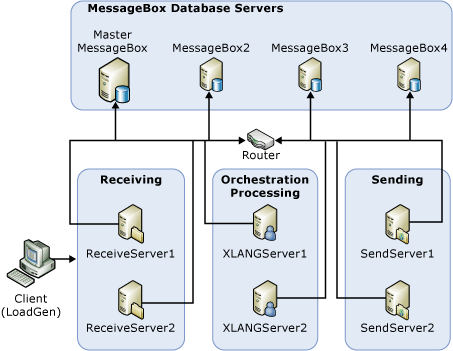

# Test Scenarios for Measuring MST of the Engine
This section describes a test scenario that was implemented to measure the effect of driving a BizTalk system at three different levels of load:  
  
- [Sustainable Load Test](../core/sustainable-load-test.md). For purposes of these tests, sustainable load is described in the topic [What Is Sustainable Performance?](../core/what-is-sustainable-performance.md).  
  
- [Overdrive Load Test](../core/overdrive-load-test.md). Overdrive load is defined as a consistent load that exceeds MST.  
  
- [Floodgate Load Test](../core/floodgate-load-test.md). Floodgate load is defined as low load with intermittent peaks of load that exceed MST.  
  
  This topic describes the test hardware configuration, the test scenarios, and discusses the findings of each of these tests.  
  
> [!IMPORTANT]
>  Readers should be aware that the information contained in this section represents the current view of Microsoft on the issues discussed as of the date of publication. Because we must respond to changing market conditions and technologies, Microsoft cannot guarantee the accuracy of any information presented after the date of publication.  
  
## Test System Configuration  
 The following hardware was used for this test scenario:  
  
- **Six BizTalk Servers**. Each equipped with dual 3GHz processors and 2GB of RAM. Each server is using local disks. Two of the BizTalk Servers are configured with an instance of the receiving host, two are configured with an instance of the sending host, and two are configured with an instance of the host used for processing orchestrations.  
  
- **One SQL Server for the master MessageBox database and the non-MessageBox databases**. Equipped with eight 2GHz processors and 4 GB of RAM. This server is connected to a fast SAN disk subsystem via fiber. Message publication is disabled.  
  
- **Three SQL Servers for the Messagebox databases that are being published to**. Equipped with four 2GHz processors and 4GB of RAM. These servers are each connected to a fast SAN disk subsystem via fiber. The data and transaction log files for the MessageBox database are on separate storage area network (SAN) logical unit numbers (LUNs).  
  
- **Load driver client machine**. Equipped with dual 3GHz processors and 2GB of RAM. This server was used to generate the load for testing the BizTalk system.  
  
  The topology used for the load tests is illustrated below.  
  
  **Topology used for load tests**  
  
    
  
## The Test Scenario  
 The test scenario is very simple. The load generation tool, LoadGen 2007, was installed on the load driver server and was used to send copies of a file to shares monitored by the file adapter. The load generation tool distributes copies of the input file instance evenly across the file shares.  
  
> [!NOTE]
>  Download [LoadGen](https://www.microsoft.com/download/details.aspx?id=14925). The previous version of this tool, the BizTalk Server 2004 Load Generation Tool is available for download at [http://go.microsoft.com/fwlink/?linkid=108999](http://go.microsoft.com/fwlink/?linkid=108999). For information about using LoadGen with the MSMQ adapter, see [Using LoadGen 2007 with MSMQ](../core/using-loadgen-2007-with-msmq.md).  
  
 The BizTalk File adapter is configured to monitor the file shares and publish the messages into the MessageBox. A simple orchestration that contains only a receive shape and a send shape subscribes to the published message. Messages that are published back into the MessageBox by the orchestration are picked up by a file send port and sent to a common share, defined on the SAN. Files arriving on the output SAN share are immediately deleted in order to avoid file buildup on that share during long test runs.  
  
 Four hosts were defined for the scenario, one each for the receive location, the orchestrations, the send port, and for tracking. For the purposes of observing engine backlog behavior, tracking is completely turned off during the test runs. Tracking is only enabled for pipelines and orchestrations by default so tracking was explicitly turned off in the BizTalk Administrator for the orchestration and pipeline that was used.  
  
 No instances of the tracking host were created since tracking was turned off to isolate core MessageBox behavior for these tests.  
  
 A simple schema was used and the instance files used for the test were all 10KB in size. The XMLReceive pipeline was used for inbound documents and no mapping components or outbound components were used in order to keep the test scenario simple and focus observations on the behavior of the MessageBox.  
  
## Parameters Measured in the Test  
 The parameters measured in this test are as follows:  
  
 **Primary test parameters measured**  
  
 The following parameters are the primary indicators used when measuring MST:  
  
- The MessageBox backlog as measured by the **Spool Size** counter that is available with the **BizTalk:MessageBox:General Counters** performance object. Messagebox backlog is a key indicator of sustainability. Clearly, MessageBox backlog cannot continue to grow indefinitely without eventually running into problems. So, the depth of the MessageBox database backlog, monitored over time, is used to evaluate sustainability.  
  
   The MessageBox table named **spool** contains a record for each message in the system (active or waiting to be garbage collected). Monitoring the number of rows in this table, and the number of messages received per second, while increasing system load provides an easy way to measure the maximum sustainable throughput. This measurement is also referred to as the **spool table depth** or **spool depth**.  
  
- The number of documents received per second as measured by the **Documents received/Sec** counter that is available with the **BizTalk:Messaging** performance object.  
  
  **Secondary test parameters measured**  
  
  The following parameters are secondary indicators that can be evaluated when measuring MST. These parameters may impact the primary indicators of spool depth and the number of documents received per second.  
  
- The physical disk idle time for the MessageBox data and transaction file disk as measured by the **%Idle Time** counter available with the **LogicalDisk** performance object.  
  
- The CPU utilization (%) for the MessageBox server as measured by the **%Processor Time** counter available with the **Processor** performance object.  
  
- The lock timeouts per second on the MessageBox database as measured by the **Lock Timeouts/sec** counter available with the **SQLServer:Locks** performance object.  
  
- The time in seconds for the most recent run of the SQL agent job that cleans up message box tables associated with removed messages. This is measured by the **MsgBox Msg Cleanup(Purge Jobs)** counter available with the **BizTalk:MessageBox:General Counters** performance object.  
  
- The time in seconds for the most recent run of the SQL agent job which cleans up message box tables associated with removed message parts. This is measured by the **MsgBox Parts Cleanup(Purge Jobs)** counter available with the **BizTalk:MessageBox:General Counters** performance object.  
  
  When testing to determine the maximum sustainable throughput, input load was increased up to the point that the spool table started to grow indefinitely.  
  
> [!NOTE]
>  If you are unable to generate enough load to cause the spool table to grow indefinitely, it simply means that the slowest part of your system is on the receive side, rather than the processing/send side.  
  

## Next
  
-   [Using the Microsoft BizTalk LoadGen 2007 Tool](../core/using-the-microsoft-biztalk-loadgen-2007-tool.md)  
  
-   [Sustainable Load Test](../core/sustainable-load-test.md)  
  
-   [Overdrive Load Test](../core/overdrive-load-test.md)  
  
-   [Floodgate Load Test](../core/floodgate-load-test.md)