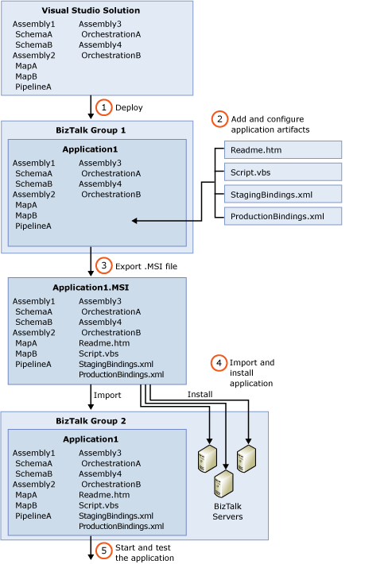

# The Application Deployment Process
This following diagram depicts the general steps involved in deploying a BizTalk application. For detailed information about the tasks involved during the development, testing, staging, and production phases of application deployment, see [Application Deployment Tasks](../core/application-deployment-tasks.md).  
  
   
  
1. **Deploy from Visual Studio the assemblies in a BizTalk solution.** This builds the assemblies and imports them, along with the orchestrations, pipelines, schemas, and maps that they contain (called "artifacts") into the local BizTalk Management database. Deployment also associates them with the BizTalk application that you have specified in project properties within [!INCLUDE[btsVStudioNoVersion](../includes/btsvstudionoversion-md.md)]. For instructions, see [Deploying BizTalk Assemblies from Visual Studio into a BizTalk Application](../core/deploying-biztalk-assemblies-from-visual-studio-into-a-biztalk-application.md). After you deploy a solution, you can view and manage the deployed assemblies and their artifacts from within the [!INCLUDE[btsBizTalkServerNoVersion](../includes/btsbiztalkservernoversion-md.md)] Administration console or by using the BTSTask command-line tool. You can manage the artifacts either individually or together, grouped within the application.  
  
2. **Add and configure artifacts.** You can add artifacts, such as scripts and Readme files, to the application by using the Administration console or BTSTask. You can also configure artifacts, such as send and receive ports, receive locations, and orchestrations by using the [!INCLUDE[btsBizTalkServerNoVersion](../includes/btsbiztalkservernoversion-md.md)]Administration Console. For more information, see [How to Create or Add an Artifact](../core/how-to-create-or-add-an-artifact.md). Also see [Managing Artifacts](../core/managing-artifacts.md). You can also generate binding files and add them to the application if you want to apply different bindings for different environments into which you might import the application. For more information, see [Binding Files and Application Deployment](../core/binding-files-and-application-deployment.md).  
  
3. **Export the application into an .msi file.** You can use the Export MSI File Wizard or BTSTask to export the application artifacts into an .msi file that you will use to import the application into a new BizTalk group as well as install the application on the computers that will run it. For instructions, see [How to Export a BizTalk Application](../core/how-to-export-a-biztalk-application.md).  
  
4. **Import the application into another BizTalk group and install the application on the computers that will run it.** You can use the Import MSI Wizard or BTSTask to import the BizTalk application from the .msi file created in Step 3 into another BizTalk group to create the application and its artifacts in the new group. You then use the .msi file to install the application on the computers that will run it. You must do this before the application can run. If you are ready to test the application, you can import it into BizTalk group in a test environment and install it. If your application is ready for staging or production, you can import it into one of those environments and install it. For instructions, see [How to Import a BizTalk Application](../core/how-to-import-a-biztalk-application.md). Also see [How to Install a BizTalk Application](../core/how-to-install-a-biztalk-application.md).  
  
5. **Start the application and verify that it is functioning correctly.** You can start the application from the [!INCLUDE[btsBizTalkServerNoVersion](../includes/btsbiztalkservernoversion-md.md)] Administration console, as described in [How to Start and Stop a BizTalk Application](../core/how-to-start-and-stop-a-biztalk-application.md). You can then test the application, as described in [Testing Tasks for BizTalk Application Deployment](../core/testing-tasks-for-biztalk-application-deployment.md).  
  
## See Also  
 [Understanding BizTalk Application Deployment and Management](../core/understanding-biztalk-application-deployment-and-management.md)   
 [What Is a BizTalk Application?](../core/what-is-a-biztalk-application.md)