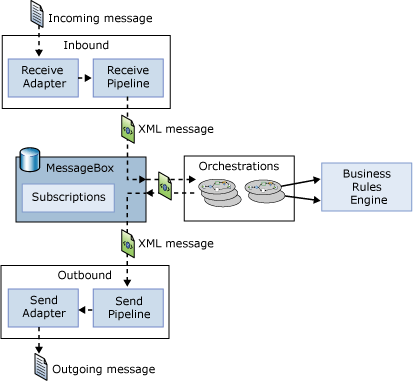

# The BizTalk Server Messaging Engine
The [!INCLUDE[btsBizTalkServerNoVersion](../includes/btsbiztalkservernoversion-md.md)] Messaging engine enables users to create business processes that spans multiple applications by providing two primary things:  
  
- A way to specify and implement the logic driving that business process  
  
- A mechanism for communicating across the applications that the business process uses  
  
  The figure below illustrates the main components of the engine that address these two problems.  
  
    
  
  As the diagram shows, a message is received through a **receive adapter**. Different adapters provide different communication mechanisms, so a message might be acquired by accessing a Web service, reading from a file, or in some other way. The message is then processed through a **receive pipeline**. This pipeline can contain various components that do things such as converting the message from its native format into an XML document, validating a message’s digital signature, and more. The message is then delivered into a database called the **MessageBox**, which is implemented using Microsoft SQL Server.  
  
  The logic that drives a business process is implemented as one or more **orchestrations**, each of which consists of executable code. These orchestrations are not created by writing code in a language such as C#, however. Instead, a business analyst or (more likely) a developer uses an appropriate tool to graphically organize a defined group of shapes to express conditions, loops, and other behavior. Orchestrations can optionally use the **Business Rule Engine**, which provides a simpler and more easily modified way to express complex sets of rules in a business process.  
  
  Each orchestration creates **subscriptions** to indicate the kinds of messages it wants to receive. When an appropriate message arrives in the MessageBox, that message is dispatched to its target orchestration, which takes whatever action the business process requires. The result of this processing is typically another message, produced by the orchestration and saved in the MessageBox. This message, in turn, is processed by a **send pipeline**, which may convert it from the internal XML format used by [!INCLUDE[btsBizTalkServerNoVersion](../includes/btsbiztalkservernoversion-md.md)] to the format required by its destination, add a digital signature, and more. The message is then sent out using a **send adapter**, which uses an appropriate mechanism to communicate with the application for which this message is destined.  
  
  A complete **solution** built on the [!INCLUDE[btsBizTalkServerNoVersion](../includes/btsbiztalkservernoversion-md.md)] engine can contain various parts (sometimes referred to as artifacts): orchestrations, pipelines, message schemas, and more. These parts, or artifacts, can be worked with as a single unit, referred to as a **BizTalk application**. A BizTalk application wraps all of the pieces required for a solution into a single logical unit, making it the fundamental abstraction for management and deployment.  
  
  Different kinds of people perform different functions using the [!INCLUDE[btsBizTalkServerNoVersion](../includes/btsbiztalkservernoversion-md.md)] engine. A **business analyst**, for example, might define the rules and behaviors that make up a business process. She also determines the flow of the business process, defining what information gets sent to each application and how one business document is mapped into another. After the business analyst has defined this process, a **developer** can create a BizTalk application that implements it. This includes things such as defining the XML schemas for the business documents that will be used, specifying the detailed mapping between them, and creating the orchestrations necessary to implement the process. An **administrator** also plays an important role by setting up communication among the parts, deploying the BizTalk application in an appropriately scalable way, and performing other tasks. All three roles—business analyst, developer, and administrator—are necessary to create and maintain [!INCLUDE[btsBizTalkServerNoVersion](../includes/btsbiztalkservernoversion-md.md)] solutions.  
  
## In This Section  
  
-   [Connecting Systems](../core/connecting-systems.md)  
  
-   [Defining Business Processes](../core/defining-business-processes.md)  
  
-   [Management and Monitoring](../core/management-and-monitoring.md)  
  
-   [Enterprise Single Sign-On](../core/enterprise-single-sign-on-sso.md)  
  
## See Also  
 [BizTalk Server Architecture](../core/biztalk-server-architecture.md)   
 [Runtime Architecture](../core/runtime-architecture.md)