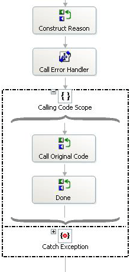
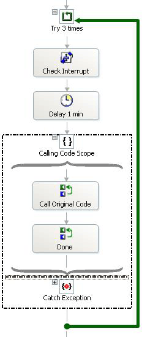
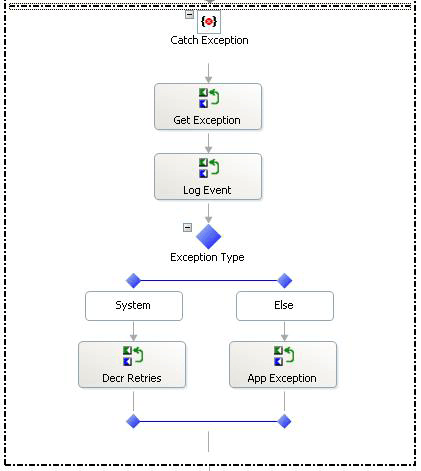
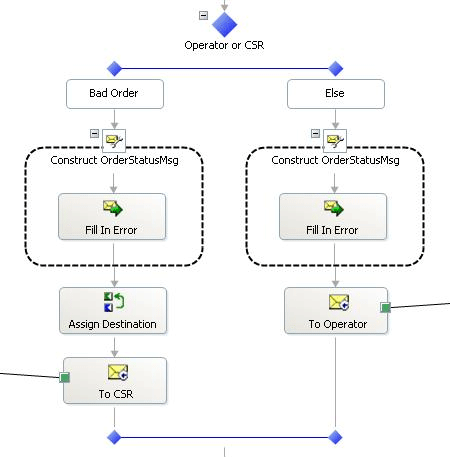
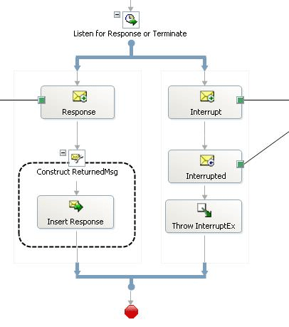

# The ExceptionHandler Orchestration
The Business Process Management solution uses two kinds of exceptions: system exceptions and application exceptions. System exceptions include things like resource errors—a network connection failing, for example. There is a chance that such a problem may resolve itself after an interval so that the solution retries all operations that produce system exceptions. Application exceptions are produced by things less likely to resolve themselves, such as logical errors or some form of inconsistency. The solution uses the **ExceptionHandlerOrch** orchestration to process both system and application errors.  
  
 The order processing stages (**CableOrder1**, **CableOrder2**) and their satellite orchestrations (**Activate**, **Analyze**, **Cancel**, **Change**, **Complete**, **Validate**) all use **ExceptionHandlerOrch**.  
  
> [!NOTE]
>  You may want to read this section with the **ExceptionHandlerOrch** orchestration open in Microsoft [!INCLUDE[btsVStudioNoVersion](../includes/btsvstudionoversion-md.md)].  
  
## Application Errors  
 The exception handler first logs the error by calling the **PostError** method of the **ErrorHandler** object in the **Utilities** assembly. The exception handler then tests whether the error was a system error or an application error. The following screenshot shows the orchestration branch that processes application exceptions:  
  
   
  
 For an application error, the orchestration constructs a string describing the error and calls the **ErrorHandlerOrch** orchestration. This orchestration sends the error to operations where an operator decides whether to fix the error or terminate the operation. If the operator fixes the error, the repaired message comes back from the ErrorHandlerOrch orchestration and the operation is retried. The exception handler does this by calling the **Invoke** method of the **Recaller** object in the **Utilities** assembly. The **Recaller** object uses reflection to call the code that caused the error.  
  
 If the call to **Invoke** succeeds, the exception handler exits. Otherwise, it loops back and attempts the call to **Invoke** again. For more information about the **Recaller** object, see [The Recaller Object](../core/the-recaller-object.md).  
  
## System Errors  
 The following diagram shows the system error branch of the **ExceptionHandler** orchestration:  
  
   
  
 For a system error, the exception handler first calls the **CheckInterrupt** orchestration and then waits for one minute. The wait allows for temporary, short-term errors such as network connection problems, to clear before trying again. When making remote calls there is always the chance of a network problem.  
  
> [!NOTE]
>  In an interruptible design, as a general rule, you want to test for an interrupt during or immediately after any waiting period to see if an interrupt has occurred.  
  
 After the wait, the handler uses the **Invoke** method of the **Recaller** object to run the original code. If the call succeeds, the handler exits. Otherwise, the handler will try two more times to run the original code. If all three attempts fail, the handler constructs an error string and calls the **ErrorHandlerOrch** orchestration.  
  
 If processing a system exception causes an exception, the exception block catches it:  
  
   
  
 The exception handler tests the type of the exception and either decrements the retry counter if it's a system exception, or sets a flag to indicate an application exception.  
  
## The ErrorHandlerOrch Orchestration  
 The following diagram shows the first part of the **ErrorHandlerOrch** orchestration:  
  
   
  
 The **ErrorHandlerOrch** orchestration first tests the **IsBadOrder** parameter to see if the error is a bad order (**IsBadOrder** is true) or some other error. If the error is a bad order, it assigns the destination of the message from the original order return address and sends the message back to the customer service system. If the error is not a bad order, the orchestration creates an order error message and sends it to the operations system.  
  
 After either error, the orchestration then listens for a response message or an interrupt message:  
  
   
  
 If the orchestration receives a response, it returns to the caller. If the orchestration receives an interrupt message, it passes the message on to an interrupt port and throws a custom **InterruptException**.  
  
 For more information about how the solution uses and handles interrupts, see [Interrupt Handling in the Business Process Management Solution](../core/interrupt-handling-in-the-business-process-management-solution.md).  
  
## See Also  
 [Exception Handling in the Business Process Management Solution](../core/exception-handling-in-the-business-process-management-solution.md)   
 [Custom Exceptions](../core/custom-exceptions.md)   
 [Interrupt Handling in the Business Process Management Solution](../core/interrupt-handling-in-the-business-process-management-solution.md)   
 [The Recaller Object](../core/the-recaller-object.md)
