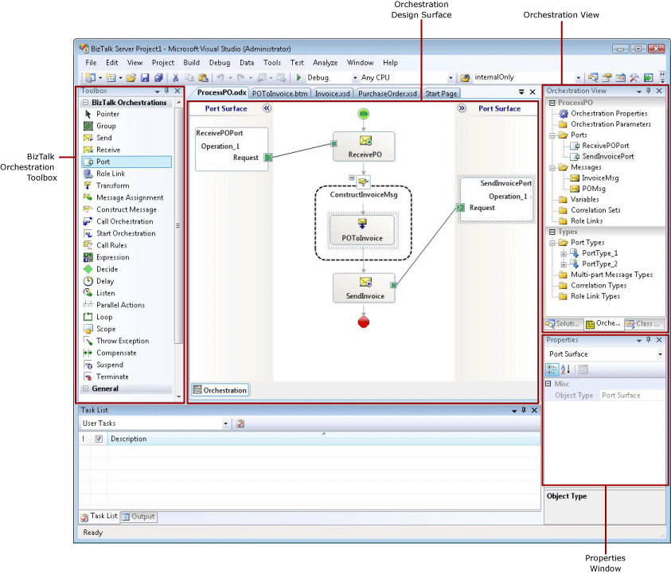

# The Orchestration Design Surface
The Orchestration Design Surface is a visual designer that you can use to create a BizTalk Orchestration, and is the central component of Orchestration Designer. It is a canvas that you can drag shapes onto from the Toolbox, and then configure the shapes. As a Visual Studio editor window, it occupies the main window area used by other Visual Studio editor windows.  
  
   
Orchestration Design Surface  
  
 The name of the orchestration is displayed on the top tab of the Orchestration Design Surface window and in the Visual Studio window title bar.  
  
 The design surface itself is divided into three areas: the Process Area and two Port Surfaces. The central Process Area contains shapes that describe the actual process flow of the orchestration. It is flanked on both sides by Port Surfaces, which contain only Port and Role Link shapes that interact with the **Send** and **Receive** shapes in the Process Area.  
  
 **Process Area**  
  
 The Process Area is the main part of the Orchestration Design Surface of Orchestration Designer, and is always horizontally centered in the Orchestration Design Surface.  
  
 On either side of the Process Area you see Port Surfaces. The **Begin** shape is placed at the top of the design surface and the orchestration grows downward as you add shapes.  
  
 **Port Surfaces**  
  
 Two Port Surfaces are displayed in the Orchestration Design Surface, one on either side of the Process Area. Port Surfaces can contain two kinds of shapes: **Ports** and **Role Links**. These shapes interact with the **Send** and **Receive** shapes in the Process Area.  
  
 It makes no difference which Port Surface you use for a shape; that is, the shape functions identically on either the right or the left Port Surface. Having two Port Surfaces on which to place new ports lets you create orchestrations with fewer crisscrossing connectors that therefore are easier to read.  
  
 Both Port Surfaces can be collapsed or expanded by double-clicking on them or by clicking on the double arrow icon.  
  
> [!IMPORTANT]
>  Many Orchestration Designer tasks require you to select various items such as schemas or orchestrations. If these items are not in the current project, you must remember to add a reference in your project to the assembly that contains the item that you want to select. To do this, right-click the project and select **Add Reference**.  
  
 **Zoom Support**  
  
 [!INCLUDE[btsBizTalkServerNoVersion](../includes/btsbiztalkservernoversion-md.md)] provides the ability to zoom in or zoom out of the Orchestration designer surface. You can use zoom support by completing one of the following steps:  
  
-   Right-click the Orchestration designer surface and click the **Zoom** menu option. You can then select the percentage of magnification that you would like to apply.  
  
-   Use the CTRL + MWHEEL combination to zoom in or zoom out. Hold down the CTRL button and simultaneously rotate the mouse wheel up or down. Use the CTRL+MWHEELUP combination to zoom out and the CTRL+MWHEELDOWN combination to zoom in.
