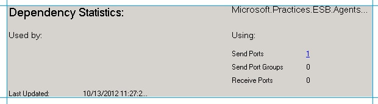
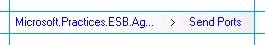

# Tracking Dependencies Between Artifacts in a BizTalk Server Application
A typical [!INCLUDE[btsBizTalkServerNoVersion](../includes/btsbiztalkservernoversion-md.md)] application involves various artifacts such as orchestrations, send ports, receive locations, pipelines, schemas, maps, and the likes. All these artifacts have dependencies on each other. The following table lists these dependencies.  
  
|Artifacts|Orchestration|Send Port|Receive Port|Receive Location|Pipeline|Maps|Schemas|  
|---------------|-------------------|---------------|------------------|----------------------|--------------|----------|-------------|  
|**Orchestration**||||||||  
|**Send Port**||||||||  
|**Receive Port**||||||||  
|**Receive Location**||||||||  
|**Pipeline**||||||||  
|**Map**||||||||  
|**Schema**||||||||  
  
 As the table suggests, there are two modes of dependencies.  
  
- Uses () – An artifact uses another artifact, for example, a send port uses a pipeline.  
  
- Used By () – An artifact is used by another artifact, for example, a send port is used by an orchestration.  
  
  With these dependencies, if you need to update an artifact, you must know which artifacts in the dependency hierarchy must be stopped or re-deployed. Such dependency information is available in the [!INCLUDE[btsBizTalkServerNoVersion](../includes/btsbiztalkservernoversion-md.md)] Administration console. The [!INCLUDE[btsBizTalkServerNoVersion](../includes/btsbiztalkservernoversion-md.md)] Administration console displays the dependency information in both the modes – whether an artifact uses another artifact *as well as* whether an artifact is used by another artifact.  
  
## Viewing Dependencies  
 This section provides information on how to view the dependency using the [!INCLUDE[btsBizTalkServerNoVersion](../includes/btsbiztalkservernoversion-md.md)] Administration console.  
  
> [!NOTE]
>  The following procedure provides instructions on how to view a dependency for an orchestration. You can follow the same instructions to view dependency for other artifacts as well.  
  
#### To view dependencies for an artifact  
  
1. In the [!INCLUDE[btsBizTalkServerNoVersion](../includes/btsbiztalkservernoversion-md.md)] Administration console, expand an application, and then click **Orchestrations**. In the middle pane, right-click the orchestration for which you want to see the dependencies, and then click **View Dependencies**.  
  
2. Towards the bottom of the pane, the **Dependency Statistics** pane, displays two categories of dependencies. The **Used By** category shows the artifacts that use that specific orchestration. The **Using** category shows the artifacts that are used by the specific orchestration.  
  
      
  
    Because no other artifact is dependent on an orchestration, the **Used By** dependency category for an orchestration is empty. However, under the **Using** dependency mode, the image shows that the orchestration is dependent on one send port. The number of dependencies is displayed as a hyperlink, which when clicked, displays only the send ports that the orchestration depends on. Note that even after you click the hyperlink to list the send ports, the dependency pane still shows the dependency statistics for the orchestration and not the send port.  
  
    You can right-click the send ports and then click **View Dependencies** again, to see the dependency matrix for the send port. You can view such a dependency tree up to any level. The level at which you are in the dependency tree is displayed by a trail of bread crumbs at the top of the pane, as shown in the image below.  
  
    