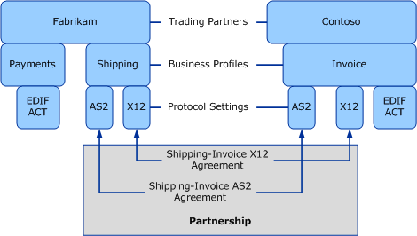

# Trading Partner Agreement
## Overview
A Trading Partner Agreement (TPA) is defined as a definitive and binding agreement between two trading partners for transacting messages over a specific B2B Protocol. Agreements bring together common bi-directional message processing properties from specific business profiles of both partners. It is a comprehensive collection of all aspects governing the business transaction between the two trading partners. A TPA is typically derived from the profiles of each partner, with the ability to customize and override the required settings.  
  
 In simpler terms, a TPA is an understanding between two business profiles to use a specific message encoding protocol or a specific transport protocol while exchanging B2B messages with each other.  
  
   
  
 In the preceding illustration, there’s an agreement between the “Shipping” and “Invoice” profiles of Fabrikam and Contoso respectively to use the X12 encoding for business messages (**encoding agreement**) and AS2 transport for exchanging messages (**transport agreement**). There can be many such agreements between various business profiles. For example, there can be an agreement between the “Payments” and “Invoice” profiles to use the EDIFACT message encoding standard. All such agreements for all the profiles for a pair of trading partners constitute a **Partnership** between the two trading partners.  
  
## Bi-directional agreements  
 Each agreement between two business profiles is bi-directional. For example, the agreement between “Shipping” and “Invoice” business profiles will contain properties to process messages:  
  
- Received by “Shipping” profile from “Invoice” profile, and  
  
- Sent by “Shipping” profile to “Invoice” profile  
  
  In simpler terms, a bi-directional agreement is a collection of two one-way agreements. One one-way agreement can be considered as a collection of properties that define how message transaction happens from party A to party B. The other one-way agreement can be considered as a collection of properties that define how message transaction happens from party B to party A.  
  
## Considerations when defining an agreement  
 You must consider the following points while creating a Trading Partner Agreement:  
  
-   For two business profiles that exchange B2B messages with each other, defining a message encoding agreement is mandatory. The divisions may choose to have an AS2 agreement only if they want to use the AS2 protocol to transfer messages. For example, an AS2 agreement is not required if the business divisions choose to transfer messages over e-mail.  
  
-   If two business profiles support both X12 and EDIFACT encoding and both business profiles agree to use both encoding protocols while exchanging messages, there should be separate agreements for each protocol. There should be one agreement for X12 protocol and one agreement for EDIFACT protocol. There cannot be a single agreement that can be used for both protocols.  
  
-   The encoding agreement for X12 and EDIFACT messages and transport agreement (for AS2) cannot be part of one agreement. You must create separate agreements for both.  
  
## Global or fallback agreement  
 Certain business organizations may choose to have a singular set of B2B processing mechanism without differentiating on the partners involved in specific B2B messaging. In effect, such business organizations have just one common B2B protocol setting that is shared with all other trading partners. Also, because such organizations do not need to have specific settings for specific partners, the B2B protocol settings are defined for the trading partner itself and not for a trading business profile. In [!INCLUDE[btsBizTalkServerNoVersion_md](../includes/btsbiztalkservernoversion-md.md)], such business organizations are reflected as **Global Trading Partners**. Other businesses that need to trade with a business represented as a global trading partner use agreements with the global trading partner that are called **Global Trading Partner Agreement**. These agreements conform to the message encoding and protocol settings defined for the global trading partner.  
  
 The settings defined at the global level can also be useful in scenarios when the profile-specific protocol settings between two trading partners do not formulate a trading partner agreement. In this scenario, the organization hosting [!INCLUDE[btsBizTalkServerNoVersion_md](../includes/btsbiztalkservernoversion-md.md)] can use the protocol settings defined for the partner to formulate an agreement with another trading business profile. In such cases, the agreement arrived at using the global protocol settings defined for the partner is called the **Fallback Trading Partner Agreement**.  

## Learn next

[Putting it all together: Defining a trading partner management solution](../core/putting-it-all-together-defining-a-trading-partner-management-solution.md)
  
## See Also  
 [Building Blocks of a Trading Partner Management Solution](../core/building-blocks-of-a-trading-partner-management-solution.md)