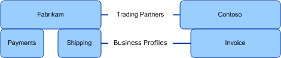

# Trading partners and business profiles

## Overview
Each participating organization in a business relationship is a trading partner. A trading partner, also referred to as a “trading party” or a “party”, is at the root level and forms the base for a trading partner solution. A trading partner is one of the two or more participants in an ongoing business relationship. A trading partner is any single business entity that can send or receive messages to or from any other partner.  
  
 In [!INCLUDE[btsBizTalkServerNoVersion](../includes/btsbiztalkservernoversion-md.md)], TPM solution can be used to model and store information of any trading partner, such as send port associations and certificates used to validate the identity of a party. [!INCLUDE[btsBizTalkServerNoVersion](../includes/btsbiztalkservernoversion-md.md)] uses this information for handling messages received and messages sent. Each organization participating in a business relationship, including the home organization (the local host organization running the [!INCLUDE[btsBizTalkServerNoVersion](../includes/btsbiztalkservernoversion-md.md)] host), is represented as a trading partner.
  
   
  
 For example, consider two organizations: Fabrikam and Contoso. Fabrikam is using [!INCLUDE[btsBizTalkServerNoVersion](../includes/btsbiztalkservernoversion-md.md)]. To use [!INCLUDE[btsBizTalkServerNoVersion](../includes/btsbiztalkservernoversion-md.md)] for managing all business data interchanges with Contoso, Fabrikam must create two trading partners, one for itself and one for Contoso. While creating a party, you provide certain details like partner name, and so on.  
 
## Business profiles

A trading partner’s business profile, also called a business profile, is the business face of an organization. Each business division in an organization that trades with another business division in another organization is represented as a business profile in a TPM solution. All the properties that define the B2B messaging parameters specific to the business division, business unit, or a business system are captured in its business profile. For example, assume Fabrikam has two business divisions: “Payment” and “Shipping”. Contoso has a business division “Invoices”. Considering Fabrikam is using [!INCLUDE[btsBizTalkServerNoVersion](../includes/btsbiztalkservernoversion-md.md)], it must create:  
  
- Two business profiles, one each for Payment and Shipping, under the trading partner, Fabrikam.  
  
- One business profile for Invoice under the trading partner, Contoso.  
  
  The following figure illustrates how the partners and business profiles are managed in a TPM solution:  
  
    
  
  After defining the business profiles, the business divisions can define the message encoding formats and transports that the business divisions adhere to while sending and receiving B2B messages. These communication patterns between business profiles are discussed in [Protocol Settings](../core/protocol-settings.md).  
  
### Why do I need Business Profiles?  
 Business profiles enable [!INCLUDE[btsBizTalkServerNoVersion](../includes/btsbiztalkservernoversion-md.md)] users to better represent their business model in a TPM solution. An enterprise with multiple business divisions can be represented independently in [!INCLUDE[btsBizTalkServerNoVersion](../includes/btsbiztalkservernoversion-md.md)]. More importantly, this model enables users to set properties for each business profile which define how a business profile transacts with other profiles. For example, consider an enterprise that has division in USA and Europe. The division in USA expects EDI messages only in X12 standard, while the division in Europe expects EDI messages only in EDIFACT standard. By creating parties, the enterprise can set the right messaging properties at the profile level, and at the same time use the properties that are already set at the partner level. Without business profiles, the enterprise would have to create trading partners for all business divisions, and then replicate a host of properties across those trading partners.  
  
 You can also associate business identities with business profiles to have a unique identification. These business identities can either be provided by a standard body or can be a mutually agreed upon business identity.  
  
> [!IMPORTANT]
>  If two business divisions within the same organization need to have transactions within themselves, they must be created as separate trading partners. Two profiles under the same partner cannot transact with each other as trading partner relationships are managed between distinct partners only.  
  
## Learn next

[Protocol Settings](../core/protocol-settings.md)  
[Trading Partner Agreement](../core/trading-partner-agreement.md)  
[Putting it all Together: Defining a Trading Partner Management Solution](../core/putting-it-all-together-defining-a-trading-partner-management-solution.md)
 
## See Also  
 [Building Blocks of a Trading Partner Management Solution](../core/building-blocks-of-a-trading-partner-management-solution.md)