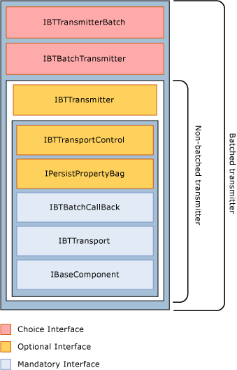

# Transmitter Interfaces
In addition to the mandatory adapter interfaces, transmit (send) adapters, need to implement either **IBTTransmitter** if they are non-batched or **IBTBatchTransmitter** if they are batched.  
  
 The following figure shows the interfaces that batched and non-batched send adapters need to implement.  
  
 
