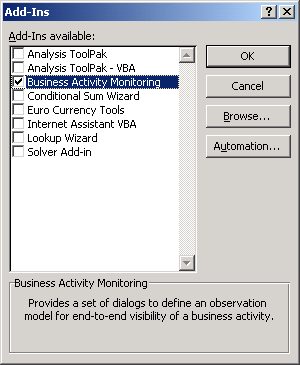

# Troubleshooting BAM
This topic provides information to help you troubleshoot problems you might encounter when using Business Activity Monitoring (BAM).  
  
## BAM deployment failed  
 If you attempt to deploy a BAM definition that includes a real-time aggregation (RTA) when SQL Server Analysis Services is not available, the Bm.exe command will display the following message:  
  
 ERROR: BAM deployment failed. A connection cannot be made. Ensure that the server is running. No connection could be made because the target machine actively refused it *\<IP address>*.  
  
 This occurs because SQL Server Analysis Services must have been installed and configured, and must be running in order to deploy a BAM definition that includes an RTA.  
  
## Cannot refresh the live data workbook  
 When you try to refresh the data in a live data workbook, Microsoft Office Excel might display the following error:  
  
 `XML for Analysis parser: The CurrentCatalog XML/A property was not specified.`  
  
 This occurs because the BAM add-in has not been added to Excel.  
  
#### To add the BAM add-in to Excel  
  
1.  Click **Start**, point to **All Programs**, point to **Microsoft Office**, and then click **Microsoft Office Excel**.  
  
2.  Click the **Microsoft Office Button**, and then click **Excel Options**.  
  
3.  In the **Excel Options** dialog box, click **Add-Ins**.  
  
4.  In the **Add-Ins** pane, click **Go**.  
  
5.  In the **Add-Ins** dialog box, select the **Business Activity Monitoring** check box, and then click **OK**.  
  
       
  
## Error:"Object library invalid or contains references to object definitions that could not be found" with BAM Excel Add-In in Office  
 You may receive this error, when you try use the BAM Excel Add-In after you upgrade Microsoft Excel.  
  
 **Resolution:** Since the BAM Add-In uses ActiveX controls, you have to delete any cached .exd files from the following directories:  
  
-   C:\Documents and Settings\\<username\>\Application Data\Microsoft\Forms  
  
-   C:\Documents and Settings\\<username\>\AppData\Local\Temp\VBE  
  
## BAM portal cannot connect  
 In [!INCLUDE[btsWinSvr2k8](../includes/btswinsvr2k8-md.md)] or [!INCLUDE[btsWinVista](../includes/btswinvista-md.md)], you must run the BAM portal as an administrator.  
  
#### To run the BAM portal on Windows Server 2008 R2 or Windows 7  
  
1.  Click **Start**, point to **All Programs**, right-click **Internet Explorer**, and then click **Run as administrator**.  
  
2.  In the **User Account Control** dialog box, click **Continue**.  
  
3.  In the Internet Explorer address bar, type `http://<server>/BAM`, where *\<server>* is the name of the computer that is running the BAM portal.  
  
## BAM portal does not work if invalid users are granted permissions  
 If an AD user who has the BAM view permissions is removed from the AD, then the BAM portal does not load properly for any user (except DBO).  
  
 To resolve this issue, remove the invalid user from the corresponding bam_{viewname}view security role.  
  
## Cannot export or import a BAM definition to localhost  
 When you export a BAM definition as XML, you will see the following error message if you try to export to localhost:  
  
 `The system cannot find the path specified.`  
  
 Exporting a BAM definition to localhost is not supported. Similarly, importing a BAM definition from localhost is not supported.  
  
## Alerts do not work after upgrading SQL Server editions  
 If you have upgraded from one edition of [!INCLUDE[btsSQLServerNoVersion](../includes/btssqlservernoversion-md.md)] to another edition (for example, from Standard Edition to Enterprise Edition), BAM alerts will not restart. To fix this problem, either delete the BAM alerts and re-create them, or upgrade the [!INCLUDE[btsSQLServerNoVersion](../includes/btssqlservernoversion-md.md)] Notification Service.  
  
#### To upgrade the SQL Server Notification Service  
  
1.  Click **Start**, click **All Programs**, click **Microsoft SQL Server 2005**, and then click **Notification Service Command Prompt**.  
  
2.  Type the following command at the command prompt:  
  
     `nscontrol.exe upgrade -name <instanceName>`  
  
## ObjectDisposedException Exception  
 If your application is using BAM WF 3.5 interceptor, you may receive the following error message: **System.ObjectDisposedException: Cannot access a disposed object**. For more information about this error message, see [ObjectDisposedException Exception](http://go.microsoft.com/fwlink/?LinkID=195338) (http://go.microsoft.com/fwlink/?LinkID=195338).   
To resolve this issue, install the hotfix 960754 available at [http://go.microsoft.com/fwlink/?LinkID=195339](http://go.microsoft.com/fwlink/?LinkID=195339).  
  
## Workbook has lost its VBA project, ActiveX controls and other programmability-related features  
 When attempting to use BAM.xla in Microsoft Excel, you may get the following error:  
  
 `This workbook has lost its VBA project, ActiveX controls and any other programmability-related features.`  
  
 To resolve this issue, install the **Visual Basic for Applications** option under **Office Shared Features** with Microsoft Office.  
  
## Pivot table fails to get the data  
 You have permissions to access BAM databases, and also role and permissions on the views which are deployed. The Activity Search page works as expected and you can see the data. But, in the Pivot table, the following error is displayed:  
  
```  
Failed to get data.  If available, errors returned from the provider are listed below.  
* The following system error occurred:  No connection could be made because the target machine actively refused it.  
```  
  
 To resolve this issue, add the respective DNS settings as follows:  
  
1.  Click **Start** and go to **Control Panel**.  
  
2.  Click **Network and Internet** and then click **Network Connections**.  
  
3.  Right-click on the network connection (like Local Area Connection), and select **Properties**.  
  
4.  On the **Local Area Connection** page, select **Internet Protocol Version 4 (TCP/IPv4)**, and click **Properties**.  
  
5.  Click **Advanced**. On the **Advance TCP/IP Settings** page, click the **DNS** tab.  
  
6.  Select **Append these DNS suffixes** and then add the required DNS suffixes.  
  
7.  Click **OK** and close all the open windows.  
  
## Pivot table view shows all values as “0”  
 When you deploy the BAM portal, the Activity Search page displays expected results. But, the Pivot table view displays all values as “0”. The following error is displayed:  
  
```  
Failed to get data.  If available, errors returned from the provider are listed below.  
* Safety settings on this machine prohibit accessing a data source on another domain.  
```  
  
 To resolve this issue, add the site to the zone as follows:  
  
1.  In the Internet Explorer window, click **Tools**, then click **Internet Options**. Click the **Security** tab, and then select the **Trusted sites** zone.  
  
2.  Click **Custom level** to set the security level for the zone.  
  
3.  On the **Settings** page, under the **Access data sources across domains** option, click **Prompt**. You will be prompted when a component requires this permission.  
  
## See Also  
 [Using Business Activity Monitoring](../core/using-business-activity-monitoring.md)